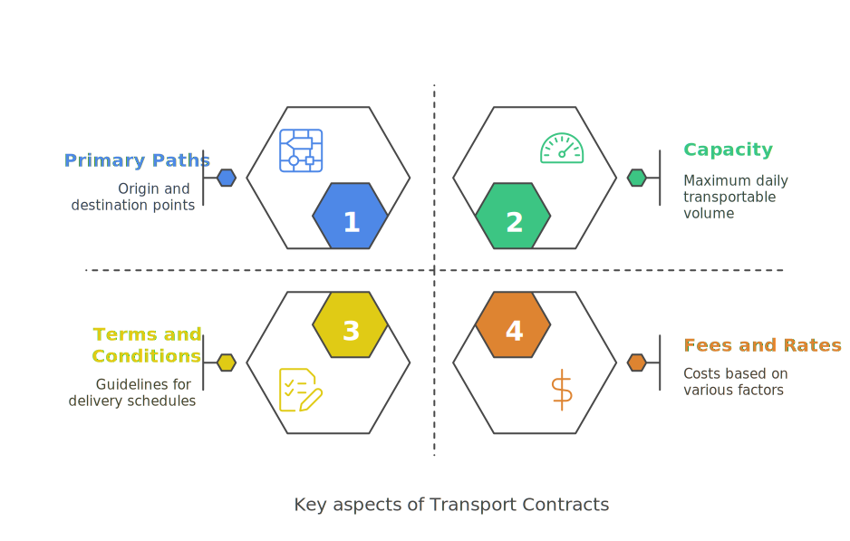
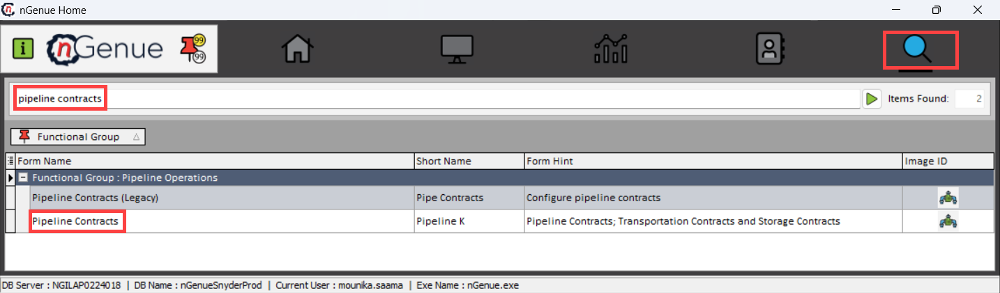
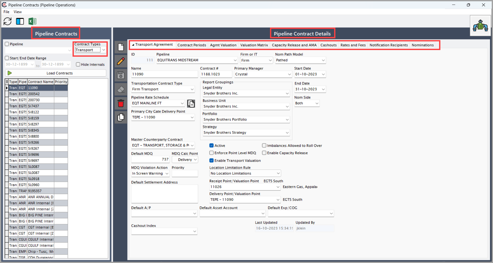
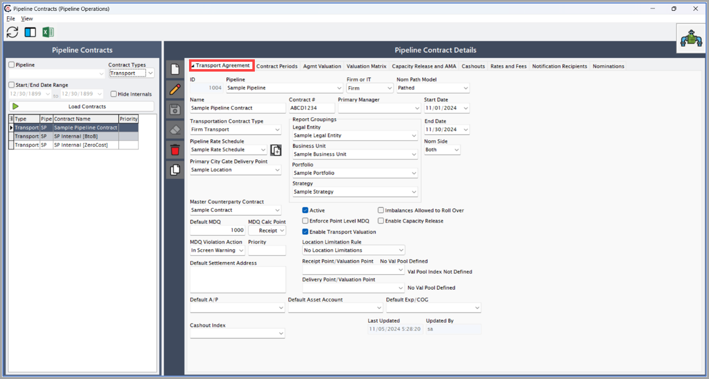
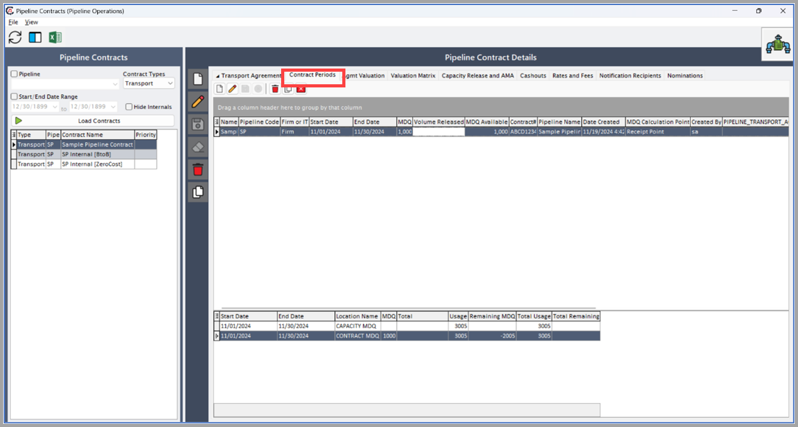
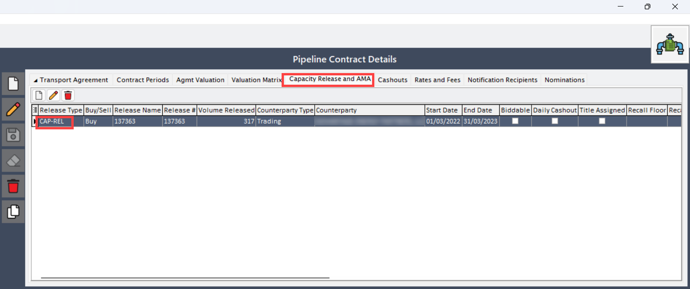
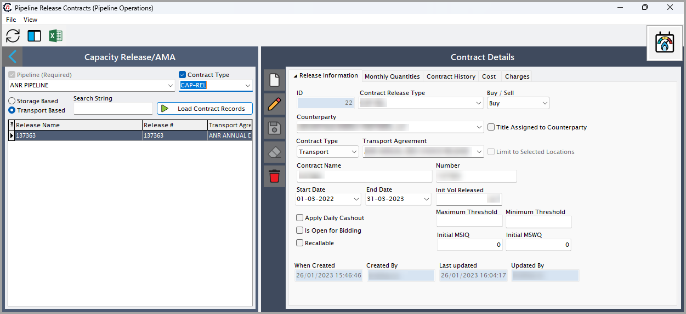
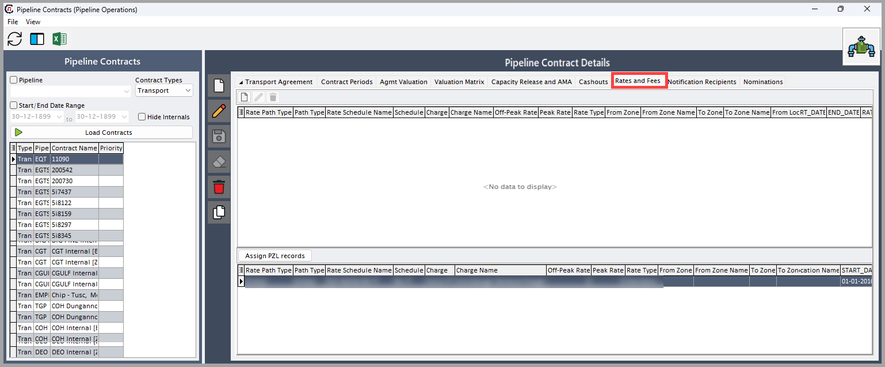
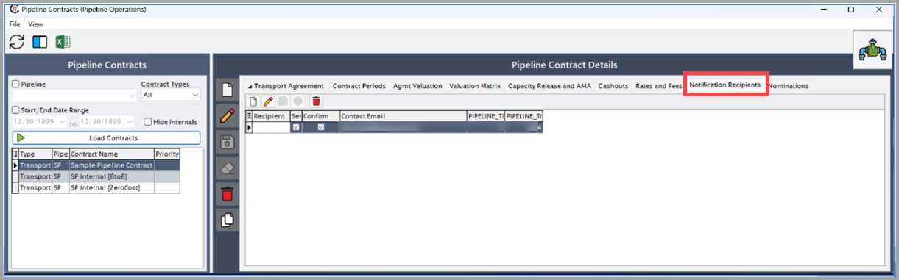
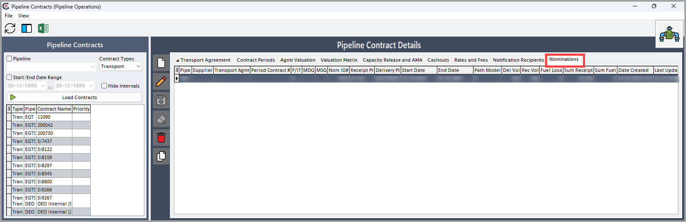

# Understanding transport contracts

**Transport contracts** are formal agreements with pipeline operators to facilitate the transportation of natural gas from one location to another. These contracts define the terms, conditions, and capacities for moving gas across pipeline systems. They are essential for ensuring reliable gas delivery to designated locations such as end-users, storage facilities, or operational hubs.

## Key aspects of the transport contracts

* **Primary paths:** The origin and destination points for gas transportation.
* **Capacity:** The maximum daily transportable volume to ensure supply reliability.
* **Terms and conditions:** Guidelines for delivery schedules, penalties, and contingencies.
* **Fees and rates:** Costs based on volume, distance, and other factors.

<!-- ## Prerequisites

Ensure the following conditions are met before initiating the configuration:

* You must have the required permissions to _add_ or _modify_ the transport contracts details from the **Pipeline contract details** section. 
* [Pipelines](./pipeline.md), including [locations](./pipeline.md#understanding-pipeline-location) and [rates](./rates_tariffs.md), are fully configured and active.

## Procedure

### Step 1: Accessing the Pipeline contracts screen

1.	Log in to the **nGenue** application.
2.	Click on the **Search** icon and enter *Pipeline contracts* into the search text bar.  
3.	Double click on **Pipeline contracts** to open the **Pipeline contracts** screen.

!!! note "Note"

    Avoid using the **Pipeline contracts (Legacy)** screen for transport contract configuration. Instead, use the **Pipeline contracts** screen to ensure accurate configuration.

4. The next screen has two main sections: **Pipeline contracts** and **Pipeline contract details**

    * The **Pipeline contracts** section displays a comprehensive list of all pipeline contracts configured to date. It helps organize and manage contract data systematically, ensuring clarity and easy access. Various filters are available to refine search results based on contract type, pipeline, start date, and end date. Since this article focuses on transport contracts, be sure to select **Transport** as the contract type from the dropdown menu.
    * The **Pipeline contract details** section provide in-depth, specific information about a pipeline contract. It contains the following tabs to organize and manage contract-specific data efficiently:
 

#### Transport agreement tab

This tab provides an overview of the transport agreement, including operational, financial, and strategic details.

Below are the key fields and their descriptions:

| Fields | Description | Data type | Mandatory (Y/N) | Fetched from (UI screen) | Displayed on (UI screen)|
| --- | --- |--- | --- |--- | --- |
| ID  | The ID field is an unique identifier for each transport contract.| Auto-generated | Y | Auto-generated | N/A |
| Pipeline | The name of the pipeline associated with the contract.| Dropdown | Y | Pipeline screen | Displayed on multiple screen. Example: Pipeline scheduling screen |
| Firm or IT| Specifies whether the agreement guarantees firm capacity or allows for interruptions based on availability.| Dropdown| Y | System-generated | N/A |
| Nom path model| The following fields define how transport contracts manage capacity and scheduling in pipeline systems:   1. **Pathed:** Follows a fixed route from the receipt point to the delivery point. Capacity is allocated along the entire path, and constraints along the route may impact scheduling.   2. **Non-pathed:** Does not require a predefined route. Receipt and delivery points can be selected independently, providing greater flexibility in capacity management.   3. **Pathed non-threaded:** Uses a defined path but offers more scheduling flexibility. Unlike pathed contracts, it does not strictly bind receipt and delivery points in a fixed sequence. |Dropdown | Y | TBA | TBA |
| Name | A freeform field to provide additional details alongside the contract number. | String | Y | User input | Pipeline scheduling screen |
| Contract # |  A reference number assigned to the contract for tracking purposes. | String | Y | User input | Nomination settings screen |
| Primary manager|The internal owner responsible for planning and managing the transportation contract.| Dropdown | N | Employee screen | N/A |
| Start date and End date| Defines the time frame during which the contract remains active.| Date | Y | User input | Pipeline scheduling screen |
| Transportation contract type| Select the **Transport contract type** from the dropdown menu. | Dropdown | Y | TBA | N/A |
| Pipeline rate schedule | Defines the rate schedule for a pipeline | Dropdown | Y | PZL configuration screen | N/A |
| Primary citygate delivery point| Retail delivery designation.| Dropdown | N | TBA | TBA |
| Legal entity| Responsible organization.| Dropdown | N | Internal book structure | N/A |
| Business unit| Unit managing the contract.| Dropdown | N | Internal book structure | N/A |
| Nom side | Choose the nomination type | Dropdown | Y | TBA | Pipeline scheduling screen |
| Master counterparty contract | TBA | Dropdown | Y | Counterparty contracts | TBA |
| MDQ (Maximum Daily Quantity) violation action | Configurable warning options (e.g., Popup warning).| Dropdown | User input | warning popup in the Pipeline schedling screen |
| Default MDQ | MDQ set in the contract.| Decimel | Y | ME | Pipeline scheduling screen |

#### Contract periods tab

This tab defines contract duration and MDQ details to align terms with operational and billing requirements.

The **Contract periods tab** automatically populates contract details in the upper grid, while the lower grids display nominations and capacity release data.

#### Capacity release and AMA tab

This tab manages capacity release transactions and AMA (Asset management arrangements) to optimize pipeline and storage capacity usage.

1. Double click on the **CAP-REl** to open **Capacity release and AMA** screen.
2. The next screen has two main sections: **Capacity release/AMA** and **Contract details**
    * **Capacity release/AMA:** Capacity Release refers to the process where a primary capacity holder (shipper) releases all or part of their contracted capacity to another shipper (replacement shipper) in the pipeline transportation system.
    * **Contract details:** This screen provides a comprehensive view of transport contract information.

Below are the key fields and their descriptions:

| Fields | Description | Data type | Mandatory (Y/N) | Fetched from (UI screen) | Displayed on (UI screen)|
| --- | --- |--- | --- |--- | --- |
|Id| Unique identifier for the contract.| Auto-generated | Y | Auto-generated | TBA |
| Counterparty| Party involved in the transaction.| Dropdown | Y | Counterparty screen | TBA |
| Start and end date| Duration of the release.| Date | Y | User input | N/A |
| Int volume released| Capacity released for external use.| Decimel | N | User input | N/A |
| Is open for bidding| Specifies if the release is open to bidding.| Checkbox | N | User input | N/A |

!!! note "Note"
    Ensure that the data is configured in the **Pipeline release contracts** screen before populating this tab.

#### Rates and fees tab

This tab lists applicable transportation costs, surcharges, and other expenses.

**Lower grid:**  It shows data from the **PZL configuration** > **Fuel and Rate tab**, listing predefined rates. Users can select a record and use the button to create a new rate or fee in the Upper Grid, linking it to the contract.

**Upper grid:** In this grid users can add, edit, or delete records, but changes apply only to the contract and do not affect the original PZL records. Both grids have the same columns.

Below are the key fields and their descriptions:

| Fields | Description | Data type | Mandatory (Y/N) | Fetched from (UI screen) | Displayed on (UI screen)|
| --- | --- |--- | --- |--- | --- |
| Rate path type| The fields in this tab are dropdown menus, allowing you to select the appropriate options.   1.**Global:** Provides a comprehensive list of all available options across different categories, ensuring flexibility in selection.   2. **Point-to-Point:** Offers specific choices based on predefined start and end points, typically used for targeted selections within a defined range. | Dropdown | Y | System-generated | Pipeline scheduling |
| Rate type| Type of fee applied.| Dropdown | Y | System-generated | N/A |
| Peak/Off-peak rates| Rates based on demand. Default is set to 0. | Decimel/Percentage | Y | User input | Pipeline scheduing, settlement, and customer invoice report. |
| Start/End date| Rate validity period.| Date | Y | User input | N/A |

!!!note "Note"
    Configure rates in the [**PZL**](../getting_started/configure_pipeline.md) screen before using this tab.

#### Notification recipients tab

This tab allows users to configure notification recipients for transport contract updates.

Below are the key fields and their descriptions:

| Fields | Description | Data type | Mandatory (Y/N) | Fetched from (UI screen) | Displayed on (UI screen)|
| --- | --- |--- | --- |--- | --- |
| Recipient| Person receiving notifications.| Dropdown | N | Counterparty contacts screen | N/A |
| Settle/Confirm| Checkbox options for notification type.| Checkbox | N | User input | N/A |
| Contact email| The email address where the notifications will be sent.| String | N | User input | N/A |
| Pipeline transport contract recipient ID | Unique identifier | Auto-generated | Y | Auto-generated | N/A |
| Pipeline Transport AGMT | Unique identifier | Auto-generated | Y | Pipeline contract > Transport agreements tab | N/A |

!!!note "Note"
    Configure contacts in the **Retail contacts** screen before adding recipients.

#### Nominations tab

This tab displays and manages the nominations linked to the transport contract, ensuring accurate scheduling and utilization.

Below are the key fields and their descriptions:

| Fields | Description | Data type | Mandatory (Y/N) | Fetched from (UI screen) | Displayed on (UI screen)|
| --- | --- |--- | --- |--- | --- |
| Pipeline| Pipeline associated with the nomination.| Auto-generated | Y | Pipeline screen | N/A |
| Supplier| GName of the supplier linked to the nomination.| Auto-generated | Y | Counterparty screen | N/A |
| Transport agmt| Linked transport agreement.| Auto-generated | Y | Pipeline contract > Transport agreements tab | N/A |
| Start/End date| Nomination duration.| Date (Auto-generated) | Y | Pipeline scheduling screen | N/A |
| Nom type| Type of nomination.| Auto-generated | Y | Pipeline scheduling screen | N/A |
| Delivery/Receipt volume| Amount of gas delivered or received.| Auto-generated | Y | Pipeline scheduling screen | N/A |

!!! note "Note"
    The system auto-populates this tab based on nominations in the **Pipeline scheduling Screen**. -->
