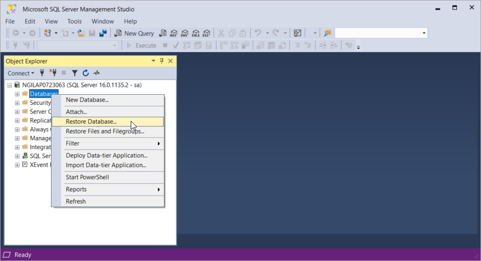
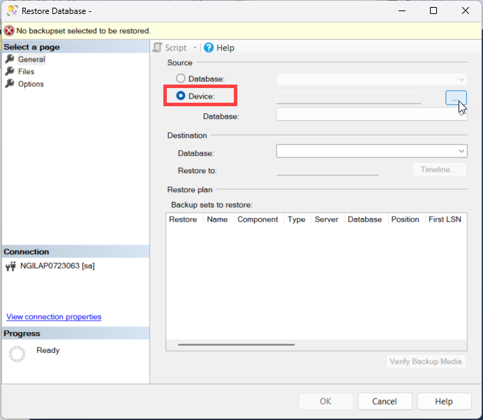
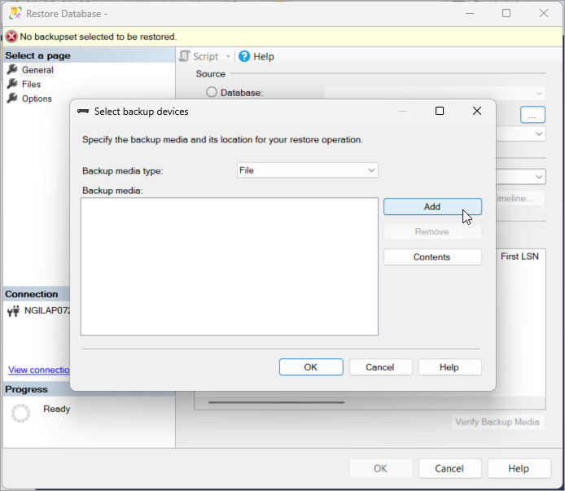
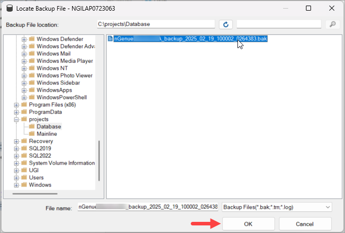
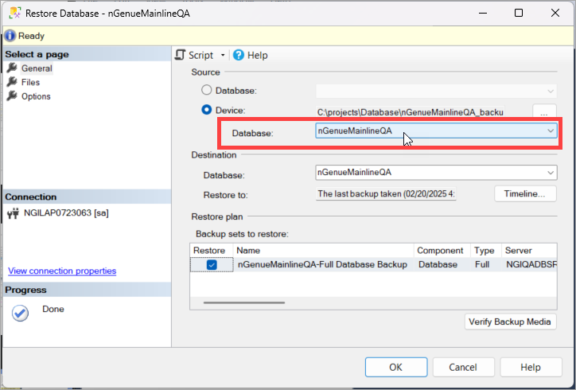
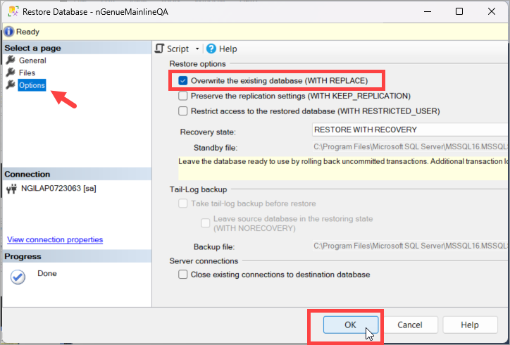
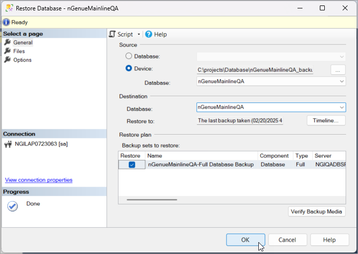
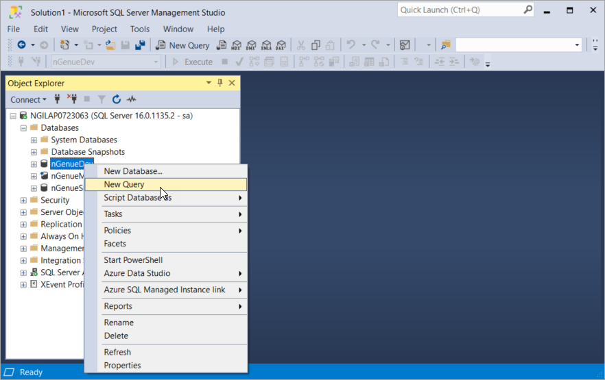
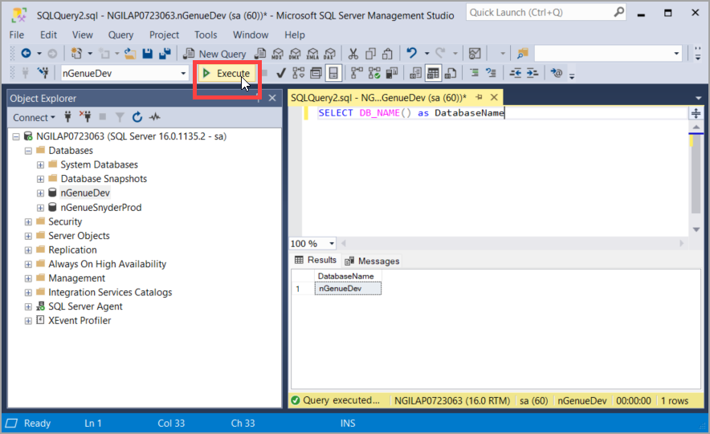

# Restore a database backup using Microsoft SQL Server Management Studio (SSMS)

In the previous article, we have successfully installed both [Microsoft SQL Server](sql_server_installation.md#install-microsoft-sql-server) and [SQL Server Management Studio (SSMS).](./sql_server_installation.md#step-3-install-sql-server-management-tools) In this article, we would be focusing on how to restore a database backup using SSMS.

## How to restore a database in SQL Management Studio

Restoring a database is a critical task that allows you to recover from data loss, corruption, or system failures. It’s also useful when migrating databases between environments. Before starting the restore process, it's essential to ensure you meet certain prerequisites to avoid errors or incomplete restorations.

### Prerequisites

* Ensure you have appropriate permissions to perform restore operations (sysadmin or dbcreator role).
* Have the full backup file (.bak) readily available and accessible. The database backup file to be shared by the nGenue team.
* Confirm that no active connections are using the database you wish to restore.
* Verify adequate disk space on the server to accommodate the database files.

### Steps to restore a database

1. Launch **SQL Server Management Studio (SSMS)** and connect to the appropriate SQL Server instance.
2. Navigate to **Connect > Database** and right-click **Databases** and select **Restore Database...**

3. In the **Restore Database** general screen, choose **Source** as **Device**. Select the **browse (...)** button to open the **Select backup devices** dialog box.

4. Click on **Add** button to select a local backup (.bak) file from your system. After you add the devices you want to the **Backup media** list box, select **OK** to return to the **Restore Database** general screen.

5. In the **Source: Device: Database** list box, the name of the database will be auto-populated.

    !!!note "Note"
        If the database with the same name already exists, select **Options** in the **Select a page** pane and select the **Overwrite the existing database (WITH REPLACE)** checkbox.
        
    

6. In the **Destination** section, the **Database** box is automatically populated with the name of the database to be restored. To change the name of the database, enter the new name in the **Database** box.
7. In the **Restore to** box, leave the default as **To the last backup taken.**
8. In the **Backup sets to restore** grid, select the **backup(s)** to restore.
9. Select **OK.**

### Running a query for your database

1. In the **Object Explorer**, expand **Databases** and locate your new database.
2. Right click on the database and select **New Query.**

3. A new query window appears, where commands can be typed, saved, and executed.
4. Enter your query in the query window and click on the **Execute** button available just above the query window. You may alternatively hit the **F5** key to execute the command.

---