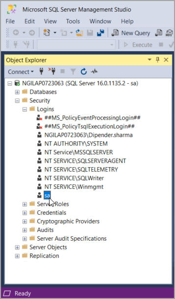
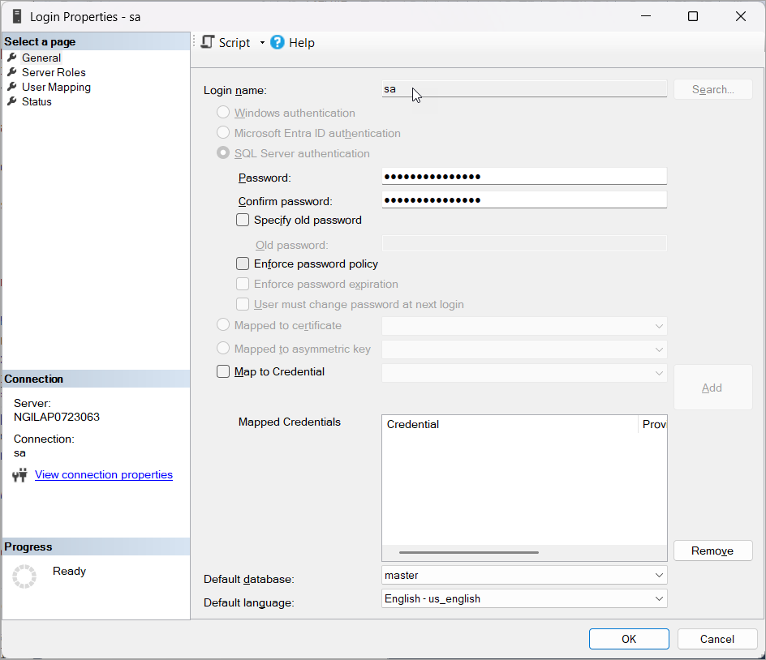
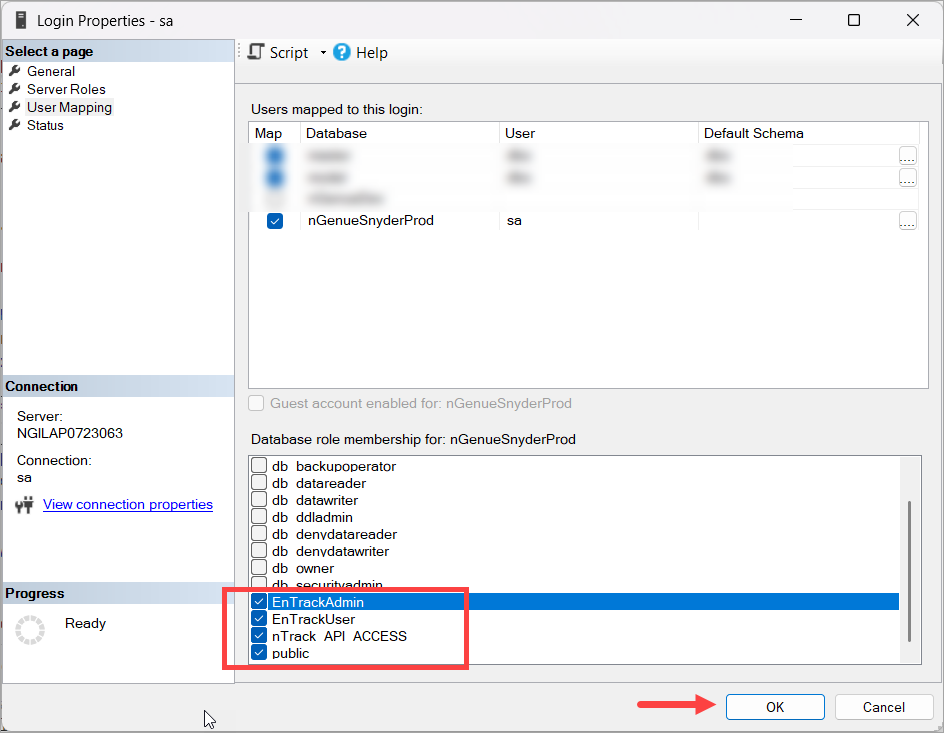
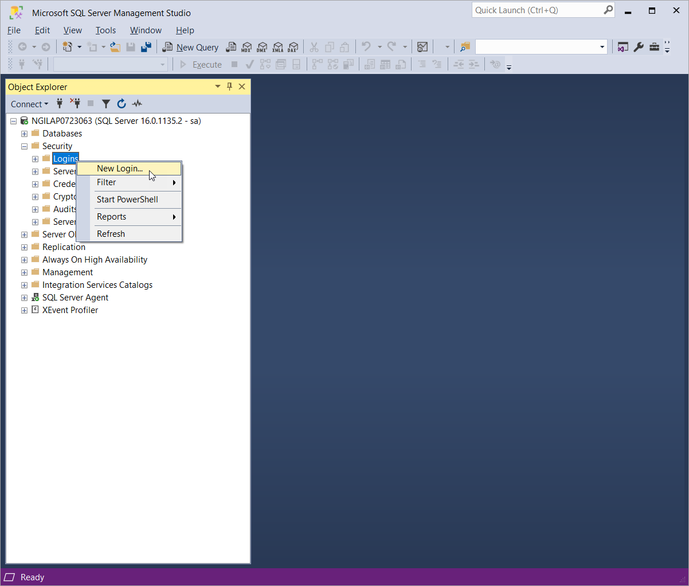
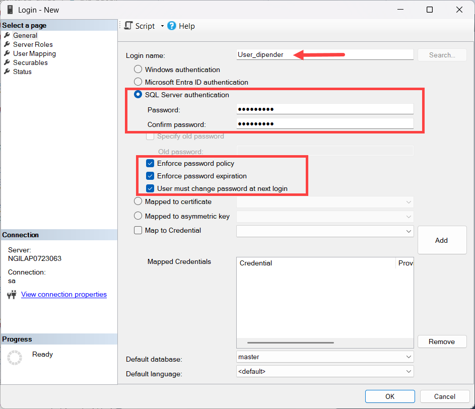
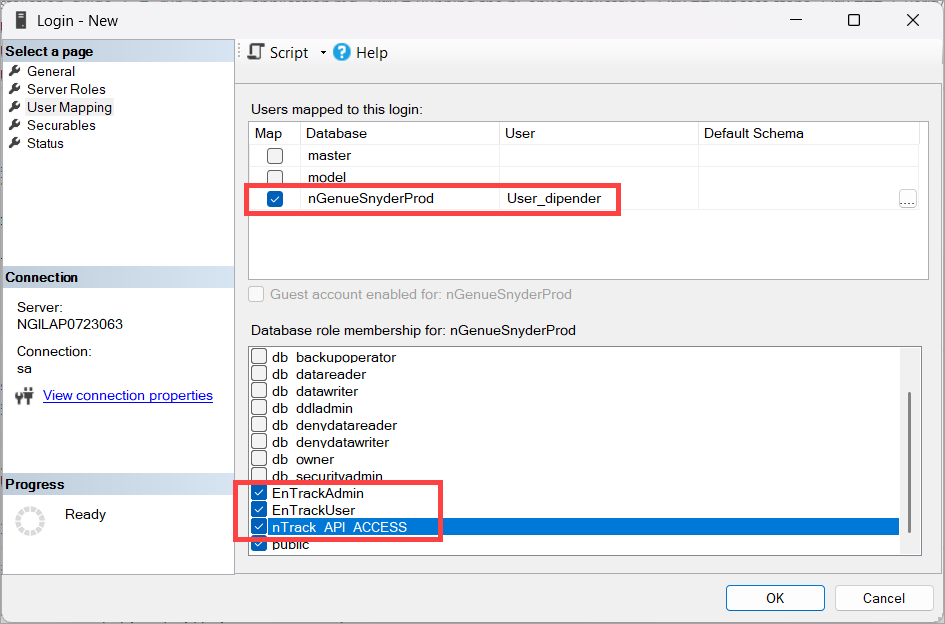
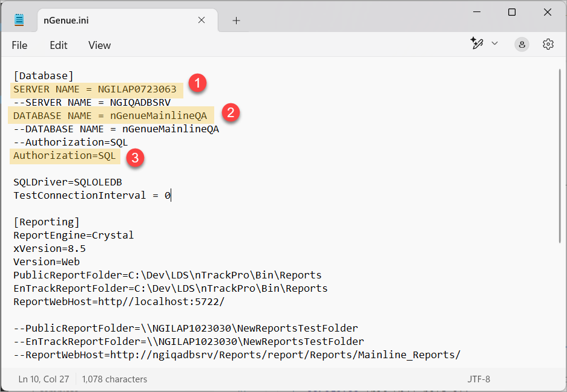

# Running the nGenue application

In the previous article, we successfully [restored a database in Microsoft SQL Server Management Studio (SSMS).](./restore_database.md) The next critical step is to configure the nGenue application by deploying the **nGenue executable (.exe)** and updating the **configuration (.ini)** files. This setup ensures that the application can communicate with the restored database and store logs and generated documents in the correct locations. 

Proper configuration is essential to prevent runtime errors and misconfigurations.

## Prerequisites

Before starting, ensure the following:

* The nGenue team has shared the `nGenue.ini` and `nGenue.exe` files in the user's designated SharePoint location or shared folder.
* The shared folder should have both *read* and *write* permissions for all intended users.
* Administrative access is required to update application settings.
* Confirm that the **SQL Server database** is restored and accessible.

## Process steps

### 1. Download and place nGenue configuration files

1. Access the shared folder provided by the nGenue team.
1. Download the `nGenue.exe` and `nGenue.ini` files.
1. Place both files in the same directory on either the application server or a common shared location.
1. Ensure that both files have identical base names. For example, `nGenue.exe` and `nGenue.ini`.

### 2. Create necessary subfolders

1. In the shared folder or the directory where the executable is placed, create two subfolders:
    1. **Documents** This will be the root folder where the application will store generated PDF reports.
    2. **Logs:** This will hold all application log files.

2. Double-check that all users have read and write access to both **Documents** and **Logs** folders.

### 3. Verify SQL Server roles

1. Run **SQL Server Management Studio (SSMS).**
1. Connect to the server and access the restored database.
2. In the **Object Explorer** window, go to **Security** and expand **Logins**.
    
3. Double click **sa** to open the **Login Properties** window.
    
4. In the **User Mapping** screen, verify the following database role permissions are checked. Assign these roles if they are missing to avoid authorization errors.
    1. **EnTrackAdmin:** Grants administrative permissions.
    1. **EnTrackUser:** Grants standard user access.
    1. **nTrack API ACCESS:** Grants API access.
       
5. Click **OK.**

#### 3.1 Users and permissions

To allow specific users to access the database, you'll need to create a login for your user and give the necessary authorization permissions.

1. In the **Object Explorer** window, go to **Security > Logins.**
3. Right click on **Logins** and select **New Login...**
    
4. On the **General** page, enter the user's login name *(for example: HRDBLogin),* select **SQL Server authentication**, type a password and confirm it, and keep the following items checked:
    1. **Enforce password policy**
    2. **Enforce password expiration**
    3. **User must change password at next login**
      

4. In the **User Mapping** screen, select the database, and assign the necessary permissions.
    
5. Click **OK.**

### 4. Configure the database connection

1. Open the `nGenue.ini` file using a text editor (*Notepad* or *Notepad++* recommended).
1. Update these key parameters:
    * `SERVER NAME = <Database Server Name>` (Replace with your SQL Server instance name)
    * `DATABASE NAME = <nGenue Database Name>` (Replace with the name of your restored nGenue database)
    * `AUTHORIZATION = SQL` or `WINDOWS` (Use `SQL` for SQL Authentication and `WINDOWS` for Windows Authentication)
      

1. Save and close the `nGenue.ini` file.  

### 5. Update Global settings in nGenue

1. Run the `ngenue.exe` executable file to launch the nGenue application.
1. Search for **Global Settings** and navigate to **Global settings > File management.**
1. Update the folder paths to point to the shared locations created:
    1. **Root PDF document storage** folder: `<SharedFolderPath>\Documents`
    1. **Default log** folder: `<SharedFolderPath>\Logs`
1. Save the settings to ensure all documents and logs are stored in the correct directories.

### 6. Final verification

1. Confirm that both `nGenue.exe` and `nGenue.ini` reside in the same folder and share the same base name.
2. Ensure the location is accessible to all intended users and properly secured.
3. Launch the nGenue application and ensure it connects to the database without issue
4. Test by generating a document to verify that the PDF is saved in the **Documents** folder.
5. Check the **Logs** folder to confirm that log entries are being created as expected.

---