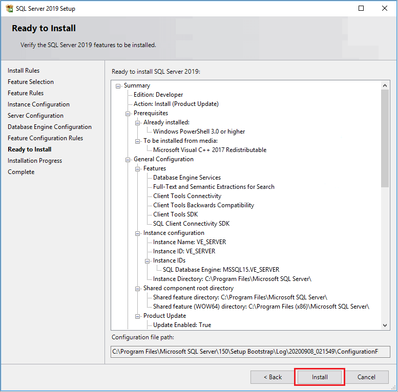
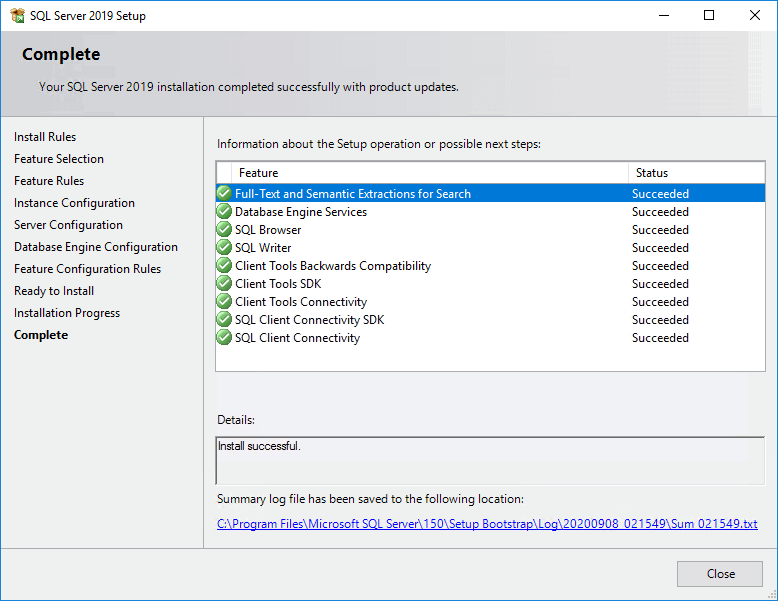
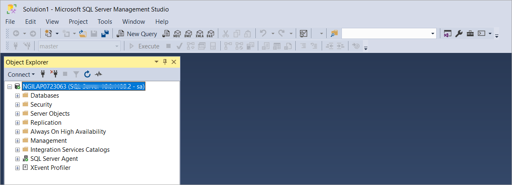

# Install Microsoft SQL Server

The document begins with discussion SQL Server editions, downloading SQL Server from Microsoft and installing SQL Server.

## Supported versions and editions

Microsoft periodically releases new versions of SQL Server. Each new version builds upon the foundation of its predecessors, incorporating new technologies, addressing customer feedback and adapting to evolving industry trends.

The following versions of SQL Server are currently supported:

* **SQL Server 2022 -** The latest major release of SQL Server introduced several new features and enhancements. They include batch mode processing to row store indexes; improved query performance; enhancements to intelligent query processing features.

* **SQL Server 2019 —** This version delivered enhancements in performance, security and availability. New features included intelligent query processing, accelerated database recovery and big data clusters.

* **SQL Server 2017 —** This version introduced support for Linux and Docker containers, as well as new features such as adaptive query processing and automatic tuning.

!!!note "Note"
    These setup instructions are for **SQL Server 2019 Developer Edition,** however can be used in installing other versions from 2019 and latest 2022 editions.

### Editions

Each version of SQL Server has various editions, each with its own set of features, limitations and licensing considerations. Below are the available editions.

* **Standard Edition —** This edition is suitable for small to medium-sized databases; it provides core database functionality along with basic business intelligence and reporting capabilities.

* **Enterprise Edition —** This is the most feature-rich edition of SQL Server, designed for large-scale, mission-critical applications requiring high availability, performance and scalability. It includes advanced features such as advanced security, data warehousing and advanced analytics.

* **Developer Edition —** This is similar to the Enterprise Edition in terms of features but is licensed for use in development and testing environments only. It offers full functionality without production use rights.

## SQL 2019 Developer Edition installation

This guide covers installation of the **Microsoft SQL Server 2019 Developer Edition.**

!!! note "Note"
    These setup instructions are for **SQL Server 2019 Developer Edition,** however can be used in installing other versions from 2019 and latest 2022 editions.

### Step 1: Downloading SQL Server installer

1. Download the SQL Server 2019 Developer Edition from the [Microsoft download center.](https://www.microsoft.com/en-us/sql-server/sql-server-downloads)
2. Once the download is complete, go to the destination folder (i.e. downloads folder on your computer).
3. Click on the installed file to begin the install process.

### Step 2: Installing SQL Server

1. Once the installation starts, you will be presented with installation type. We will focus on the **Custom** install and explain various features of the installation.

2. Choose the **Media location** path. Note the minimum free space and download size and click **Install.**

3. The installation process gets initiated.

3. After a brief period, the **SQL Server Installation Center** screen will open with the **Planning** page displayed.

4. On the left, click **Installation.** On the right, click the option **New SQL Server stand-alone installation or add features to an existing installation.**

6. On the **Product Key** page make sure that the selected Edition is **Developer.** Click **Next.**

7. Accept the license terms and click **Next.**

8. Make sure all **Setup Rules** pass the test and click **Next.**

8. The **Feature Selection** window allows you to select which SQL Server components will be installed. Select the **Instance features** as shown below, as they are mandatory for SQL Server to work with nGenue. Click **Next.**

9. In the **Instance Configuration** window, select **Default instance** and click **Next.**

10. The **Server Configuration** window allows users to configure service accounts. Update the **SQL Server Browser** startup type from *Automatic* to *Manual*. Click **Next.**

11. In the **Database Engine Configuration** window, under the **Server Configuration** tab, select **Mixed Mode** authentication.
Doing so will allow you to set a password for **system administrator (sa)** user.

12. Click on **Add Current User** to set the current user as Administrator for this SQL Server instance. Click **Next.**

13. On the next window, give constent to install **Microsoft R Open** by clicking on the **Accept** button.

14. Similarly, give constent to install **Python** using the **Accept** button.

15. Arriving at the **Feature Configuration Rules** window, make sure all the rule(s) pass the installer scanning test. Then, click **Next.**

14. All configuration steps have been completed. Click **Install** to start the installation.

15. The installation begins.

16. The installation of **SQL Server 2019 Developer Edition** is completed.

### Step 3: Install SQL Server Management Tools

You will need **SQL Server Management Tools** to work with SQL Server, this is the user interface that include components such as the Query interface as well as components for advanced topics such as analysis and integration services as well as the database tuning advisor. SQL Server, like other modern relational databases, uses a client-server architecture. The database itself is the server and contains all of the data and the capability to add, modify, delete, and access the data. A client is needed to connect to the
database and perform specific commands. The most popular client by far for SQL Server is **SQL Server Management Studio (SSMS)**, which you will install in this section. SSMS is very capable and provides many powerful conveniences and capabilities.

1. In the **SQL Server Installation Center** screen, click on the **Installation** tab.

2. Click the option **Install SQL Server Management Tools.**

3. You will be brought to a web page to download the latest release of SQL Server Management Studio. Click on the link to download the latest release and save the file to a location you can remember.

    !!!note "Note"
        You can find the download link under the **Download SSMS** heading.
        
    

4. Once downloaded, run the SSMS installer. The first screen that appear is shown below.

5. Click the **Install** button to begin. A progress screen will appear similar to the following.

6. Let it progress through until completion, then you will see a screen indicating successful setup. Click **Close**. SSMS is installed successfully.

7. Restart the system.

8. Upon restart, run the **Microsoft SQL Server Management Studio** application.

9. As soon as run the application, a **Connect to Server** dialog screen will appear.
    

10. Choose the **Server type** as **Database Engine.**

10. Since MS SQL Server was installed with the default option, the default **Server name** should appear that was specified when installing MS SQL Server.

11. Choose the authentication method as **SQL Server Authentication.**

12. Enter **sa** in the **Login** field and the password that you have set while installing SQL Server *(Refer Step 12 - Installing SQL Server)*.

13. Keep the remaining fields as default and click on **Connect.** You have just connected to your database through SQL Server Management Studio.

---
