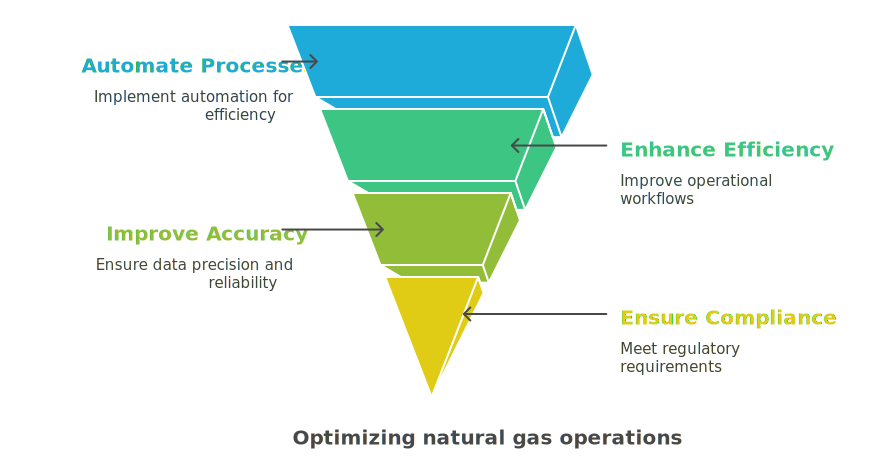
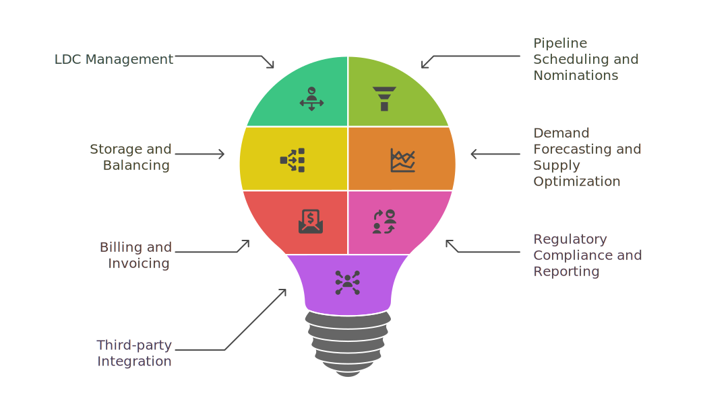

---
hide:
 - toc
---

# Introduction to nGenue

**nGenue** is a comprehensive, end-to-end software solution designed to optimize and streamline natural gas operations for Utilities, Marketers, and Local Distribution Companies (LDCs). It provides a robust and scalable platform that automates critical processes such as pipeline nominations, storage balancing, LDC operations, scheduling, contract management, and compliance reporting. With nGenue, businesses can enhance operational efficiency, improve accuracy, and ensure regulatory compliance while reducing manual efforts.

With a user-friendly interface and powerful automation, nGenue supports seamless data integration, enabling businesses to optimize gas procurement, distribution, and billing. Whether for suppliers, marketers, or utilities, nGenue delivers a flexible and efficient platform tailored to the evolving needs of the natural gas sector.

## Key functionalities

### 1. LDC management

**nGenue** provides seamless integration with Local Distribution Companies (LDCs), enabling users to manage contracts, nominations, imbalances, and invoicing efficiently. The system supports multiple LDCs with different operational and tariff structures, ensuring compliance with their specific requirements. Users can track pipeline deliveries, reconcile imbalances, and generate reports to facilitate accurate billing and settlements.

### 2. Pipeline scheduling and nominations

Managing gas transportation across pipelines requires precise scheduling and nomination processes. nGenue automates pipeline nominations, allowing users to submit, track, and modify nominations in real-time. The system ensures compliance with pipeline rules, monitors capacity constraints, and provides alerts for critical events, reducing the risk of imbalances and penalties.

### 3. Storage and balancing

nGenue offers real-time visibility into gas storage assets, allowing businesses to optimize storage injections and withdrawals based on market conditions. The system helps users track inventory levels, manage storage contracts, and balance supply with demand efficiently. Automated alerts notify users of imbalance situations, ensuring proactive decision-making to minimize financial exposure.

### 4. Demand forecasting and supply optimization

Accurate demand forecasting is critical for optimizing gas procurement and ensuring supply reliability. nGenue leverages historical data, weather patterns, and market trends to predict demand fluctuations. Users can align supply contracts with projected demand, optimize procurement strategies, and mitigate risks associated with over- or under-supply.

### 5. Billing and invoicing

nGenue automates the billing and invoicing process, reducing manual errors and improving financial accuracy. The system supports complex rate structures, contract-specific pricing, and multi-tiered billing rules. Users can generate detailed invoices, track payments, and reconcile accounts with built-in financial reporting tools.

### 6. Regulatory compliance and reporting

Compliance with industry regulations is a key requirement for natural gas businesses. nGenue includes built-in compliance tools that help organizations meet regulatory obligations, such as FERC, NAESB, and state-specific reporting requirements. The system generates compliance reports, maintains audit trails, and ensures that all transactions align with industry standards.

### 7. Third-party integration

To enhance operational efficiency, nGenue integrates seamlessly with third-party systems, including:

* **Electronic Data Interchange (EDI):** Automates data exchange with pipelines, LDCs, and trading partners.
* **Accounting systems:** Syncs financial transactions with ERP and accounting platforms.
* **Trading platforms:** Connects with energy trading systems for seamless deal execution.
* **Market data providers:** Ingests real-time pricing and market intelligence for informed decision-making.

These integrations enable businesses to create a fully connected ecosystem, reducing data silos and enhancing process automation.

---