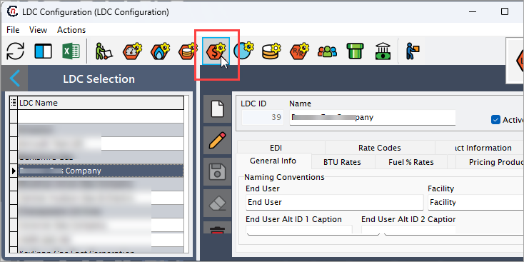
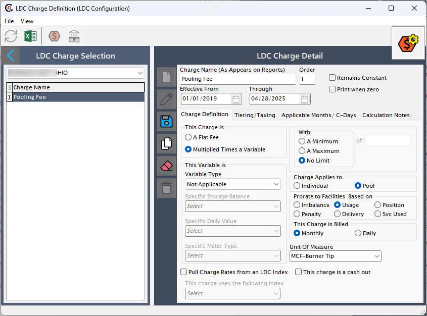
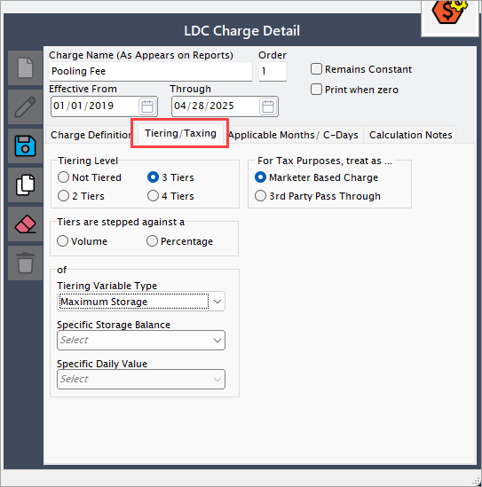
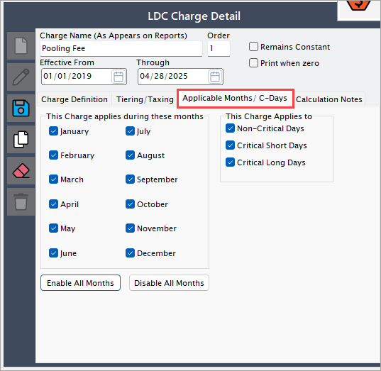

# Understanding LDC charge definition

The **LDC charge definition** module is used to define and manage the different charges that a Local Distribution Company (LDC) applies to customers or facilities. These charges can be either fixed or variable and are important for correctly calculating the cost of services like transportation, delivery, storage, and usage of natural gas.

Setting up the LDC charges properly ensures:

* Accurate billing for customers.
* Transparent reporting of costs.
* Correct application of tariffs and rates based on usage patterns or contractual agreements.

## Configure a new LDC charge definition

This step-by-step guide will help you set up LDC charges efficiently while providing all the necessary details for proper configuration and application.

### Step 1: Access LDC charge definition screen

There are two ways to access the **LDC configuration** screen:

 1. Search for *LDC charge definition* from the nGenue homepage.
 2. Navigate via the **LDC configuration** screen. From this screen, select the desired LDC from the list, and then click on the **Open LDC charge definitions** icon to take you to the LDC charge definition screen.
    

You can view or edit existing LDC charge definition or create a new one. The table below describes the available icons and their functions:

<!--  -->

| Icons      | Description                          |
| ----------- | ------------------------------------ |
|         | Add a new LDC charge definition record. |
|     | Edit the LDC charge definition record detail. |
|         |  Save the LDC charge definition record. |
|   | Cancel the updates being made to the LDC charge definition record. |
|   | Delete a LDC charge definition record. |

### Step 2:  Enter the LDC charge cofiguration details

1. Click on the **Add new LDC charge definition record** button under **LDC charge detail**.
3. Enter a **Charge name**. This will appear in billing reports and invoices. It identifies the charge clearly for internal teams and customers.
4. Complete the following details:
     1. Set the **effective dates** i.e., the start and end dates during which this charge is active. This ensures the charge is applied only within the valid timeframe and supports future changes without deleting older rules.
     2. In the **Order** field, set the sequence in which charges are processed or displayed. This is useful if multiple charges need to be applied in a specific order for calculations.
     3. Select the **Remains constant** checkbox to indicate whether the charge amount remains the same over time. This is helpful for charges that do not vary with conditions like volume or time of year.
     4. Select the **Print when zero** checkbox if you like you to force the charge to appear even if the calculated amount is zero.This is useful for audit tracking or compliance needs where every possible charge must be shown.
     <!-- 2. Define the charge type (flat fee or multiplied by a variable). 3. Specify applicable variables and rules. -->
5. Configure additional options like tiering, applicable months, and calculation notes if needed available in different tabs.
    

#### Charge definition tab

| Field | Description | Why this field is required? |
|------|-------------|------------|
| This charge is | Radio button to select how the charge will be calculated: <ul><li><b>A flat fee</b>: A fixed amount that does not vary with usage or other variables.</li><li><b>Multiplied times a variable</b>: The charge is based on a selected variable, such as usage, imbalance, or storage.</li></ul> | Defines how the charge is calculated. Critical for correct billing logic. |
| This variable is | Selection for what variable the charge is multiplied by, if applicable (e.g., usage, imbalance, etc.). | Links the charge amount directly to measurable operational activities. |
| Variable type | Further specifies the type of variable the charge is based on. Available options include: <ul><li><b>A Meter Type</b>: Selects a specific meter category (e.g., daily meter, cycle meter) for charges based on meter readings.</li><li><b>Net Positive Imbalance</b>: Applies when delivered gas exceeds actual usage, resulting in a positive imbalance.</li><li><b>Net Negative Imbalance</b>: Applies when actual usage exceeds delivered gas, resulting in a negative imbalance.</li><li><b>Subscribed Balancing Service</b>: Applies charges based on the volume of balancing service that the customer has subscribed to.</li><li><b>Used Balancing Service</b>: Applies charges based on the actual balancing service volumes used during the billing period.</li><li><b>Cash Out - Sales</b>: Applies when the customer sells surplus gas to the pipeline (cash-out sales).</li><li><b>Cash Out - Purchases</b>: Applies when the customer purchases deficit gas from the pipeline (cash-out purchases).</li><li><b>Cycle Meter Read</b>: Applies charges based on meter readings taken at specific billing cycles.</li></ul> | Necessary to fine-tune how the charge should vary according to operations. |
| Pull charge rates from an LDC index | Checkbox to indicate if the system should automatically pull charge rates from an external or predefined index. | Reduces manual updates and ensures that rates reflect market/regulatory updates. |
| This charge uses the following index | If pulling rates from an index, specifies which index to use. | Important for dynamic rate calculation based on external pricing changes. |
| With | Allows setting additional boundaries for the calculated charge: <ul><li><b>A minimum amount</b>: Ensures that even if the calculated amount is very low, a baseline minimum is charged.</li><li><b>A maximum amount</b>: Places an upper limit on the charge, no matter how large the variable becomes.</li><li><b>No limit</b>: No minimum or maximum is applied; the calculated charge is used as-is.</li></ul> | Prevents unreasonable charge amounts and supports contractual limits. |
| Charge applies to | Defines the level at which the charge is applied: <ul><li><b>Individual</b>: Applies the charge to a single facility, meter, or customer account.</li><li><b>Pool</b>: Applies the charge collectively to a group of facilities or customer accounts.</li></ul> | Controls whether charges are applied at a granular level or a group level. |
| Prorate to facilities based on | Specifies how charges should be distributed if multiple facilities are involved. Options include: <ul><li><b>Imbalance</b>: Distribution based on imbalance volumes at each facility.</li><li><b>Usage</b>: Distribution based on the amount of usage at each facility.</li><li><b>Position</b>: Distribution based on storage position or pipeline nominations.</li><li><b>Penalty</b>: Distribution based on any penalties incurred by facilities.</li><li><b>Delivery</b>: Distribution based on the amount of gas delivered to each facility.</li><li><b>Service used</b>: Distribution based on the services (like balancing or storage) utilized by each facility.</li></ul> | Ensures fair distribution of charges across facilities based on actual usage, imbalances, or other key events. |
| This charge is billed | Selection for how often the charge should be billed: <ul><li><b>Monthly</b>: Charges are billed once per month, typically at the end of the billing cycle.</li><li><b>Daily</b>: Charges are calculated and billed on a daily basis.</li></ul> | Controls the billing frequency for accurate financial tracking. |
| Unit of measure | Unit associated with the charge (e.g., MMBtu, Therms). | Essential for converting raw data into meaningful charge calculations. |
| This charge is a cash out | Checkbox to indicate if this charge involves a direct cash settlement instead of standard billing. Typically used for imbalance settlements. | Important for cases where financial settlement (rather than invoice) is required. |

#### Tiering/ Taxing tab

| Field | Description | Why this field is required? |
|------|-------------|------------|
| Tiering level | Radio button to define the number of tiers for the charge: <ul><li><b>Not tiered</b>: No tiering applied; one single rate applies.</li><li><b>2 tiers</b>: Two levels of rates based on thresholds.</li><li><b>3 tiers</b>: Three levels of rates based on thresholds.</li><li><b>4 tiers</b>: Four levels of rates based on thresholds.</li></ul> | Determines whether a single rate or multiple tiered rates are applied depending on usage or volume brackets. |
| Tiers are stepped against | Selection to determine what basis is used to evaluate the tiers: <ul><li><b>Volume</b>: Tiers are based on absolute quantity (e.g., MMBtu, Therms).</li><li><b>Percentage</b>: Tiers are based on a percentage of a target or limit (e.g., contracted volume).</li></ul> | Controls how the system calculates tier eligibility and rate application. |
| Tiering variable type | Dropdown to select the operational basis used for tiering, such as: <ul><li><b>Not applicable</b>: No specific operational variable is tied to the tiering calculation.</li><li><b>Maximum storage</b>: Based on the maximum volume stored over a time period.</li><li><b>Storage level</b>: Based on the storage inventory at a given point in time.</li><li><b>Penalty therms</b>: Based on quantities subject to penalties due to contractual or operational violations.</li><li><b>A daily quantity</b>: Based on a quantity measured each day (e.g., daily usage, nominations).</li><li><b>Nomination</b>: Based on nominated quantities submitted for scheduling services (e.g., transportation, storage).</li><li><b>Deliveries</b>: Based on actual delivered volumes to a facility or delivery point.</li><li><b>Consumption</b>: Based on the end customer's or facility's actual gas consumption.</li></ul> | Specifies the operational quantity that determines which tier applies. Proper selection is critical to ensure accurate tier-based rate application. |
| Specific storage balance | (Optional) Additional filter where tiering is based on a selected specific storage balance if applicable. | Allows fine-grained control over how storage-related activities affect tiered charges. |
| Specific daily value | (Optional) Additional filter where tiering is based on specific daily metrics if applicable. | Supports daily-based tier calculations, such as daily nominations or usage thresholds. |
| For tax purposes, treat as | Radio button to define how this charge should be treated for taxation: <ul><li><b>Marketer based charge</b>: Treated as a charge from the marketer's side for tax calculations.</li><li><b>3rd party pass through</b>: Treated as a direct pass-through of a third party’s cost, usually tax-exempt or handled differently.</li></ul> | Ensures accurate tax handling and reporting depending on the charge's nature. |

#### Months/ C-Days tab

|Field |Description |Why this field is required? |
|-----|-----------|----------|
|This charge applies during these months| Selection for which months the charge applies.| Defines the time period during which the charge is applicable.|
|This charge applies to|Defines what the charge applies to: <ul><li><b>Non-critical days</b>: Refers to days with regular or non-urgent operational conditions, where no special urgency or high impact is present.</li><li><b>Critical short days</b>: Refers to days with urgent or demanding operational conditions that last for a short period, typically due to sudden surges or temporary limitations.</li><li><b>Critical long days</b>: Refers to days with critical conditions that extend over a longer duration, usually involving high demand or operational challenges that last for a prolonged period.</li></ul>|Specifies the types of days or periods to which the charge is applicable.|
|Enable all months| Checkbox to enable all months for the charge to apply.|Enables the charge to apply throughout the entire year.|
|Disable all months| Checkbox to disable all months for the charge to apply.|Disables the charge for the entire year.|

#### Calculation notes tab

Add any additional information or notes as needed. This section can include clarifications, special instructions, or considerations related to the LDC charge definition. Ensure that any important details that could affect the charge calculation or application are included here for future reference.

### Step 3: Save the changes

1. Click on the **Save** icon to save the LDC charge definition. Once saved, the configuration will be displayed in the **LDC charge selection** panel under the LDC that was selected earlier.  
2. If you need to modify the charge definition later, you can revisit the saved configuration in the panel and make any necessary adjustments. Saving the configuration ensures that the LDC charge definition is correctly applied and retained for future use.

<!-- ## Example scenario

Suppose the LDC wants to charge customers based on their **daily gas usage** with a minimum charge of **$50 per month**:

- **Charge Name**: Daily Usage Charge
- **Order**: 1
- **Effective From**: 04/01/2025
- **Through**: 03/31/2026
- **This Charge is**: Multiplied Times a Variable
- **This Variable is**: Daily Usage
- **Pull Charge Rates from an LDC Index**: No
- **With**: A Minimum of $50
- **Charge Applies to**: Individual
- **Prorate to Facilities Based on**: Usage
- **This Charge is Billed**: Monthly
- **Unit Of Measure**: Dth
- **This charge is a cash out**: Unchecked -->

<!-- ## Example Scenario

In this example, the LDC wants to charge customers based on their **daily gas usage**, with a minimum charge of **$50 per month**. Here's how to configure the LDC charge:

* **Charge name**: Daily Usage Charge  
* **Order**: 1  
* **Effective from**: 04/01/2025  
* **Through**: 03/31/2026  
* **This charge is**: Multiplied times a variable  
* **This variable is**: Daily usage  
* **Pull charge rates from an LDC index**: No  
* **With**: A minimum of $50  
* **Charge applies to**: Individual  
* **Prorate to facilities based on**: Usage  
* **This charge is billed**: Monthly  
* **Unit of measure**: Dth  
* **This charge is a cash out**: Unchecked -->

## Example scenario

In this example, the LDC wants to charge customers based on their **daily gas usage**, with a minimum charge of **$50 per month**. Here's how to configure the LDC charge:

* **Charge name**: Daily usage charge
    * *Description*: Enter a descriptive name for the charge that will appear on billing reports and invoices.

* **Order**: 1  
    * *Description*: Set the sequence in which this charge will be applied or displayed. In this case, it is the first charge applied.

* **Effective from**: 04/01/2025  
    * *Description*: Specify the start date for when this charge becomes active.

* **Through**: 03/31/2026  
    * *Description*: Specify the end date for when this charge is no longer applicable.

* **This charge is**: Multiplied times a variable  
    * *Description*: Choose this option if the charge is based on a variable such as daily usage.

* **This variable is**: Daily usage  
    * *Description*: Select or enter the variable on which the charge will be calculated. In this case, it is based on daily gas usage.

* **Pull charge rates from an LDC index**: No  
    * *Description*: Indicate whether the charge rates should be pulled from an LDC index. If not, select ***"No."***

* **With**: A minimum of $50  
    * *Description*: Set the minimum charge amount. This ensures the customer is charged at least $50, even if the calculated charge based on usage is lower.

* **Charge applies to**: Individual  
    * *Description*: Specify whether the charge applies to individual customers or facilities.

* **Prorate to facilities based on**: Usage  
    * *Description*: Choose whether the charge should be prorated to facilities based on usage. In this case, prorating is based on daily usage.

* **This charge is billed**: Monthly  
    * *Description*: Indicate the billing frequency for this charge. In this example, it is billed monthly.

* **Unit of measure**: Dth  
    * *Description*: Enter the unit of measure for the charge. In this case, it is in Dth (Dekatherms), a unit used to measure gas usage.

* **This charge is a cash out**: Unchecked  
    * *Description*: Specify whether this charge is a cash-out charge. In this case, it is unchecked, meaning it is not a cash-out charge.

---

