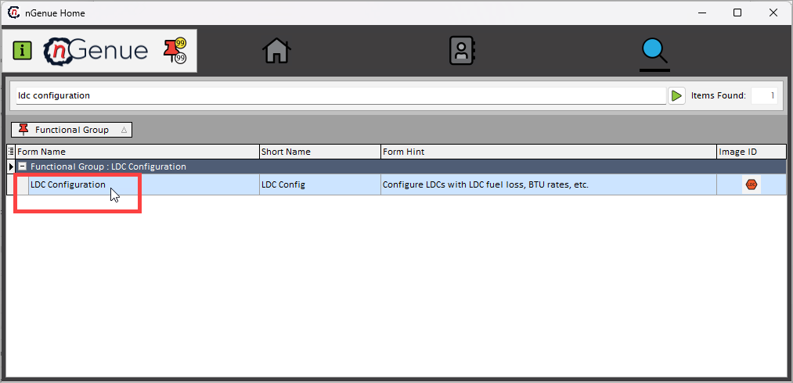
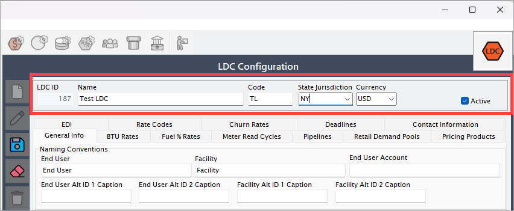
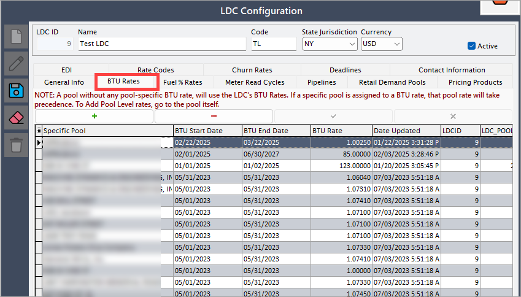

# Create a new LDC

The following article is designed to capture and manage essential details about Local Distribution Company (LDC) in the natural gas industry. It ensures that all relevant information—such as identification, operational regions, and status—is accurately recorded for efficient management and reporting.

The **LDC setup** is the foundational step in the retail configuration process. It defines the utility company responsible for delivering gas to end users and links to key operational regions and business units.

## Prerequisites

1. You must have the requisite *add* or *modify* permissions in the **LDC configuration** screen.

2. The following fields are required and must be configured before saving the LDC: 
       1. **[Business unit](../getting_started/inbook_structure.md)**: A **business unit** represents a distinct operational or financial division within your organization. It is typically aligned with a legal entity or a specific line of business and is used to track financial transactions, reporting, and operational responsibilities.
       2. **[Supply region](../getting_started/supply_region.md)**: A **supply region** defines the geographical area where the gas is physically supplied or delivered. It is used to group customers and contracts based on their physical delivery zones.
       3. **Sales region**: A **sales region** represents a commercial or marketing territory used to manage and track sales activities. You can configure a new one in the **Sales Area** screen within the nGenue application.
      
        Each of these fields must be pre-configured in their respective screens.

## Procedure

### Step 1: Navigate to the LDC configuration screen

1. Log in to the **nGenue** application.
2. Click the **Search** icon and enter *LDC configuration* in the search bar.
 
3. Double-click **LDC configuration** to open the respective screen.
4. The **LDC Configuration** screen is designed to help you manage LDC within the system. It is divided into two main sections: **LDC selection** and **LDC configuration.**

   
#### LDC selection 

1. This section displays a list of all LDC created so far. 
2. You can quickly browse through the list and select an LDC to view or modify its configuration.
3. The filter option allows you to quickly find a specific LDC based on certain criteria.

#### LDC configuration

When you select an LDC from the selection panel, its detailed configuration is displayed in this section.

1. This includes attributes like LDC name, code, description, associated pipeline paths, rate schedules, storage options, and any other relevant setup details.
2. The configuration panel allows you to view, update, or fine-tune the settings of the selected LDC. The table below describes the available icons and their functions:

      | Icons      | Description                          |
      | ----------- | ------------------------------------ |
      |         | Add a new LDC record |
      |     | Edit the LDC record detail. |
      |         |  Save the LDC record. |
      |   | Cancel the updates being made to the LDC record. |
      |   | Delete a LDC record. |

### Step 2:  Enter the basic LDC details

1. In the **LDC configuration** section, click on the **Add** button.
 

2. You’ll need to provide the following information:

      1. **Name:** Enter the full name of the LDC.
      2. **Code:** Provide a short, unique code to identify the LDC within the system.
      3. **State jurisdiction:** Select the state or regulatory jurisdiction under which this LDC operates. This ensures correct tax rates, tariffs, and regulatory compliance are applied.
      4. **Currency:** Choose the currency in which transactions or rate schedules related to this LDC will be maintained. For example: USD, CAD, MXN.
      5. **Active (checkbox):** Check this box if the LDC is active and should be available for use in the system. If left unchecked, the LDC is created in an inactive state and will not appear in operational workflows.
       

3. The **LDC configuration** screen is also divided into multiple tabs, each designed to capture specific details required to manage a Local Distribution Company (LDC) in the system. These tabs collectively help define operational, financial, compliance, and contact-related information for an LDC, ensuring smooth gas distribution, billing, and reporting processes. 

Below is a detailed explanation of each tab:

#### 1. General info tab

The **General info** tab is the foundation of LDC setup. It captures the core identification and operational status of the LDC. The fields in this section ensure the system correctly identifies and recognizes the LDC across different modules and workflows.

*Naming conventions:*

| Field Name | Description |
|---|---|
| End User | Label or caption used to represent the end customer in system displays and reports.|
| Facility | Label for representing facility-level information linked to an end user. |
| End User Account | Caption or label for an end user’s account number. |
| End User Alt ID 1 Caption | Custom field to define an alternative identifier (Alt ID 1) label for the end user. |
| End User Alt ID 2 Caption | Custom field to define an alternative identifier (Alt ID 2) label for the end user. |
| Facility Alt ID 1 Caption | Custom field to define an alternative identifier (Alt ID 1) label for the facility. |
| Facility Alt ID 2 Caption | Custom field to define an alternative identifier (Alt ID 2) label for the facility. |

*Default values for end users*

| Field Name| Description |
|--- |--- |
| Default Weather Zone| Pre-defined weather zone for new end users, used in forecasting and analysis. |
| Default Supply Region | Default supply region automatically assigned to end users unless overridden. |
| Holiday Set | Defines the default set of holidays used for billing cycles and other date-based calculations. |
| Time Zone | Default time zone that applies to the end users and their transactions.|
| Default Sales Region| Sales region automatically assigned for new end user accounts. |
| Default Business Unit | The business unit that will be pre-selected for new end users under this LDC.|

*Other LDC rules*

| Field Name| Description|
|---|---|
| Treatment of Sales Tax on LDC Charge| Dropdown selection that determines how sales tax should be treated for LDC charges (taxable or exempt).|
| LDC Require Specific Delivery Points Alloc | Checkbox indicating if delivery point allocations are required for this LDC. |
| Default Physical Supply Curve | Dropdown to select the default cost or supply curve index used for pricing and forecasting.|

*Direct connect information*

| Field Name| Description|
|---|---|
| Treat This LDC as a Direct Connect| Checkbox to indicate if this LDC is considered a direct connect. If enabled, additional pipeline fields appear. |
| Direct Connect Pipeline | Pipeline selection used when the direct connect checkbox is enabled. |
| Direct Connect Delivery Point | Delivery point selection used when the direct connect checkbox is enabled. |

*GL account information*

| Field Name| Description|
|---|---|
| GL Expense Account| The general ledger account for recording expenses related to this LDC. |
| GL A/P Account| The general ledger account for accounts payable linked to this LDC.|
| GL A/R Account| The general ledger account for accounts receivable linked to this LDC. |
| GL Income Account | The general ledger account for recording income generated via this LDC.|

#### 2. BTU rates tab

The **BTU rates** tab is used to define the British Thermal Unit (BTU) conversion factors. These values are critical in converting gas volumes into energy units for billing, balancing, and reporting.

**Key fields:**

* **Specific pool:** Enter the name of the pool. If no pool-specific BTU rate is defined, the LDC’s BTU rates will apply by default. However, if a BTU rate is assigned to the pool, that pool-specific rate will override the LDC rate.
* **BTU start and end date:** The start date and the end date for the BTU rate.
* **BTU rate:** The energy conversion factor.
* **Date updated:** The date on which the BTU rates is defined or updated.

#### 3. Fuel % rates tab

The **Fuel % rates** tab allows configuration of fuel loss percentages applied during gas transportation. These fuel rates impact cost calculations and customer billing.

**Fields included:**

* **Effective date**: Date from which the fuel rate is applicable.
* **Fuel % rate**: Percentage of fuel loss.
* **Applicable pipeline/Zone**: (If applicable) specific pipelines the rate applies to.

#### 4. Meter read cycles tab

The **Meter read cycles** tab defines how frequently meter readings are collected, enabling accurate billing cycles and usage tracking.

**Key fields:**

* **Cycle name/code**: Identifier for the meter reading cycle.
* **Frequency**: Monthly, bi-monthly, quarterly, or custom.
* **Start/End dates**: Defines the cycle duration.

#### 5. Pipelines tab

The **Pipelines** tab associates pipelines with the LDC. It is essential for mapping transportation infrastructure and ensuring proper scheduling and balancing.

**Fields included:**

* **Pipeline name**: Name of the associated pipeline.
* **Pipeline code**: Unique code.
* **Capacity allocations**: (If applicable) details of assigned capacity.

#### 6. Retail demand pools tab

The **Retail demand pools** tab allows grouping retail customers for demand forecasting and balancing purposes. This feature helps streamline supply management and minimize imbalances.

**Key fields:**

* **Pool name**: Identifier for the demand pool.
* **Pool type**: Daily, weekly, or monthly balancing pool.
* **Associated pipelines or city gates**: Links to transportation infrastructure.

#### 7. Pricing products tab

The **Pricing products** tab enables configuration of various pricing structures that can be applied to customers under this LDC. It supports different pricing methodologies that fit retail and wholesale scenarios.

**Fields included:**

* **Product name**: Name of the pricing product.
* **Pricing type**: Fixed, variable, or index-based pricing.
* **Effective dates**: Duration during which the product pricing is valid.

#### 8. EDI tab

The **EDI** (Electronic Data Interchange) tab facilitates automated data exchange between your system and the LDC. Proper EDI setup ensures that transactions, nominations, and invoices are transferred electronically without manual intervention.

**Key fields:**

* **Trading partner ID**: Unique identifier for EDI communication.
* **Contact information**: Names and contact details of EDI personnel.
* **Transmission settings**: Protocols and server details (FTP, SFTP, API) for transmitting and receiving EDI files.

#### 9. Rate codes tab

The **Rate codes** tab allows for the definition of rate codes that form the basis of customer billing. Rate codes determine the rates applied to different services and products.

**Fields included:**

* **Rate code**: Code used in billing and contracts.
* **Description**: Explanation of the rate code.
* **Linked products/services**: Products or services associated with the rate.

#### 10. Churn rates tab

The **Churn rates** tab is used for defining expected customer attrition rates. Tracking churn rates helps in forecasting revenue and planning customer retention strategies.

**Key fields:**

* **Time period**: The duration for which churn rate applies (monthly/yearly).
* **Churn % rate**: Expected percentage of customer turnover.

#### 11. Deadline tab

The **Deadline** tab allows configuration of various operational and regulatory deadlines to ensure timely compliance and task execution.

**Fields included:**

* **Deadline type**: Type of deadline, such as nominations, balancing submission, invoicing.
* **Due date and time**: When the task is due.
* **Due date and time**: The deadline date and time.
* **Recurrence**: Defines if the deadline is recurring—weekly, monthly, etc.

#### 12. Contact information tab

The **Contact information** tab captures essential contact details of key LDC representatives. Having up-to-date contact details is crucial for addressing operational, billing, and emergency issues.

**Key fields:**

* **Contact name**: Name of the LDC representative.
* **Designation**: Role or title of the contact person.
* **Phone number & email**: Standard communication channels.
* **Emergency contacts**: Optional contacts for urgent support.

These tabs together provide a comprehensive framework for configuring LDC in the system. Accurate and complete data entry in each tab is critical for successful operation, compliance, and customer satisfaction.

### Step 3: Validate and save the LDC configuration

1. Review all details to ensure accuracy and click on **Save** button to finalize the LDC creation.

## Next steps

1. Configure [rate riders](./ldcs_rider/configure_ldcs_riders.md) from the **LDC configurations** screen.

---