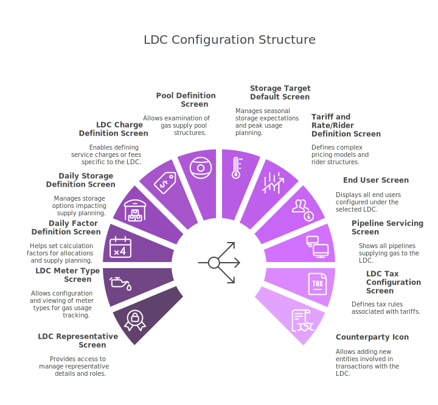
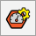

# Navigate to the LDC configuration screen

You will be able to access LDC configuration page by typing *LDC configuration* in the quick search available in the nGenue application homepage. Select **LDC configuration** and this will redirect you to the **LDC configuration** screen.

## Available navigational links

The **LDC configuration** screen includes a set of icons located in the top-header menu, each acting as a navigational link to related screens within the nGenue application. These links are designed to streamline access to interconnected configuration modules, allowing users to seamlessly manage all aspects of an LDC without navigating away from the current screen.

For example, users can quickly access the **LDC representative** screen to review or update contact details and roles of representatives responsible for that LDC. The **LDC meter type** screen allows users to view and configure the types of meters used by the LDC for tracking gas usage. Similarly, the **daily factor definition** screen and **daily storage definition** screen help in setting calculation factors and storage options that impact allocations and supply planning.

By centralizing all these links on a single screen, the application enhances user productivity and ensures consistent and efficient LDC configuration management across multiple business functions.

## Fields and features available

You'll see this when you land into the **LDC configuration** page.

Let's get to know the main areas of the page:

### The menu

You see a list of icons with the context in the top-header.

| Menu/Icons | Description | Purpose |
| ----------- | ----------- | ------- |
|  | Refresh supply deals record. | Updates the grid with the latest data from the database to ensure accuracy. |
|  | Configure grid columns. | Customize which data columns are visible in the grid to suit user preferences. |
|  | Open grid data in excel. | Export the currently displayed grid data to Excel for offline review or analysis. |
|  | Open LDC representative screen. | Access and manage LDC representative contact and role information. |
|  | Open LDC meter type screen. | View or modify the meter types associated with the selected LDC. |
|  | Open daily factor definition screen | Define or edit daily factors used for calculations like allocation or balancing. |
|  | Open storage type definition screen. | Manage and configure different types of storage options available for the LDC. |
|  | Open LDC charge definition screen. | Configure and manage charges applicable to the LDC like service fees or tariffs. |
|  | View pool definition screen. | View how pools are defined and linked to the LDC for supply management. |
|  | Open storage target default screen. | Set default storage targets and configurations for seasonal or peak usage. |
|  | Open tariff and rate/rider definition screen. | Define or adjust rates, tariffs, and riders applicable to the LDC. |
|  | View the list of end users configured for the LDC. | Access the list of customers or entities connected to the LDC for tracking or updates. |
|  | View pipelines servicing the current LDC. | See which pipelines are associated with delivering gas to the LDC. |
|  | Configure taxes for LDC tariff. | Set up and adjust tax rules applied to tariffs specific to the LDC. |
|  | Add new counterparty | Create a new counterparty entity that can transact with the LDC. |

### Main body

The main body is divided into two sections- **LDC selection** and **LDC configuration.** 

#### LDC selection 

1. This section displays a list of all LDC created so far. 
2. You can quickly browse through the list and select an LDC to view or modify its configuration.
3. The filter option allows you to quickly find a specific LDC based on certain criteria.

#### LDC configuration

When you select an LDC from the selection panel, its detailed configuration is displayed in this section.

1. This includes attributes like LDC name, code, description, associated pipeline paths, rate schedules, storage options, and any other relevant setup details.
2. The configuration panel allows you to view, update, or fine-tune the settings of the selected LDC. The table below describes the available icons and their functions:

      | Icons      | Description                          |
      | ----------- | ------------------------------------ |
      |         | Add a new LDC record |
      |     | Edit the LDC record detail. |
      |         |  Save the LDC record. |
      |   | Cancel the updates being made to the LDC record. |
      |   | Delete a LDC record. |

---

