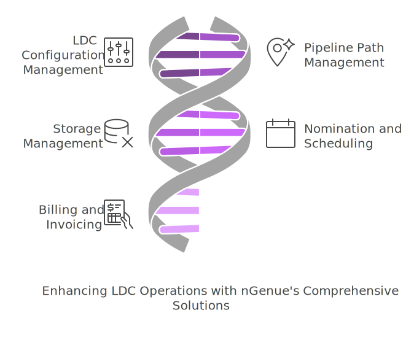

# Understanding LDC configuration

Local distribution company (LDC) configuration is a fundamental process in the natural gas industry that ensures seamless gas distribution, accurate billing, and regulatory compliance. Configuring an LDC involves setting up its operational structure, defining rate and rider frameworks, and implementing charge definitions. A well-configured LDC enhances efficiency, minimizes billing discrepancies, and aligns with industry regulations.

This document provides an overview of LDC configuration, its importance, and how various components interconnect. For detailed steps on specific configuration aspects, refer to the following topics:

* [Create a LDC](ldcs_configure.md) – Understanding the foundational setup of a LDC.
* [Configure rate/rider](./ldcs_rider/configure_ldcs_riders.md) – Defining rate structures and additional pricing mechanisms.
* [Define LDC charges](#) – Managing fixed, variable, and regulatory charges.

## Key components of LDC configuration

1. **LDC setup** – Establishing the identity, service territory, and pipeline connections.
2. **Rate and rider structure** – Defining the pricing mechanisms that govern customer billing.
3. **Charge definition** – Implementing additional cost structures such as fixed fees, demand charges, and regulatory surcharges.

Each of these components plays a crucial role in maintaining a well-functioning LDC. By integrating these elements effectively, utilities and suppliers can optimize their operations and provide better service to end users.

## Importance of LDC configuration

Effective LDC configuration offers several benefits, including:

* **Operational efficiency** – Streamlines gas distribution and customer management.
* **Regulatory compliance** – Ensures adherence to state and federal guidelines.
* **Accurate billing** – Reduces errors in invoicing and improves customer transparency.
* **Cost management** – Helps in controlling distribution costs and optimizing revenue.

## Conclusion

Understanding LDC configuration is essential for gas distribution companies to operate efficiently and meet industry standards. By ensuring proper setup, rate application, and charge definitions, LDCs can enhance service reliability and financial accuracy. For detailed insights into each configuration aspect, refer to the dedicated topics linked above.

<!-- # Understanding LDC

A Local Distribution Company (LDC) is responsible for transporting and distributing natural gas from the city gate to end users, such as residential, commercial, and industrial customers. LDC operate regulated pipeline networks and may also provide storage and balancing services.

nGenue, a comprehensive natural gas management solution, helps LDC efficiently manage operations, improve accuracy, and enhance customer service. Key features of nGenue for LDC include:

* **LDC configuration management:** Allows customization of rules, rates, and tariffs based on specific LDC requirements.
* **Pipeline path management:** Supports tracking and managing gas flow from receipt to delivery points.
* **Storage management:** Helps LDC monitor and optimize gas storage utilization.
* **Nomination and scheduling:** Automates and streamlines nomination and scheduling processes.
* **Billing and invoicing:** Ensures accurate calculation of transportation and storage charges.

## Role of LDC in the natural gas supply chain

LDC act as intermediaries between interstate or intrastate pipelines and end users. Their key responsibilities include:

* Receiving natural gas from upstream suppliers at the city gate.
* Managing and maintaining distribution infrastructure.
* Ensuring a reliable supply to end users.
* Providing storage and balancing services to support market demands.
* Offering transportation services to marketers who sell gas to customers.

## Conclusion

LDC play a crucial role in the natural gas industry by ensuring the safe and efficient distribution of natural gas to end users. nGenue empowers LDC with advanced tools to streamline operations, optimize resources, and maintain regulatory compliance. -->
