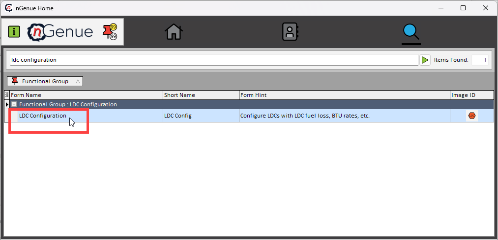
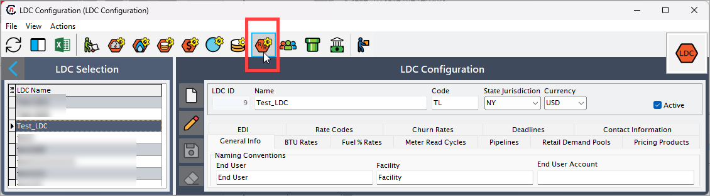
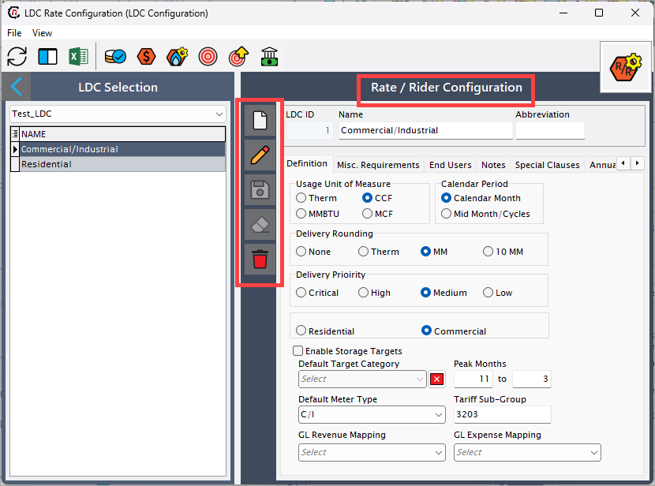
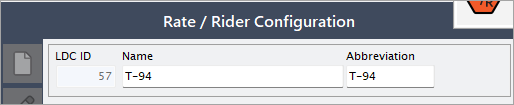
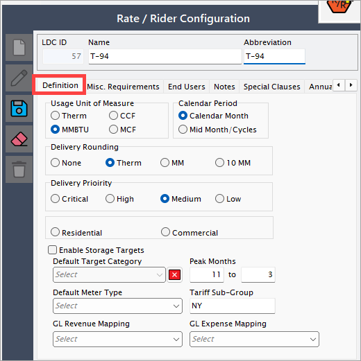
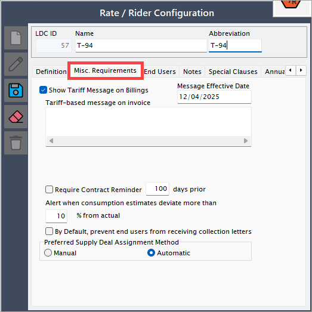
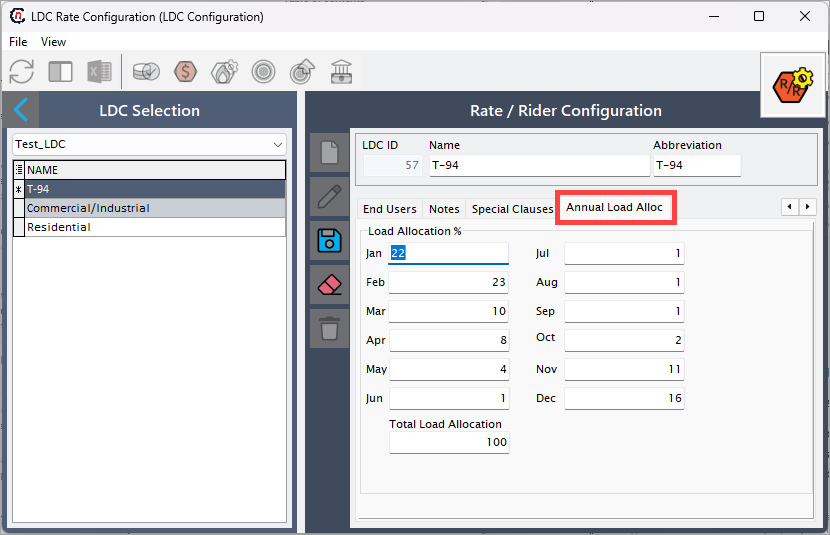

# Configure LDC rate riders

This article is designed to define and manage rate riders, which are essential components in the pricing structure for natural gas services. Rate riders categorize customers (e.g., Residential, Commercial) and determine how rates are applied based on usage, time periods, and customer types.

Rate rider configuration is a critical part of the retail setup process. It ensures that each Local Distribution Company (LDC) has clearly defined rate structures that align with regulatory requirements and business strategies. Proper configuration of rate riders enables accurate billing, customer segmentation, and flexible pricing models tailored to different market segments.

Each rate rider typically covers:

 * Who the customer is (residential, commercial, industrial)
 * How much gas they use
 * How and when they use the gas (seasonal, peak demand, off-peak)
 * Specific services provided (like storage, delivery, balancing).

## Why LDC rate riders are important

- **Fair pricing**: Ensures that customers with different needs and usage patterns pay appropriate rates.
- **Regulatory compliance**: Utilities must file rate structures with regulatory bodies and follow them strictly.
- **Revenue management**: Helps LDCs plan their infrastructure investments and recover operational costs efficiently.
- **Service customization**: Allows for offering additional services or discounts under specific conditions.

## Key components of a LDC rate rider

| Component | Description |
|---------------|------------------|
| Customer type | Specifies whether the class is for residential, small business, large industrial, etc. |
| Usage volume | Defines usage thresholds like low, medium, or high-volume users. |
| Service type | Describes services covered, such as basic delivery, firm transportation, interruptible transportation, storage. |
| Pricing structure | Defines if pricing is flat rate, tiered, or based on time of use (e.g., winter vs. summer rates). |
| Regulatory notes | Includes any government-imposed rules that affect how rates are charged (such as taxes, green energy fees). |
| Special conditions (riders) | Additional charges or discounts applied under special circumstances (for example, energy efficiency programs). |

## Simple scenario example

Suppose you live in **Dallas, Texas**. You are a residential customer, so your gas provider (an LDC) puts you under the **Residential Firm Service (RFS)** rate class.

1. You pay a **fixed charge of $25/month** for access to gas service.
1. Plus, you pay **$0.50 per therm** for the amount of gas you actually use.
1. In winter, there may be a **winter rider** that adjusts your rate slightly higher due to higher demand.

At the same time, a large bakery down the street would be classified under the **Small Commercial Firm Service (SCFS)** class with different rates and terms.

### Important notes

* One customer can sometimes fall into multiple rate classes based on different services (e.g., firm transportation for normal usage and interruptible service for peak periods).
* Rate classes can change based on seasonal usage patterns or contractual changes.

## Procedure to configure rate riders

This guide outlines the steps to configure rate riders in nGenue, including how to create, modify, and apply them to customers. 

### Prerequisites

* You must have the requisite *add* or *modify* permissions in the **LDC configuration** screen.
* The LDC is configured prior to creating a new rate rider for LDC.

### Step 1: Navigate to the LDC configuration screen

1. Log in to the **nGenue** application.
2. Click the **Search** icon and enter *LDC configuration* in the search bar.
 
3. Double-click **LDC configuration** to open the respective screen.
4. In the **LDC configuration** screen, locate and select the desired LDC from the list. 
5. Click on the **Open tariff and rate riders definitions** icon located in the header of the screen which will redirect you to the **Rate/Rider configuration** screen, where detailed information about the applicable tariffs and rate riders is available.
 
6. You can view or edit existing riders or create a new one. The table below describes the available icons and their functions:
 

      | Icons      | Description                          |
      | ----------- | ------------------------------------ |
      |         | Add a new LDC tariff definition record |
      |     | Edit the LDC tariff definition record detail. |
      |         |  Save the LDC tariff definition record. |
      |   | Cancel the updates being made to the LDC tariff definition record. |
      |   | Delete a LDC tariff definition record. |

### Step 2:  Enter the LDC rate configuration details

1. Create a new rate rider by clicking on the **Add** button.
2. On the next screen, perform the below steps:
    1. **Name:** Enter the name of the rate rider. For example, **"T-94"**.
    2. **Abbreviation:** Enter the abbreviation for the rate rider. For example: **"T-94"**.
     

3. The **LDC rate Configuration** screen is divided into multiple tabs, each designed to capture specific details required to manage a rate and rider in the system. These tabs collectively help define operational, financial, compliance, and contact-related information for an LDC, ensuring smooth gas distribution, billing, and reporting processes. 

Below is a detailed explanation of each tab:

#### 1. Definition tab

The **Definition** tab allow you to define key parameters that govern the application of rate riders within nGenue. This section includes fundamental attributes such as measurement units, billing periods, delivery settings, and classification details. These fields help ensure that rate riders are configured accurately, aligning with regulatory requirements and business needs.

| Field name | Description |
|---|---|
| Usage unit of measure | Defines the unit of measurement for gas usage applicable to the rate rider, such as Therms, MMBtu, or Mcf. This unit determines how gas volumes are calculated and billed. |
| Calendar period | Specifies the billing or operational period used for rate calculations. This could be a monthly, quarterly, or annual cycle, ensuring rates align with the appropriate time frames. |
| Delivery rounding | Determines how gas delivery quantities are rounded in calculations. Rounding rules can impact billing accuracy and should be configured to align with regulatory or contractual requirements. |
| Delivery priority | Sets the priority level for gas deliveries under the rate rider. This can influence gas allocation, scheduling, and supply chain decisions, especially during peak demand periods. |
| Residential/Commercial | Identifies whether the rate rider applies to residential customers, or commercial customers. This classification helps define pricing structures and eligibility criteria. |
| Enable storage targets | Allows users to define storage-related targets, ensuring gas availability for peak demand periods. This is particularly useful for managing seasonal fluctuations in gas consumption. |
| Peak months | Defines specific months where peak demand pricing, adjustments, or additional charges apply. Helps utilities manage high-demand periods efficiently. |
| Default meter type | Sets the default classification of meters used for consumption tracking and billing. Examples include analog meters, digital meters, and smart meters, each affecting data collection and accuracy. |
| Tariff sub-group | Categorizes customers into specific sub-groups within a tariff structure. Different sub-groups may have unique pricing models, contract terms, or regulatory considerations. |
| GL revenue mapping | Links revenue-related transactions associated with the rate rider to the appropriate General Ledger (GL) account. Ensures accurate financial reporting and tracking of revenue streams. |
| GL expense mapping | Maps expenses related to the rate rider, such as operational costs, maintenance, or administrative fees, to the appropriate GL account. Helps maintain accurate cost tracking and financial analysis. |

#### 2. Misc. requirements

The **Misc. requirements** tab provides additional settings that help manage contract reminders, consumption estimate alerts, and collection letter preferences. These configurations ensure accurate communication with end users, prevent potential billing issues, and streamline supply deal assignments.

| Field name | Description |
|---|---|
| Show tariff message on billings | Enables a tariff-based message to appear on invoices, providing end users with relevant regulatory or contractual information about their rate rider. |
| Message effective date | Specifies the date when the tariff message becomes effective on invoices, ensuring that updates or changes to tariff details align with billing cycles. |
| Require contract reminder (Days prior) | Allows users to set up an automated contract renewal reminder a specified number of days before the contract's expiration. This helps in proactive contract management and reduces the risk of service interruptions. |
| Alert when consumption estimates deviate more than (%) from actual | Triggers an alert when the estimated gas consumption deviates by a specified percentage from the actual usage. Helps detect anomalies, prevent billing disputes, and improve forecast accuracy. |
| By default, prevent end users from receiving collection letters | When enabled, prevents end users from being sent collection letters automatically. This can be useful for customers with special agreements or those on payment plans. |
| Preferred supply deal assignment method | Defines whether supply deals should be assigned manually or automatically.  Options:  **Manual** – Requires users to assign supply deals manually, offering more control over allocations.  **Automatic** – System assigns the most suitable deal based on predefined logic, minimizing manual effort and improving efficiency. |

#### 3. End users

The **End users** tab allows users to associate specific customers with the configured rate or rider. This ensures that the correct pricing, surcharges, and tariff conditions apply to designated end users. The tab provides options to add, remove, or modify end-user assignments, ensuring flexibility in rate application.

#### 4. Notes

The **Notes** tab provides a space to capture important details, comments, or justifications related to the rate or rider configuration. Users can document explanations for rate adjustments, internal approvals, or any specific considerations that may affect future rate modifications. Keeping detailed notes ensures transparency and consistency in rate administration.  

#### 5. Special clauses

The **Special clauses** tab is used to define any additional terms, conditions, or exceptions that apply to the rate or rider. This can include contractual obligations, regulatory compliance clauses, or customer-specific agreements. Special clauses help in maintaining legal and operational clarity regarding the application of the rate/rider.  

#### 6. Annual load allocation

The **Annual load allocation** tab is used to define how the total annual gas consumption is distributed across different months. This tab helps in forecasting, scheduling deliveries, and managing seasonal demand fluctuations. By configuring monthly allocation percentages, users can ensure that gas supply and billing align with actual usage patterns. This is particularly useful for adjusting supply during peak winter months when heating demand is high or reducing allocations in summer months with lower consumption. Proper configuration of this tab enhances operational efficiency and prevents supply imbalances. 

Review all details to ensure accuracy and click on **Save** button to finalize the LDC creation.

<!-- ### Next steps

1. Add the rate rider charge definition customer charge
1. Add the rate rider charge definition administrative charge
1. Add the rate rider charge definition distribution charge
2. Add charges to the configured charge definitions
2. Add charge definitions to the rate rider
2. Add contract demands to the rate rider
2. Update rate rider for end user
2. Configure rate schedule.

--- -->

