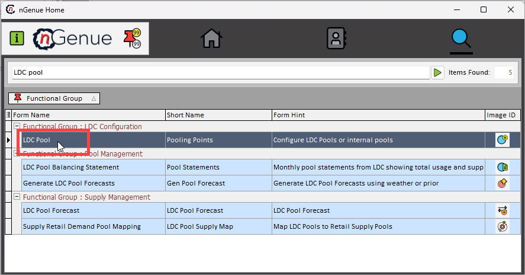
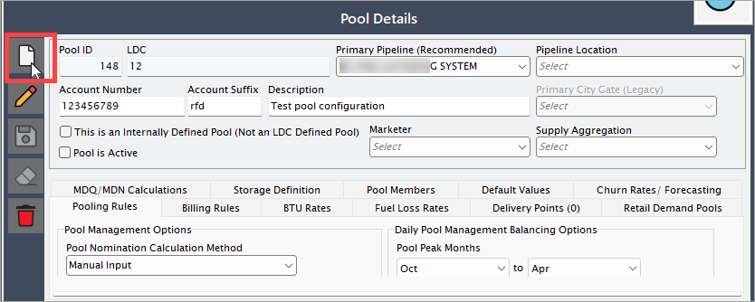
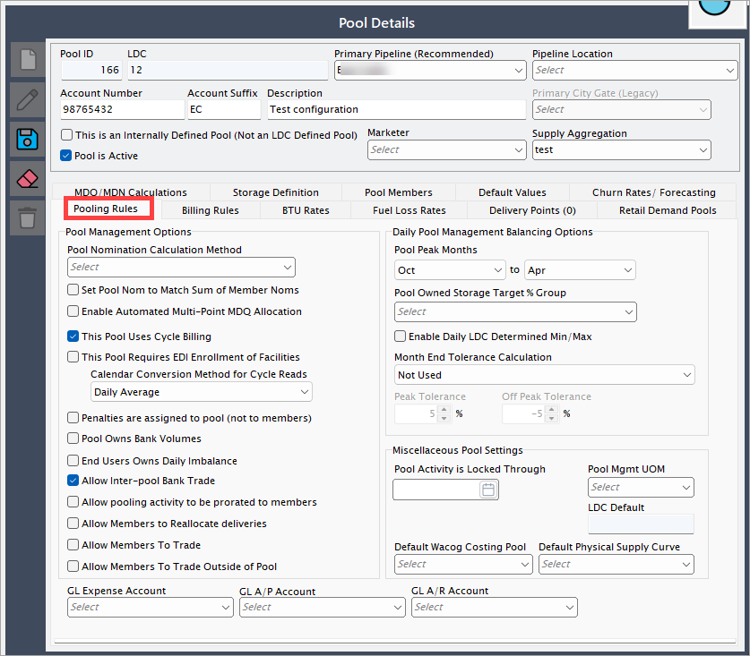
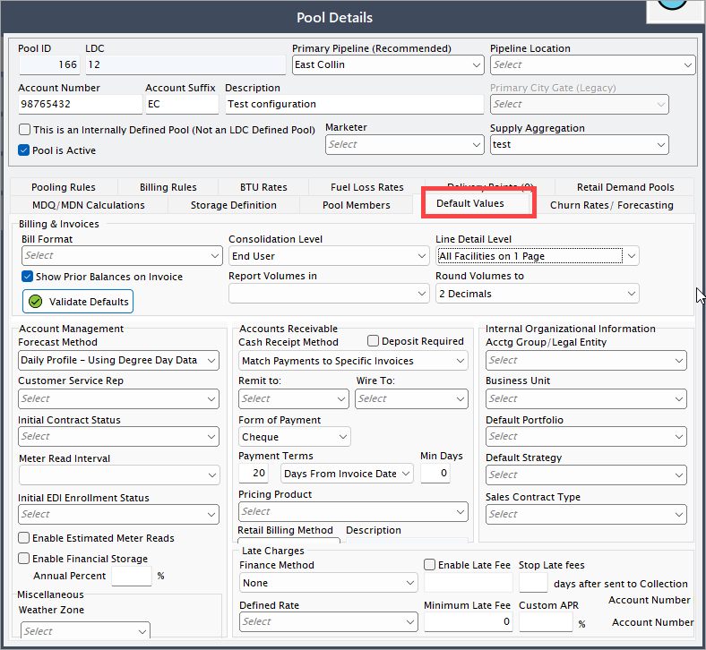
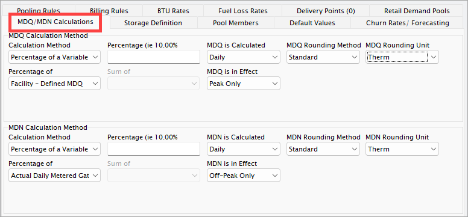
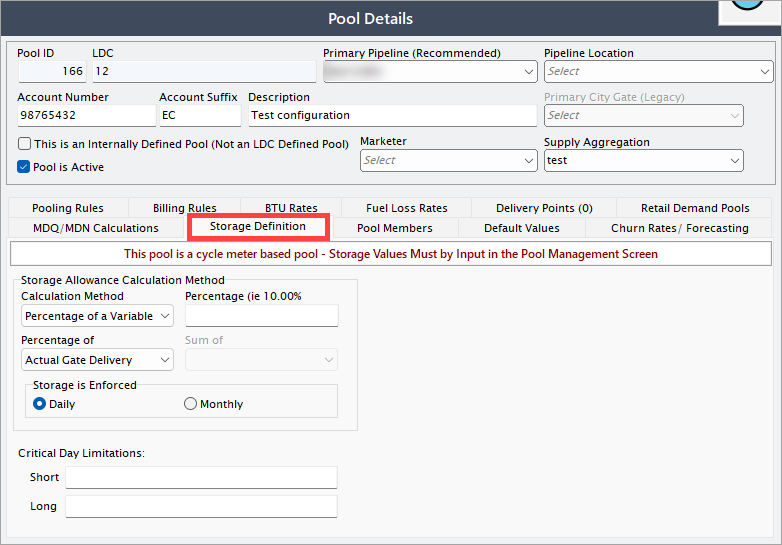
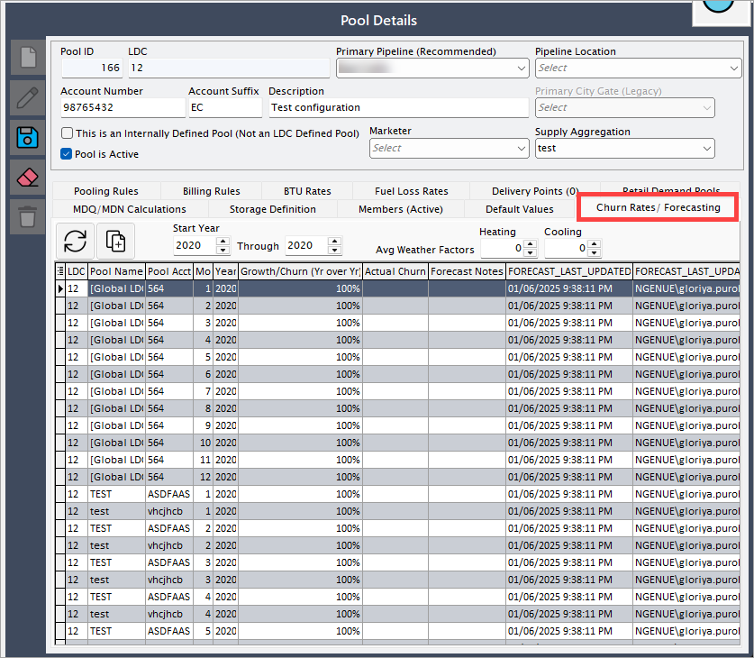

# Configure LDC pool

LDC Pool configuration plays a vital role in the retail setup process by enabling operational efficiency and billing accuracy. It allows the system to associate accounts with specific pooling rules, default values, and delivery parameters. Properly configured pools ensure that gas usage is tracked and billed correctly, in alignment with the LDC’s operational and contractual obligations.

This article is designed to configure LDC pools, which are essential for grouping customer accounts under a common delivery and billing structure. Pools help streamline gas delivery, manage balancing requirements, and apply consistent billing rules across multiple accounts.

## Prerequisites

Before configuring a LDC pool in nGenue, ensure the following prerequisites are met:

- **LDC setup** – The relevant LDC must be created and configured within nGenue.
- **User permissions** – The user should have administrative or required access rights to configure pool settings.
- **Supplier and pipeline information** – Ensure that all necessary supply sources, pipelines, and interconnections are defined in the system.
- **Rate and charge definitions** – Rates, riders, and applicable charges should be configured to align with the pool structure.
- **Customer accounts** – The customers who will be assigned to the pool must be set up in nGenue.

## Procedure to configure LDC pool in nGenue

### Step 1: Navigate to the LDC pool screen

1. Log in to the **nGenue** application.
2. Click the **Search** icon and enter *LDC pool* in the search bar.

3. Double-click **LDC pool** to open the respective screen. 
4. On the next screen, you see a list of icons with the context in the top-header.

    | Menu/Icons | Description | Purpose |
    | --- | --- | --- |
    |  | Refresh supply deals record. | Updates the grid with the latest data from the database to ensure accuracy. |
    |  | Configure grid columns. | Customize which data columns are visible in the grid to suit user preferences. |
    |  | Open grid data in excel. | Export the currently displayed grid data to Excel for offline review or analysis. |
    |  | Open the pool management screen. | Manage the configuration and allocation of gas supply pools for accurate tracking and reporting. |
    |  | Open the pool reallocation screen. | Reallocate meters or volumes across pools to reflect updated operational needs or corrections. |
    |  | View or assign LDC charges to the current pool | Define and apply daily factors or charges associated with the LDC for financial calculations. |
    |  | Assign citygates. | Link citygates to the selected pool or end user to ensure accurate delivery point tracking. |

4. The **LDC pool** screen is designed to help you manage LDC within the system. It is divided into two main sections: **Pool selection** and **Pool details.**

   
#### Pool selection 

1. This section displays a list of all LDC pools created for a LDC. 
2. You can quickly browse through the list and select an LDC pool to view or modify its configuration.

#### Pool details

When you select a LDC pool from the **Pool selection** section, its detailed configuration is displayed in this section.

1. This includes attributes like LDC name, pool id, description, associated pipeline location, account number and any other relevant setup details.
2. The details panel allows you to view, update, or fine-tune the settings of the selected LDC pool. The table below describes the available icons and their functions:

      | Icons      | Description                          |
      | ----------- | ------------------------------------ |
      |         | Add a new LDC record |
      |     | Edit the LDC record detail. |
      |         |  Save the LDC record. |
      |   | Cancel the updates being made to the LDC record. |
      |   | Delete a LDC record. |

### Step 2:  Enter the basic LDC details

1. In the **Pool details** section, click on the **Add** button.

2. You’ll need to provide the following information:

    | Field name | Description |
    |------------|------------|
    | Pool ID | Auto-generated unique identifier. This ensure each pool is uniquely tracked. |
    | LDC | Auto-filled based on selection. This links the pool to the correct LDC. |
    | Primary pipeline | Select the primary pipeline associated with this LDC. This defines the main transportation route for gas delivery. This is required to route gas flow and manage transportation contracts. |
    | Pipeline location | Choose the pipeline location to specify the geographical area where the LDC operates. This is required for operational logistics and regulatory compliance. |
    | Account number | Enter the unique account number assigned to the LDC. This identifier is used for transactions, billing, and reporting. |
    | Account suffix | Provide an additional identifier to distinguish multiple accounts under the same LDC. This is useful when an LDC has multiple service areas or contract variations. |
    | Description | Enter a brief description of the LDC pool. This can include information about the service type, region, or any other distinguishing details. |
    | This is an internally defined pool (not an LDC defined pool) | Check this option if the pool is managed internally rather than being defined by the LDC. This setting affects the control and operation of the pool. |
    | Marketer | Select the marketer responsible for managing gas procurement and distribution within this pool. This ensures proper tracking of supply agreements and transactions. |
    | Supply aggregation | Choose whether supply aggregation is enabled for this pool. Aggregation allows multiple sources of gas supply to be pooled together for distribution. |

    

3. The **LDC pool details** screen is also divided into multiple tabs, each designed to capture specific details required to manage an LDC pool in the system. These tabs collectively help define operational, financial, compliance, and supply aggregation-related information for an LDC pool, ensuring smooth gas distribution, balancing, and reporting processes.

Below is a detailed explanation of each tab:

#### 1. Pooling rules tab

This tab allows users to define the rules governing how gas is pooled and allocated within the LDC. It includes settings related to balancing, nomination procedures, and aggregation methodologies, ensuring that all customers within the pool receive gas supply efficiently while complying with regulatory and contractual obligations.

| Field name | Description |
|------------|------------|
| Pool nomination calculation method | Determines the method used to calculate nominations for the pool. Options include: manual input, where the user manually enters nomination values; member nomination sum, where the pool nomination is automatically calculated as the sum of all member nominations; and multi-point daily input, which allows users to allocate nominations to multiple points within the pool daily. The selected method directly impacts how supply is allocated and scheduled. |
| Set pool nom to match sum of member noms | When enabled, the total pool nomination value is automatically set to match the combined total of all individual member nominations. This ensures that the pool's overall gas volume reflects the sum of its members’ inputs, helping maintain balance and avoid discrepancies. |
| Enable automated multi-point MDQ allocation | Automates the allocation of the maximum daily quantity (MDQ) across multiple points within the pool. This feature is useful when a pool receives gas from various sources, ensuring that the available MDQ is distributed efficiently without manual intervention. |
| This pool uses cycle billing | Activates cycle-based billing, where charges are calculated at predefined intervals (e.g., monthly, biweekly) instead of on a per-transaction basis. This ensures consistency in invoicing and aligns with utility or supplier billing practices. |
| This pool requires EDI enrollment of facilities | Specifies whether electronic data interchange (EDI) enrollment is required for the facilities associated with this pool. EDI automates communication between the system and external entities (e.g., LDCs, suppliers), streamlining data exchange, compliance, and billing processes. |
| Calendar conversion method for cycle reads | Defines how cycle meter readings are converted for billing and balancing purposes. This is important for LDCs that operate on different cycle schedules and need to standardize readings to ensure accurate calculations. |
| Penalties are assigned to pool (not to members) | When enabled, any penalties incurred due to imbalances, non-compliance, or contractual breaches are applied at the pool level rather than being distributed among individual members. This setting is useful for centralized penalty management. |
| Pool owns bank volumes | Indicates whether the pool itself holds and manages banked gas volumes. If enabled, the pool has the authority to store excess gas and use it for future needs, ensuring better supply flexibility. |
| End users owns daily imbalance | Determines if end users are responsible for managing daily imbalances within the pool rather than the pool administrator. This setting affects how imbalance charges are assigned and managed. |
| Allow inter-pool bank trade | Enables the ability to transfer or trade banked volumes between different pools. This helps optimize gas storage management and allows for strategic trading between pools. |
| Allow pooling activity to be prorated to members | When enabled, pooling activity such as imbalances and trades is proportionally distributed among pool members based on predefined allocation rules. This ensures fair distribution based on participation levels. |
| Allow members to reallocate deliveries | Grants pool members the ability to redistribute gas deliveries among themselves to optimize supply distribution and balance within the pool. |
| Allow members to trade | Permits members to engage in gas trades within the pool. This allows for internal balancing and flexibility in supply management. |
| Allow members to trade outside of pool | Grants members permission to trade gas outside of their designated pool, providing additional flexibility in managing supply contracts. |
| Pool peak months | Defines the peak demand period for the pool, typically covering multiple months, ensuring better gas procurement and planning. |
| Pool owned storage target % group | Sets a percentage target for storage allocation within the pool, defining how much gas should be reserved in storage facilities. |
| Enable daily LDC determined min/max | Allows the local distribution company (LDC) to set daily minimum and maximum limits for the pool, ensuring better control over supply and demand variations. |
| Month-end tolerance calculation | Specifies how month-end tolerances are calculated, determining whether overages or shortages are carried forward, adjusted, or penalized. |
| Peak tolerance | Defines the acceptable percentage tolerance for gas supply during peak demand periods, ensuring operational flexibility while maintaining compliance. |
| Off peak tolerance | Sets the acceptable percentage tolerance for gas supply outside of peak periods, allowing for balanced allocations. |
| Pool activity is locked through | Specifies the date until which pool activity is restricted or locked, preventing modifications after a set period. |
| Pool mgmt UOM | Determines the unit of measure (UOM) used for pool management reporting, ensuring consistency in volume calculations. |
| Default WACOG costing pool | Assigns a default weighted average cost of gas (WACOG) pool for cost calculation, streamlining financial reporting. |
| Default physical supply curve | Defines the standard supply curve used for physical gas allocations within the pool, ensuring accurate forecasting. |
| GL expense account | Specifies the general ledger (GL) account used for recording pool expenses, enabling accurate financial tracking. |
| GL A/P account | Identifies the accounts payable (A/P) GL account linked to the pool, ensuring proper accounting integration. |
| GL A/R account | Identifies the accounts receivable (A/R) GL account associated with the pool, ensuring proper revenue tracking. |

#### 2. Billing rules tab

This section is used to configure billing-related parameters, including rate structures, calculation methods, and invoicing cycles. It ensures that billing is aligned with contractual agreements and regulatory guidelines, preventing discrepancies in customer invoices and revenue collection.

| Field name | Description |
|------------|------------|
| Pricing agreements for members are applied to | Determines how pricing agreements are applied to pool members. Options include **City Gate Delivery**, **Burner Tip Delivery**, or **Net Usage**. The selection affects cost calculations and billing methodologies. |
| Automated nominating | Allows the system to automatically adjust nominations to match expected gas usage. If enabled, nominations are generated without manual input. |
| Automatically force nominations to equal net usage | When selected, the system ensures that the nominated gas volume matches the expected net usage, reducing discrepancies between supply and demand. |
| Force nom to | Defines whether forced nominations should be directed to **City Gate** or **Burner Tip**. This impacts how gas is allocated within the system. |
| Billing start – end dates | Determines how billing periods are calculated. Options include **None – Display Month Only**, **Use Calendar Month**, or **Pull from LDC Pool Invoice**. This setting ensures alignment with invoicing cycles. |
| Cash out options | Allows configuration of cash-out processes for pool members. If **Enable Cashouts** is selected, additional fields become available for defining entity selection, frequency, and tolerance values. |
| Cash out entity | Specifies which entity (such as an LDC or marketer) is responsible for handling cash-outs in case of excess or shortage of gas supply. |
| Cash out frequency | Defines how often cash-outs occur, such as monthly or based on a predefined tolerance level. This impacts financial settlements between pool participants. |
| Daily tolerance value | Sets the acceptable tolerance level for daily gas imbalances before triggering cash-out adjustments. |
| LDC charge – over | Specifies the charge applied by the LDC when gas supply exceeds the agreed-upon limits. This ensures compliance with contractual agreements. |
| LDC charge – under | Defines the charge imposed by the LDC when gas supply falls below the required level, helping to manage shortfalls efficiently. |
| By default, buy back margins are tax-exempt for pool members | If selected, buy-back margins (revenues generated from gas buybacks) are considered tax-exempt for pool members, ensuring accurate tax calculations. |
| Adjust billing display to LDC method by | Allows users to shift the billing display date based on LDC requirements. The adjustment is defined in days to align with the LDC’s billing schedule. |
| By default, prevent end users from receiving collection letters | When enabled, prevents end users from receiving automated collection letters in case of non-payment, reducing customer disputes. |
| LDC commodity costs for this pool are based on index | Allows users to select an index-based pricing model for LDC commodity costs, ensuring dynamic cost adjustments based on market fluctuations. |
| Default marketer agency and billing authorization | Defines how marketer agencies handle billing. Options include **None**, **Authorized Agent**, **Receive LDC Bills Only**, **Pay LDC Bills; Add to Invoice**, **Billed by LDC; Marketer Generates**, **Consolidated G&E Bill**, and **Billed by LDC; LDC Generates**. Each option determines who is responsible for invoicing and payment collection. |

#### 3. Default values tab

This section contains preset values that automatically populate various fields during LDC pool configuration. Setting default values ensures consistency in data entry and reduces manual effort in maintaining pool configurations.

| Field name | Description |
|------------|------------|
| Bill format | Defines the format in which bills will be generated and presented to end users. The selection affects how invoices appear and are distributed. |
| Show prior balances on invoice | When enabled, previous outstanding balances will be displayed on the invoice to provide visibility into past due amounts. |
| Validate defaults | A validation button that checks whether the default settings are correctly configured based on system rules and requirements. |
| Consolidation level | Determines how invoices are consolidated. Options include **End User**, meaning each user receives an individual invoice, or other available consolidation methods. |
| Line detail level | Specifies how invoice line items are displayed. Options include **All Facilities on 1 Page**, meaning all facility-related charges are grouped into a single invoice page. |
| Report volumes in | Defines the unit of measure (e.g., MMBtu, Therms, or Cubic Feet) used for reporting gas volumes in invoices and reports. |
| Round volumes to | Sets the decimal precision for reported gas volumes, ensuring standardized rounding (e.g., to 2 decimal places). |
| Forecast method | Specifies how gas demand is forecasted. Options include methods such as **Daily Profile – Using Degree Day Data**, which considers temperature variations to predict consumption. |
| Customer service rep | Assigns a default customer service representative responsible for handling inquiries and managing accounts. |
| Initial contract status | Defines the default status of newly created contracts, such as **Pending**, **Active**, or **Under Review**. |
| Meter read interval | Sets the frequency at which meter readings are taken (e.g., monthly, bi-monthly) for accurate billing and forecasting. |
| Initial EDI enrollment status | Determines the default enrollment status for Electronic Data Interchange (EDI) transactions, which facilitate automated data exchange with utilities and suppliers. |
| Enable estimated meter reads | Allows estimated meter readings when actual reads are unavailable, ensuring continuous billing even if meter data is missing. |
| Enable financial storage | Enables the ability to store financial transactions or balances over time for accounting and reporting purposes. |
| Annual percent | Specifies the percentage rate applied for financial storage calculations, influencing interest accruals or adjustments. |
| Weather zone | Defines the default weather zone for gas consumption forecasting, ensuring accurate demand predictions based on climatic conditions. |
| Cash receipt method | Determines how cash receipts are processed. Options include methods such as **Match Payments to Specific Invoices**, ensuring payments are allocated correctly. |
| Deposit required | When enabled, requires customers to provide a deposit before initiating service, reducing financial risk. |
| Remit to | Defines the default recipient (bank or entity) where payments should be remitted. |
| Wire to | Specifies the banking details for wire transfers, ensuring correct routing of electronic payments. |
| Form of payment | Defines the default payment method for customers, such as **Cheque**, **Electronic Transfer**, or **Credit Card**. |
| Payment terms | Sets the default payment terms (e.g., **20 Days from Invoice Date**), indicating when payments are due. |
| Min days | Specifies the minimum number of days allowed before payments are considered overdue. |
| Pricing product | Defines the default pricing product applied to transactions, ensuring consistency in cost calculations. |
| Retail billing method | Determines how retail billing is managed. Options include **Rate Ready**, where prices are pre-determined before billing. |
| Late charges – finance method | Defines the method used to calculate finance charges for late payments. Options include **None**, **Fixed Rate**, or **Custom APR**. |
| Enable late fee | When enabled, applies a late fee to overdue invoices. |
| Stop late fees | Specifies the number of days after an account is sent to collections when late fees should no longer be applied. |
| Defined rate | Sets a predefined rate for calculating finance charges on overdue payments. |
| Minimum late fee | Specifies the minimum fee applied for late payments, ensuring a baseline charge regardless of outstanding balance. |
| Custom APR | Allows users to set a custom annual percentage rate (APR) for calculating finance charges. |
| Account number | Specifies the general ledger (GL) account number associated with financial transactions. |

#### 4. MDQ/MDN calculations tab

This tab allows users to configure Maximum Daily Quantity (MDQ) and Maximum Daily Nomination (MDN) calculations. These values define the upper limits of daily gas nominations for a pool, ensuring that supply planning adheres to operational and contractual constraints.

| Field name | Description |
|------------|------------|
| MDQ calculation method – calculation method | Specifies the method used to determine the maximum daily quantity (MDQ) for the pool. The available options include: **Sum of Member Variable** (calculates MDQ by summing specific variables of pool members), **Fixed Volume** (assigns a predefined fixed volume as MDQ), or **Percentage of a Variable** (calculates MDQ as a percentage of a selected variable). |
| MDQ is calculated | Indicates whether the MDQ value is computed automatically based on the selected calculation method or if it requires manual input. If enabled, the system will determine the MDQ dynamically. |
| MDQ rounding method | Defines how the MDQ value should be rounded to ensure consistency in calculations. The rounding method determines whether values are rounded up, down, or to the nearest whole number or decimal. |
| MDQ rounding unit | Specifies the level of precision for rounding MDQ values. Options may include **None** (no rounding is applied), **Whole Number** (rounds to the nearest whole unit), or **Decimal Precision** (rounds to a specific decimal place). |
| Percentage of | If the **Percentage of a Variable** option is selected in the MDQ calculation method, this field allows the user to choose the variable to be used as the base for percentage calculations. The MDQ will be determined as a percentage of the selected variable's value. |
| Sum of | If the **Sum of Member Variables** method is selected, this field specifies which variables will be summed to derive the total MDQ. The selected variables from individual members in the pool contribute to the final MDQ value. |
| MDQ is in effect | Determines when the calculated MDQ value is applied within the system. The available options include **Peak Only** (MDQ applies only during peak periods), **Off-Peak Only** (MDQ applies only during off-peak periods), or **Always** (MDQ applies at all times). |
| MDN calculation method – calculation method | Specifies the method used to calculate the minimum daily nomination (MDN) for the pool. The available options include **Fixed Volume** (sets a predefined minimum volume), **Percentage of a Variable** (calculates MDN as a percentage of a selected variable), **Sum of Member Variables** (adds up values from pool members to determine MDN), **Manual Daily Input** (requires users to enter the MDN manually), or **This Pool has no MDNs** (indicates that MDNs are not applicable for this pool). |
| MDN is calculated | Indicates whether the MDN value is calculated automatically by the system based on the selected method or if it must be manually entered by the user. If enabled, MDN is dynamically determined. |
| MDN rounding method | Defines how the MDN value should be rounded to maintain consistency. It ensures uniformity in calculations by rounding up, down, or to a specific decimal place, depending on the selected rounding method. |
| MDN rounding unit | Determines the unit in which MDN values are rounded. Options include **None** (no rounding), **Whole Number** (rounds to the nearest whole unit), or **Decimal Precision** (rounds to a specific number of decimal places). |
| Sum of | If the **Sum of Member Variables** method is selected for MDN, this field specifies which variables from individual pool members are summed to determine the final MDN value. |
| MDN is in effect | Defines the period during which the MDN value is applicable. Options include **Peak Only** (MDN applies during peak periods), **Off-Peak Only** (MDN applies during off-peak periods), or **Always** (MDN is in effect at all times). |

#### 5. Storage definition tab

This section allows users to configure gas storage parameters, including injection and withdrawal rates, storage capacity limits, and contractual obligations related to stored gas. Proper storage management ensures supply reliability and mitigates price fluctuations.

| Field name | Description |
|------------|------------|
| Storage allowance calculation method – calculation method | Defines the method used to calculate the storage allowance for the pool. Options include **Percentage of a Variable** (storage is allocated based on a percentage of a selected variable) and **Sum of Member Variables** (storage is determined by summing specific variables from pool members). |
| Percentage (i.e., 10.00%) | If the **Percentage of a Variable** method is selected, this field specifies the percentage used to determine the storage allowance. For example, entering **10.00%** means storage is set at 10% of the selected variable. |
| Percentage of | If the **Percentage of a Variable** method is chosen, this field allows the user to select the base variable from which the percentage will be calculated. The storage allowance will be derived from this variable. |
| Sum of | If the **Sum of Member Variables** method is selected, this field allows users to define which variables from pool members should be summed to determine the total storage allocation. |
| Storage is enforced | Specifies whether the storage enforcement applies on a **Daily** or **Monthly** basis. **Daily enforcement** means storage limits are monitored daily, while **Monthly enforcement** applies aggregated storage limits over the entire month. |
| Critical day limitations – short | Defines the short-term storage limitations that apply during critical demand days. This may represent restrictions on storage withdrawals or injections during peak periods. |
| Critical day limitations – long | Specifies long-term storage limitations that apply over an extended duration. This may include seasonal or monthly storage constraints to ensure supply reliability. |

#### 6. Churn rates/ Forecasting tab

This tab is used to analyze customer retention and predict future churn trends within the LDC pool. Users can configure churn percentages, review historical data, and apply forecasting models to anticipate changes in customer demand and develop proactive supply strategies.

| Field name                  | Description |
|-----------------------------|-------------|
| Start year                         | Allows users to set the range of years for churn and forecasting analysis. Selecting a wider range provides a broader trend analysis, but too large a range might include outdated data that may not reflect current conditions. |
| Average weather factors                         | Enables users to input heating and cooling adjustment factors to account for seasonal variations in gas demand. These values impact forecast accuracy, as extreme weather conditions can cause unexpected demand spikes or declines. |
| LDC                         | Specifies the Local Distribution Company (LDC) associated with the pool. This is required to link the pool data to the correct LDC, ensuring accurate forecasting and churn rate calculations. |
| Pool name                   | Displays the name of the gas pool. This helps in identifying the group of customers managed under the same delivery and balancing conditions. |
| Pool account                | Represents the account number assigned to the pool. Required for tracking and managing transactions related to the pool. |
| Year                        | Specifies the year for which churn rates and forecasts are being calculated. This allows users to review historical churn trends and project future customer movement. |
| Month                       | Defines the specific month within the selected year. This is important for month-over-month churn analysis and forecasting. |
| Growth/Churn (Year over Year %) | Indicates the percentage of customer growth or churn compared to the previous year. A positive value suggests growth, while a negative value indicates customer attrition. Useful for understanding customer retention and identifying risk factors affecting pool stability. |
| Actual churn                | Represents the actual churn percentage recorded in the system. This is used to compare forecasted and real-world data, ensuring the forecasting model's accuracy. |
| Forecast notes              | Allows users to enter notes related to churn rate forecasting. Useful for adding context to changes, such as market conditions or policy changes affecting churn rates. |
| FORECAST_LAST_UPDATED       | Displays the last updated timestamp for the forecast data. This ensures users work with the most recent data for accurate decision-making. |
| FORECAST_LAST_UPDATED_BY    | Shows the username of the individual who last updated the forecast. Helps in tracking modifications and ensuring accountability. |

!!! note "Note"
    1. Selecting an inappropriate LDC may lead to inaccurate forecasting results.
    2. Churn rates should be monitored closely, especially if a pool has a high attrition rate, to take preventive actions.
    3. Historical data should be analyzed alongside forecasts to ensure reliability in business planning.

#### 7. BTU rates tab

This tab defines the British Thermal Unit (BTU) conversion rates used to calculate energy content in the gas supply. Since natural gas is measured in volume but billed based on energy content, accurate BTU rates are crucial for precise billing and contract compliance.

#### 8. Fuel loss rates tab

This section captures the percentage of gas lost during transportation and distribution. Users can configure fuel loss calculations to adjust supply volumes accordingly, ensuring that end users receive the contracted amount of energy after accounting for transportation inefficiencies.

#### 9. Delivery points tab

This tab specifies the physical locations where gas is delivered to the LDC or its customers. It includes pipeline interconnections, city gates, or other designated receipt and delivery points, ensuring clear tracking of supply logistics.

#### 10. Retail demand pools tab

This section is used to group retail customers with similar demand characteristics into pools for more efficient forecasting and procurement. Proper configuration of demand pools helps in managing supply commitments and optimizing purchasing strategies.

#### 11. Members (active) tab

This tab displays the list of active customers or accounts associated with the LDC pool. It allows users to manage pool memberships, update customer details, and ensure accurate allocation of supply and costs.

## Conclusion

Configuring pool management in nGenue streamlines the aggregation and distribution of gas within an LDC. By following these steps—creating a pool, defining attributes, setting allocations, managing nominations, and ensuring balance—users can efficiently manage gas supply and distribution. Proper configuration minimizes operational risks, enhances cost efficiency, and ensures regulatory compliance.

