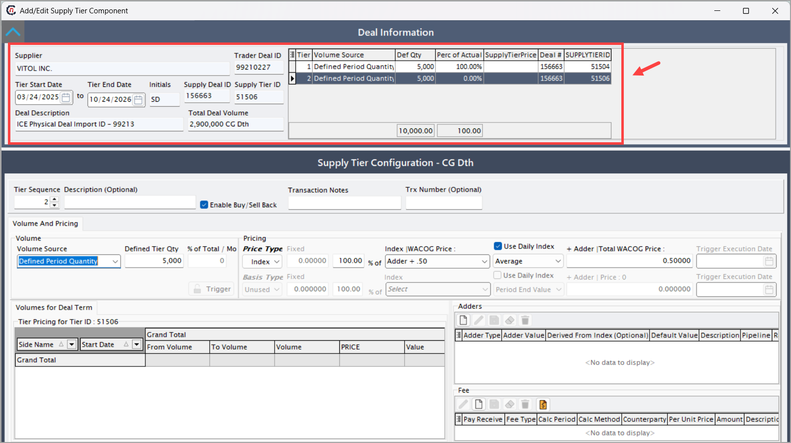

# Configure physical pricing for a deal

nGenue enables you to efficiently manage the pricing details of physical deals, ensuring accuracy and compliance with business requirements. Adding physical pricing for a deal involves specifying critical pricing attributes, such as the pricing type, contract details, and applicable rates. This guide provides a step-by-step procedure to seamlessly add physical pricing to a deal within the nGenue platform.

## Prerequisites

Before proceeding, ensure the following:

1. A [deal has been successfully created](../deal_management/create_deal.md) in the nGenue application.

## Adding physical pricing for a deal

When you create a deal via **Deal management** page, the pricing tier is auto-created by default. To add a new pricing tier, follow the below steps:

1. Click on the **Add a new tier** button.
   

2. On the next screen, in the **Deal information** section, a summary of the deal configuration is displayed such as supplier, trader deal id, deal start date and end date and various other information.

2. In the **Supply tier configuration** section, fill in the below fields as mentioned in the table below:

      | **Field** | **Description** |
      |---|---|
      | Tier sequence        | This is an auto-generated number that represents the sequence of pricing tiers applied within the deal. It helps to determine the order in which multiple pricing tiers are evaluated and applied. |
      | Description          | A user-defined text field that allows you to add a brief explanation or label for the pricing tier. This helps in identifying the purpose or specifics of each pricing configuration. |
      | Enable buy/sell back | This checkbox option allows you to enable or disable the buy-back or sell-back functionality for the specific pricing tier. It is typically used when agreements allow repurchasing or reselling of volumes. |
      | Transaction notes    | A free-text field where you can add any relevant notes or comments associated with the transaction. This can include special conditions, internal references, or reminders for review. |
      | Trx number (optional)| An optional field where you can input a transaction number for tracking or reference purposes. This may be used for audit, reporting, or linking to external systems or documentation. |

3. Under the **Volume and pricing** tab, select the **Volume source** from the dropdown:
      * **Defined period quantity:** Allows you to enter a fixed volume quantity for the pricing tier over a defined period. This is used when the deal specifies exact quantities for pricing calculation.
      * **% of total:** This option calculates the tier volume as a percentage of the total contract volume. Useful for tiered pricing based on volume allocation rules.
      * **Remaining volume:** Automatically assigns the remaining unallocated volume to this pricing tier after other tiers have been configured. This ensures no manual quantity entry is needed.
      * **Volume period:** Enables defining volumes on a periodic basis (monthly, quarterly, etc.) and allows different volumes to be set for each period within the pricing tier.

4. Under the **Pricing** tab, select the pricing type (e.g., fixed or indexed).
      * **Fixed pricing type:** In this pricing type, a fixed price per unit is set for the entire duration or specified periods of the deal. The price does not fluctuate and remains constant throughout. Use this when the price is agreed upon in advance and does not change based on market indices or other factors.
      * **Index pricing type:** In this pricing type, the price is calculated based on a market index (such as NYMEX or any published price index) plus or minus a differential. Prices change with index fluctuations. Use this when pricing is dynamic and tied to market fluctuations, allowing the customer to benefit from market movements.
      
         When you select the **Index** as the pricing type, the following fields and options are displayed. These allow you to define how the index-based price is calculated:
      
         | **Field** | **Description** |
         |---|---|
         | % of index              | Specify the percentage of the selected index price to apply. For example, entering `100%` will use the full index price, while `95%` will apply a 5% reduction on the index price. |
         | WACOG price (dropdown)  | Stands for Weighted Average Cost of Gas. This dropdown allows you to select a WACOG price reference if applicable, as an alternative or additional reference point to the index.   |
         | Use daily index (checkbox) | When enabled, this allows you to choose how daily index values should be considered in pricing. It activates a dropdown with the following options:   - **Period end value**: Use the index value at the end of the period.   - **Average**: Calculate and use the average index value over the selected period.   - **High**: Use the highest index value recorded during the period.   - **Low**: Use the lowest index value recorded during the period. |
         | Adder | A value (positive or negative) that can be added or subtracted from the calculated index price. This is used to adjust the final price based on contract terms or risk factors. For example, an adder of `+0.05` will add 0.05 per unit to the index price. |

3. The final price, including fixed or indexed price, adders (if applicable), and fees, is displayed in the **Total WACOG price** field.

!!!example "Example"
      If you select an index type of **NYMEX**, set **% of Index** to 100%, select **Average** under **Use daily index**, and add an **Adder** of +0.03, the final price calculation will be **(Average NYMEX price for the period × 100%) + 0.03**.

**Review tier details in tabs:**

1. **Volumes by period:** Displays the volume distribution by month or day based on the pricing and volume periods.
2. **Volume for deal term:** Provides a summary of the tier, including configured volume, price, and final value.
   1. **Adders section:** Displays details of adder prices. New adders can be added in this section.
   2. **Fees section:** Displays fees information. Additional expenses can be added using the **Create** button.
      
      
Review all entered details for accuracy, then click **Accept** to apply the physical pricing to the deal. Ensure that the pricing information is accurately reflected in the **Deal summary** screen.

By completing these steps, physical pricing will be successfully added to the selected deal, making it ready for further processing and reporting.

---
