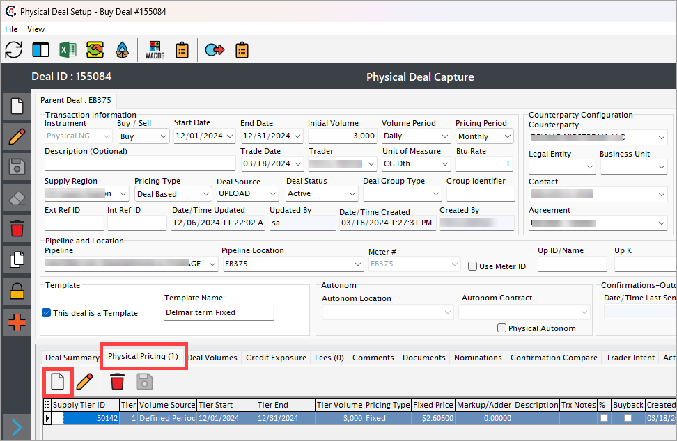
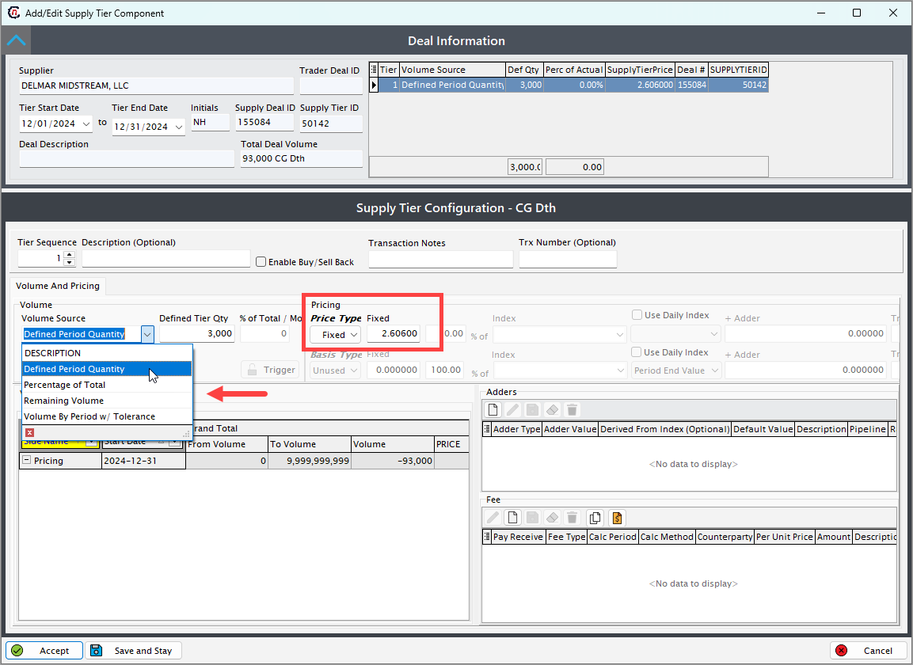
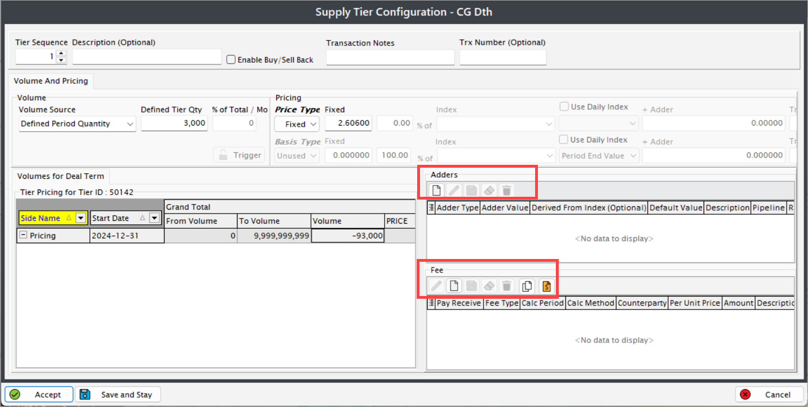

# Physical pricing configurations

nGenue enables you to efficiently manage the pricing details of physical deals, ensuring accuracy and compliance with business requirements. Adding physical pricing for a deal involves specifying critical pricing attributes, such as the pricing type, contract details, and applicable rates. This guide provides a step-by-step procedure to seamlessly add physical pricing to a deal within the nGenue platform.

## Prerequisites

Before proceeding, ensure the following:

1. A [deal has been successfully created](../deal_management/physical_deal.md) in the nGenue application.

## Adding physical pricing for a deal

When you create a deal via deal management page, the pricing tier is auto-created by default. To add a new pricing tier, follow the below steps:

1. Click on the **Add a new tier** button.
   

2. In the **Add/edit supply tier component** screen, provide the following details:
      1. **Tier dates:** Start and end dates are pre-populated based on the deal's start and end dates. Update these dates if needed.
      2. **Description:** Enter a brief description of the deal, if required.
      3. **Total deal volume:** Displays the total volume of natural gas defined in the deal.
      4. **Pricing parameters:** Specify relevant parameters such as rates, volume, and duration.
      5. **Pricing type:** Select the pricing type (e.g., fixed or indexed). For indexed pricing, configure additional fields such as adder price and index value.
      

3. The final price, including fixed or indexed price, adders (if applicable), and fees, is displayed in the **Total WACOG price** field.

4. Review tier details in tabs:
      1. **Volumes by period:** Displays the volume distribution by month or day based on the pricing and volume periods.
      2. **Volume for Deal Term:** Provides a summary of the tier, including configured volume, price, and final value.
         1. **Adders section:** Displays details of adder prices. New adders can be added in this section.
         2. **Fees section:** Displays fees information. Additional expenses can be added using the **Create** button.
            
         
5. Review all entered details for accuracy, then click **Accept** to apply the physical pricing to the deal.
6. Ensure that the pricing information is accurately reflected in the deal summary.

By completing these steps, physical pricing will be successfully added to the selected deal, making it ready for further processing and reporting.
