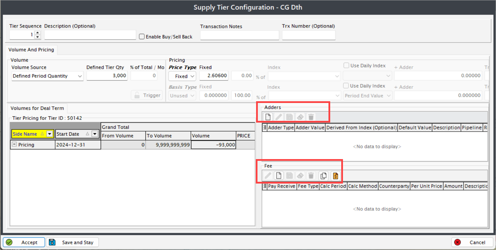

# Understanding physical pricing 

In the natural gas industry, physical pricing refers to the pricing mechanism used for the actual delivery of natural gas, as opposed to financial contracts or derivatives. This document explores the key components of physical pricing, its significance in the market, and the factors that influence pricing in the natural gas sector.

## What is physical pricing?

Physical pricing involves the determination of the price at which natural gas is bought and sold for immediate delivery or for delivery at a specified future date. This pricing is crucial for transactions that involve the physical transfer of gas from producers to consumers, including utilities, industrial users, and other end-users.

## Key components of physical pricing

* **Market locations:** Physical pricing often varies by geographic location due to differences in supply and demand dynamics. Key trading hubs, such as Henry Hub in the United States, serve as benchmarks for pricing.

* **Contract types:** Physical gas transactions can be structured in various ways, including spot contracts (for immediate delivery) and term contracts (for delivery over a specified period). Each type has its own pricing mechanisms.

* **Delivery points:** The price of natural gas can also depend on the delivery point specified in the contract. Different delivery points may have different transportation costs and market conditions.

* **Quality specifications:** The quality of the natural gas being sold can impact its price. Factors such as heating value and the presence of impurities can lead to price adjustments.

## Factors influencing physical pricing

* **Supply and demand:** The fundamental economic principle of supply and demand plays a significant role in physical pricing. Seasonal variations, weather patterns, and changes in production levels can all affect market dynamics.
* **Transportation costs:** The cost of transporting natural gas from production sites to consumption points can significantly influence pricing. Pipeline capacity and tariffs are critical considerations.
* **Regulatory environment:** Government regulations and policies can impact pricing through taxes, subsidies, and environmental regulations that affect production and consumption.
* **Market sentiment:** Speculation and market sentiment can also influence physical pricing. Traders’ perceptions of future supply and demand can lead to price fluctuations.

## Conclusion

Physical pricing in the natural gas industry is a complex interplay of various factors that determine the price at which gas is bought and sold for physical delivery. Understanding these components is essential for stakeholders in the industry, including producers, consumers, and traders, as they navigate the market and make informed decisions.

<!-- ## Prerequisites

Before proceeding, ensure the following:

1. A [deal has been successfully created](../deal_management/create_deal.md) in the nGenue application.

## Adding physical pricing for a deal

When you create a deal via **Deal management** page, the pricing tier is auto-created by default. To add a new pricing tier, follow the below steps:

1. Click on the **Add a new tier** button.
   

2. In the **Add/edit supply tier component** screen, provide the following details:
      1. **Tier dates:** Start and end dates are pre-populated based on the deal's start and end dates. Update these dates if needed.
      2. **Description:** Enter a brief description of the deal, if required.
      3. **Total deal volume:** Displays the total volume of natural gas defined in the deal.
      4. **Pricing parameters:** Specify relevant parameters such as rates, volume, and duration.
      5. **Pricing type:** Select the pricing type (e.g., fixed or indexed). For indexed pricing, configure additional fields such as adder price and index value.
      

3. The final price, including fixed or indexed price, adders (if applicable), and fees, is displayed in the **Total WACOG price** field.

4. Review tier details in tabs:
      1. **Volumes by period:** Displays the volume distribution by month or day based on the pricing and volume periods.
      2. **Volume for Deal Term:** Provides a summary of the tier, including configured volume, price, and final value.
         1. **Adders section:** Displays details of adder prices. New adders can be added in this section.
         2. **Fees section:** Displays fees information. Additional expenses can be added using the **Create** button.
            
         
5. Review all entered details for accuracy, then click **Accept** to apply the physical pricing to the deal.
6. Ensure that the pricing information is accurately reflected in the deal summary.

By completing these steps, physical pricing will be successfully added to the selected deal, making it ready for further processing and reporting. -->
