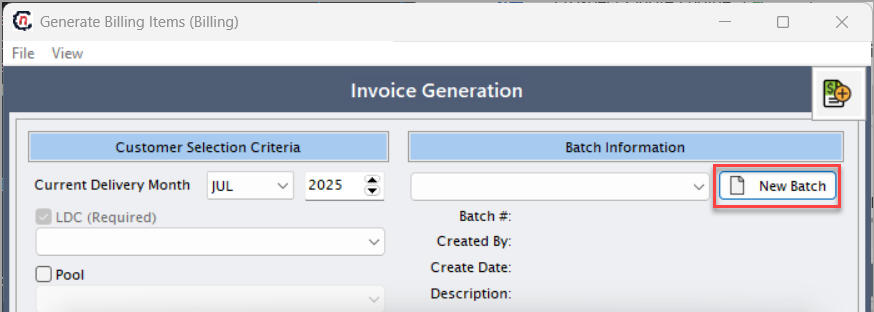
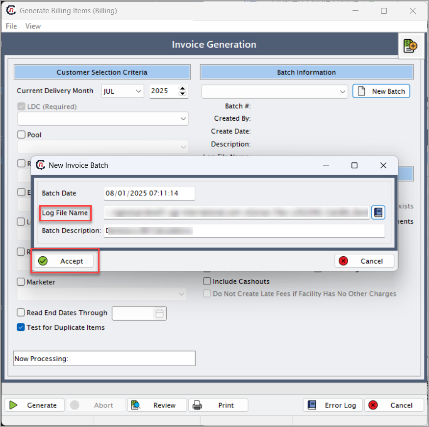
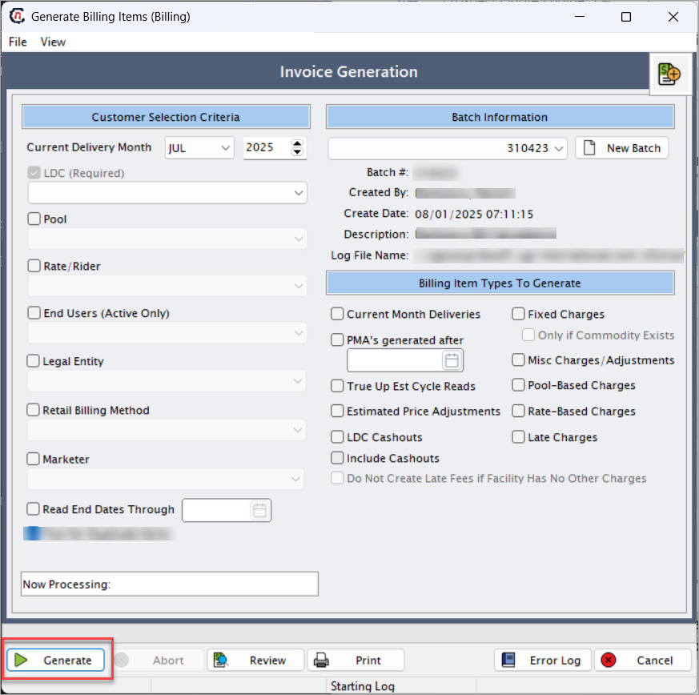
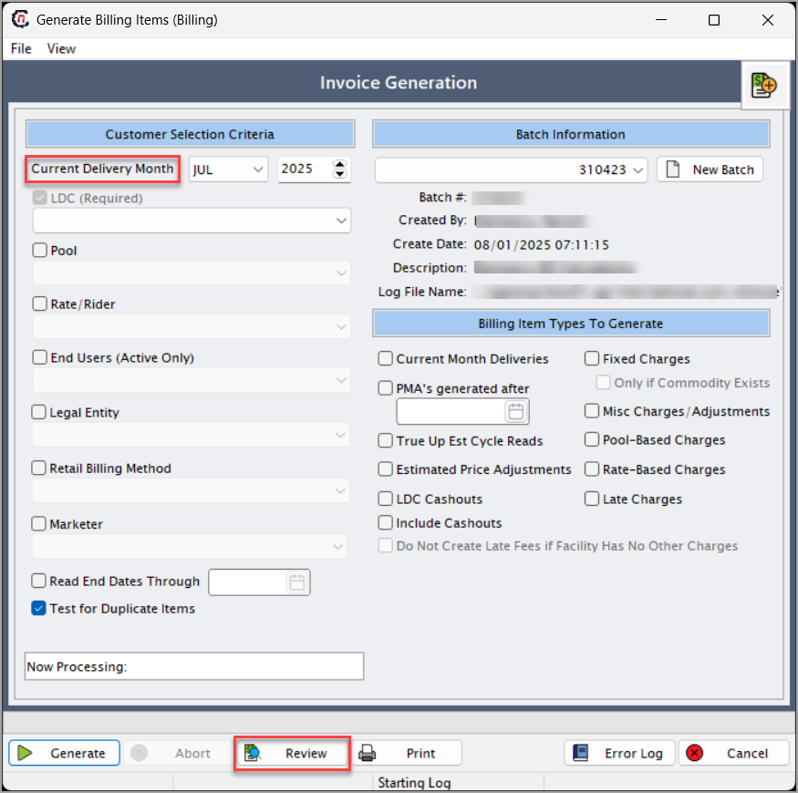

# Billing configuration
**Billing configuration** allows users to set up and manage how invoices are generated for natural gas transactions. It enables users to define and manage the rules, parameters, and templates used for generating invoices and settlements. The configuration supports flexible billing setups based on contract terms, pricing structures, and transaction types, ensuring accurate and consistent billing.

Following are the steps to configure a billing:

1. Navigate to the **Generate billing items** screen. 
2. Click **New batch**.  
   
3. Choose **Log file name** and click **Accept**. The **Log file name** is the path of where the file is located. 
   
4. After accepting, click **Generate**. This will open a popup dialog box, click **OK**. 
   
5. Click **Review** to confirm the billing invoice. 
   
   
    !!!note "Note"
        Verify cashout line items to ensure billing accuracy and alignment with transaction records.
      