# Prospect conversion to end user

After you finalize a prospect's quote, you can convert it to an active end user record. 

Converting a prospect involves:

1. Initiating the conversion from the quote history
2. Completing the new end user wizard
3. Updating the statuses of the end user and facility
4. Ensuring the setup is complete for pricing and operational readiness

## Procedure to convert prospect to end user

Follow these steps to initiate the conversion:

1. Right-click on a selected quote in the **Quote history** section.  
2. Select **Convert to active end user** from the context menu.
    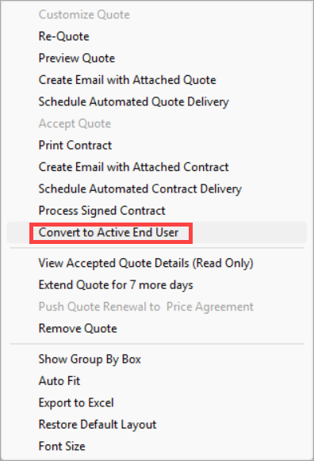

3. Once a prospect is converted to an end user and their status is updated to **Converted to end user**, they can follow the standard process to create a new quote whether for a renewal or a new purchase. 
4. After the new quote is accepted, right-click on the quote and select **Push quote renewal to price agreement** to generate the price agreement for the renewal.
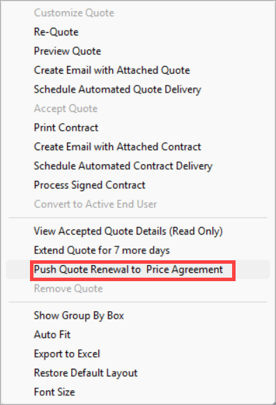

    !!! note "Note"  
        1. If a new facility is added, the system automatically triggers an enrollment request.  
        2. **Meter Cycle Reads (MRC)** are required and must be valid for the full quote term. The quote cannot be accepted without valid MRCs.

5. Ensure the system carries over all prospect details correctly.  
6. Click the **Save** button.
    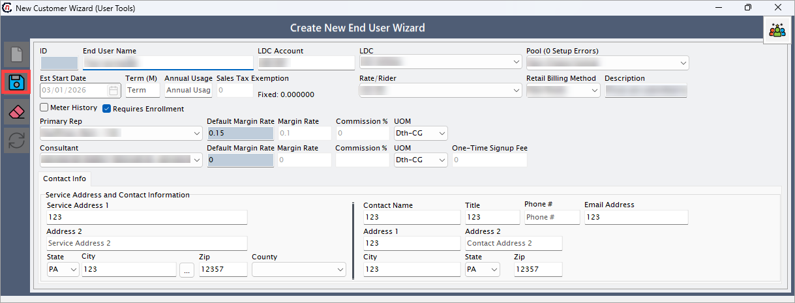
7. The system converts the prospect into an end user.  
    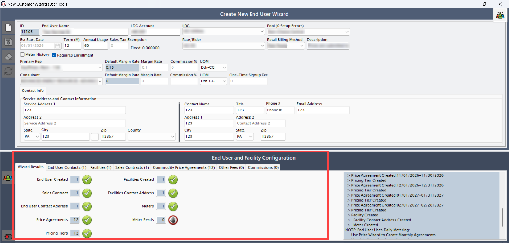

### Activating end user and facility

#### Activate end user

To activate an end user, follow the steps below:

1. Go to the **End user** screen.  
2. Click the **Activate end user** icon.
    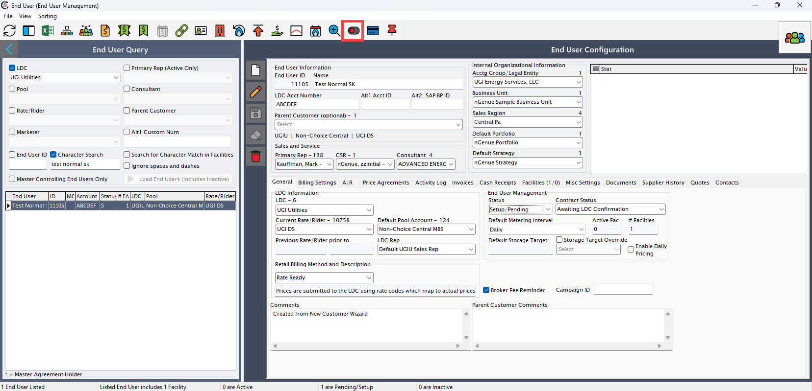
3. The system updates the end user status to **Active**.
    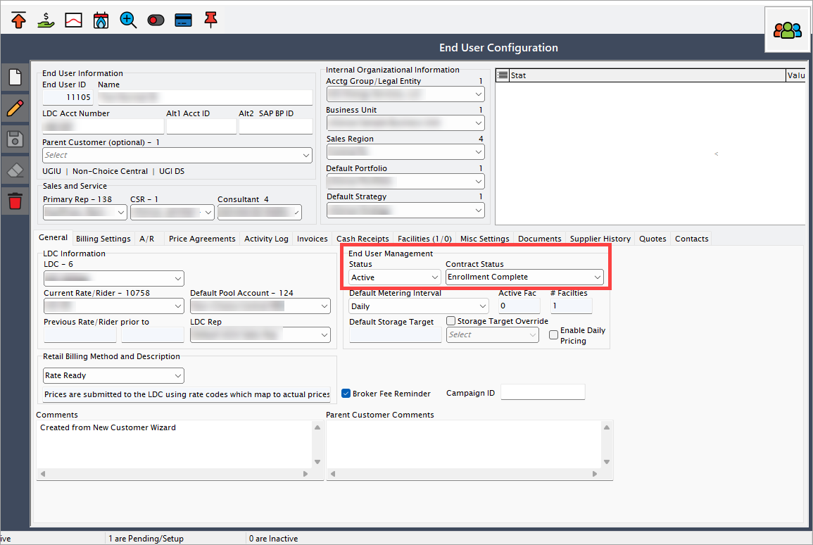
4. If any contact details or mandatory configurations are missing, a validation warning appears. Ensure all missing details are updated before proceeding.
    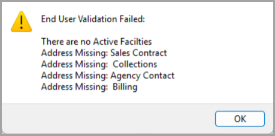

#### Activate facility

To activate a facility, follow the steps below:

1. Navigate to the **Facility** screen.  
2. Click the **Change facility status** icon.
    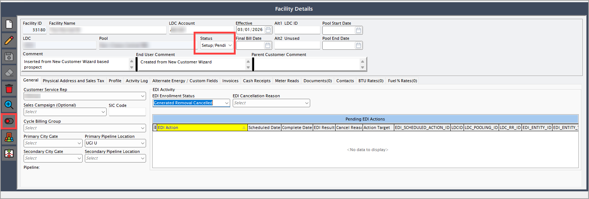
3. Enter the **Effective date** and click **Accept**.
    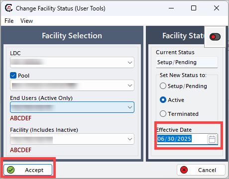
4. A warning message is displayed. Click **Yes** to proceed.
    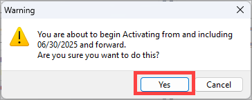
5. The facility status changes to **Active**.  
    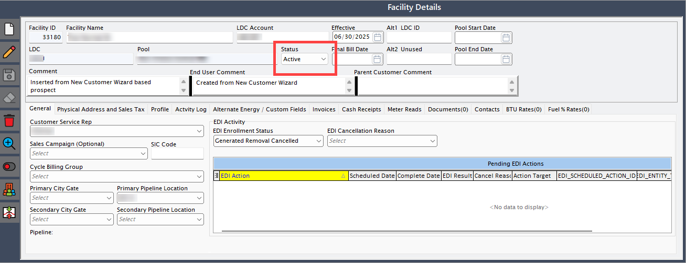

<!-- 
## Verify additional details  

- **Address validation:** Confirm the correctness of the **End user address**.  
- **Facilities:** Uncheck **Hide inactive facilities** to view all associated facilities.  
- **Price agreements:** Check whether the system reflects price agreements correctly.  
- **Tiers:** Verify the correct association of the tier structure with the **End user**.  
- **Components:** Ensure the system lists all necessary components.  
- **Computed price:** Confirm that the computed price reflects accurate product and override values.  
    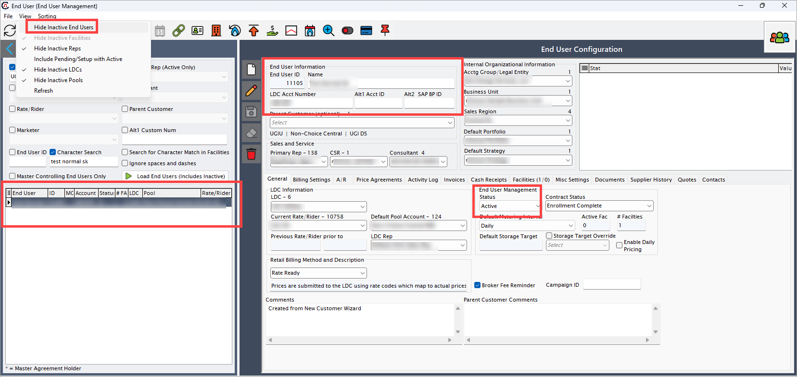 -->

## 🔍 Final verification checklist

After the conversion, validate the following elements to ensure all configurations are complete:

* **End user address**: Confirm correct and valid address information.
* **Facilities**: Uncheck **Hide inactive facilities** to review all associated facilities.
* **Price agreements**: Ensure pricing details are updated and agreements are reflected correctly.
* **Tier structure**: Verify correct tier association with the end user.
* **Components**: Check that all required components are assigned and listed.
* **Computed price**: Confirm that the computed price reflects accurate product and override values.
    

---
