# Understanding LDC pricing product

The **LDC pricing product** is how your gas company calculates your bill. It includes:

- Fixed fees (like delivery charges)  
- Variable costs (based on how much gas you use)  
- Government-approved rates (to make sure prices are fair)  

This system ensures your bill is correct and follows all the rules. 

## Configure a LDC pricing product

1. Log in to the **nGenue** application.  
2. Click on the **Search** icon and enter *LDC pricing products* in the search bar.  
3. Double-click on the **LDC pricing products** in the search result to open the **LDC pricing products** screen.
    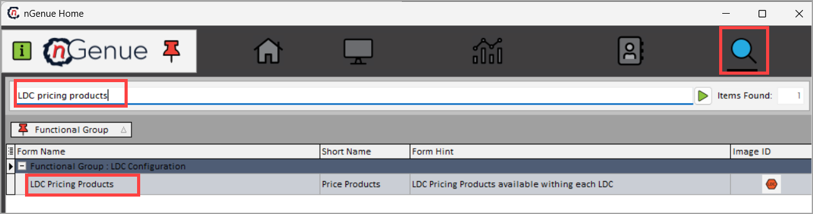

4. The **LDC pricing products** screen is divided into two sections:
    1. LDC selection
    1. Pricing product details

### 1. LDC selection

The **LDC selection** displays the already configured **LDC pricing product** details. 

To preview the LDC pricing product details:

1. Select the **LDC** from the drop-down list.  
2. Enable the **Filter by effective dates** option and specify the desired date range.  
3. To find existing LDC records, enter the **LDC name** in the **Search string** field.  
4. Click on **Load product details** to proceed.  

### 2. Pricing product details

This section consists of three tabs:

- **General**: Configure basic details of the LDC pricing product.  
- **Components**: Add, edit, or manage pricing components.  
- **Retail cashouts**: Manage cashout records associated with the LDC pricing product.
    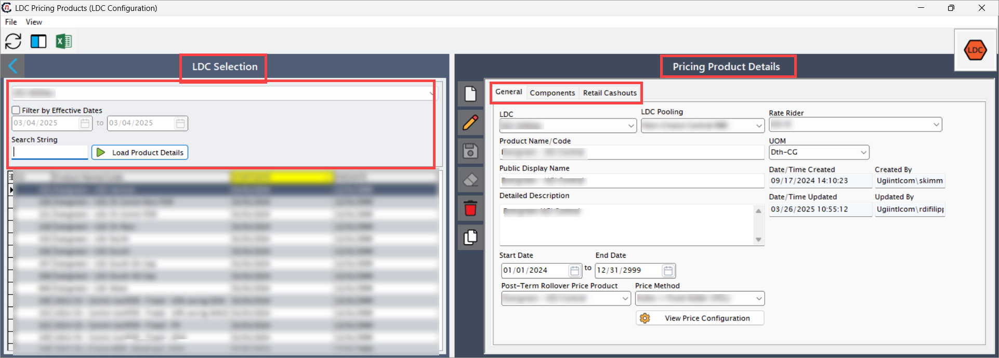

#### General tab

1. Navigate to the **General** tab.
2. Click **Add a LDC pricing record** to create new pricing product.  
3. Fill in the details as mentioned in the table below:  

    | Fields | Description |  
    |--------|--------------|  
    | LDC | Select the relevant LDC from the dropdown list. |  
    | LDC pooling | Select the appropriate pooling option that groups customers under the same pricing structure. |  
    | Rate rider | Select the rate rider from the dropdown list. |  
    | Product name/Code | Enter a unique name or code that identifies the product or defines the product name based on the configuration. |  
    | Units of Measure (UOM) | Refers to the standard measurement used to quantify the natural gas billed or tracked. Common units include:   • Hundred cubic feet (CCF)   • Thousand cubic feet (MCF)   • Million British thermal units (MMBtu)   • Million cubic feet (MMCF)   • British thermal unit (energy) (BTU)   • **Therm:** 100,000 BTUs |  
    | Public display name | Enter the desired public display name in this field. |  
    | Detailed description | Add a short description explaining the pricing product’s purpose and key details. |  
    | Start date/End date | Defines the start and end date for a pricing product. |  
    | Post-Term rollover price product | The post-term rollover price product (Evergreen) ensures uninterrupted service by automatically applying the designated pricing product and creates a price agreement when no active agreement exists but has reads from the utility. |  
    | Price method | Select the pricing method from the dropdown to determine the configuration of the agreement. |  

4. After entering all mandatory fields in the **General** section, click the **View price configuration** button.
    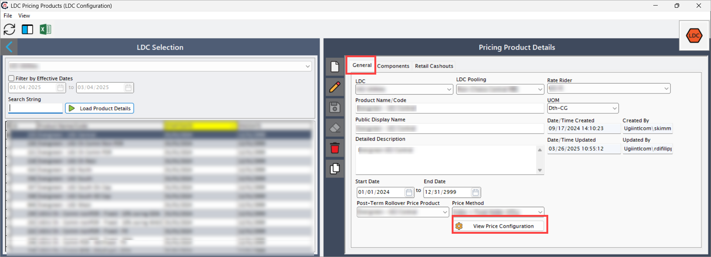
5. The system will redirect to the **Price template configuration** screen, where you can configure the price method, volume, commodity and basis configurations, and tiers lock configuration.
    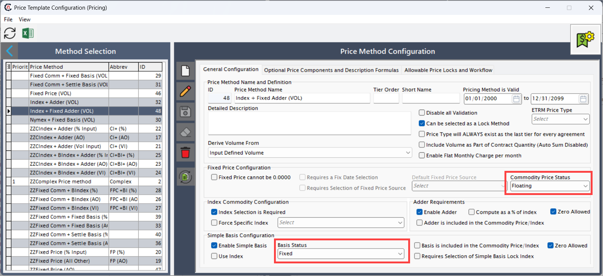

    !!!note "Note"

        **Critical validations**:

        1. **Enabling WACOG**: Ensure components marked as "part of WACOG" for any component which is required to be part of WACOG, and they will be shown under **WACOG = Y** in **Quote customization**.  
        2. **Price agreement derivation**: Verify WACOG and compute price align with the quote’s configured components.  
        3. **Basis mandatory**: If commodity is floating, basis must be configured (fixed or floating).  

#### Component tab

In the **Component** tab, you can define different price components.  

##### Key WACOG rules scenarios

| Scenario | Commodity | Basis | WACOG enabled? | WACOG flow to price agreement | Compute price logic |  
|----------|-----------|-------|----------------|-------------------------------|---------------------|  
| Fixed + Fixed | Fixed | Fixed | Yes | Commodity | WACOG + Non-WACOG components |  
| Fixed + Floating | Fixed | Floating | Yes | Commodity | WACOG + Non-WACOG components |  
| Float + Fixed | Floating | Fixed | Yes | Basis | WACOG + Non-WACOG components |  
| Floating + Floating | Floating | Floating | No | NO WACOG | Sum of all components (WACOG = 0) |  

**Steps to create pricing components**:

1. Navigate to the **Components** tab.
2. Select the month and year for the **Pricing product.**  

    !!!note "Note"

        The **Total price** is calculated by adding up the prices of all the individual price product components (Sum of all pricing components).  

3. Click on the **Add pricing component** icon; it will populate the **Pricing component configuration** screen.  
    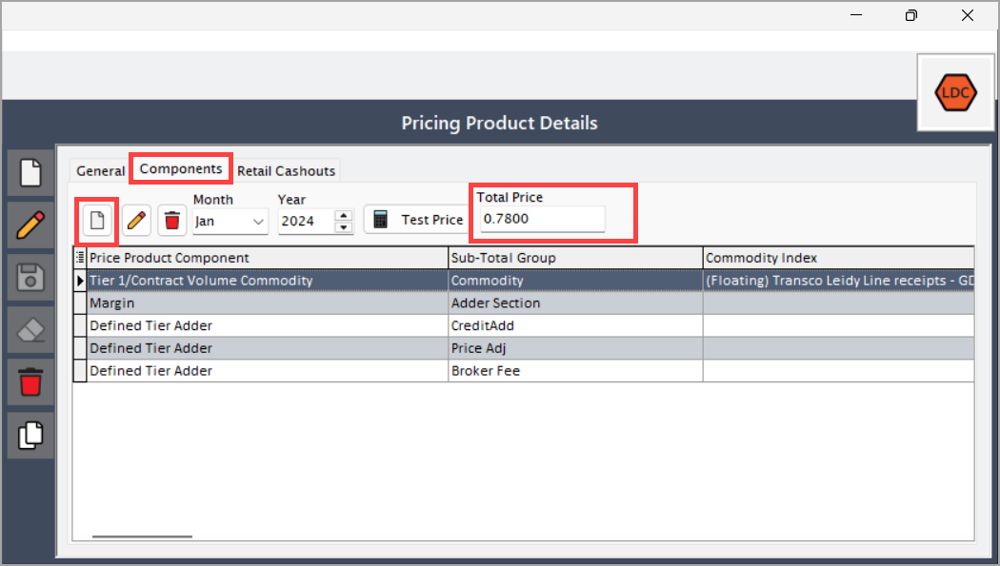
4. Under **Pricing component configuration**, you can configure different types of **Pricing component types** such as:  
    - Defined tier adder  
    - Fixed fee  
    - LDC distribution charge  
    - Margin  
    - Pipeline transport fee  
    - POR (Purchase of Receivables)  
    - Storage charge  
    - Tier-1/Contract volume basis  
    - Tier-1/Contract volume commodity  
    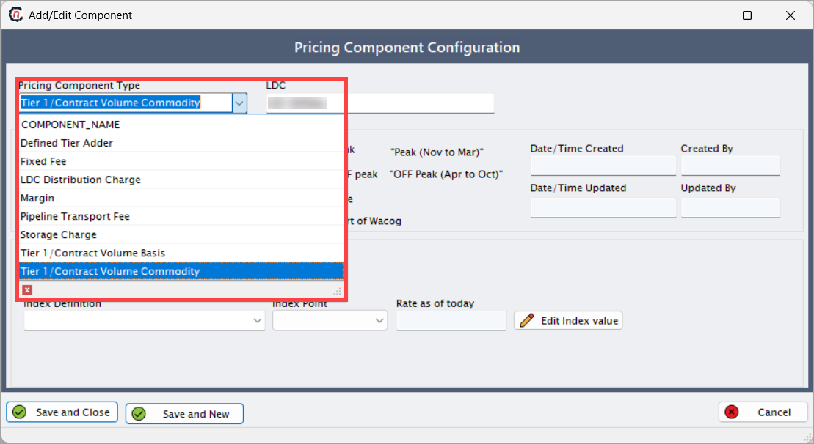
5. Enable the following common checkboxes when creating a new pricing product:  

    | Checkbox | Description |  
    |----------|-------------|  
    | Applies to peak | If enabled, this will be implemented for Peak months (November to March). |  
    | Applies to off-peak | If enabled, this will be implemented for Off-Peak months (April to October). |  
    | Allow override | Enables users to manually adjust or modify the default value of the pricing component, if necessary. Can override in the Quote. |  
    | Include as part of WACOG | Specifies whether the pricing component should be included in the Weighted Average Cost of Gas (WACOG) calculation for the commodity. |  

##### Fixed fee

A charge that stays constant for a specified volume of natural gas.  

**Steps to create fixed fee component**:

1. Select **Fixed fee** from the dropdown list as a pricing component type.  
2. Fill in the fields as shown in the table below:  

    | Fields | Description |  
    |--------|--------------|  
    | LDC | Select the LDC from the dropdown. |  
    | Description | Description of the fixed fee component. |  
    | Date/Time | The date and time when the pricing component is defined. |  
    | Created by | Name of the person who defined the pricing component. |  
    | Updated by | Initially matches created by. Updates automatically when changes are made. |  
    | Flat charges | Enter the flat/fixed charges. |  
    | Save and close | Saves the information and closes the add or edit Component screen. |  
    | Save and new | Saves the current component and opens a new one for configuration. |  

3. Click **Save and close** to save the fixed fee component configuration.  
    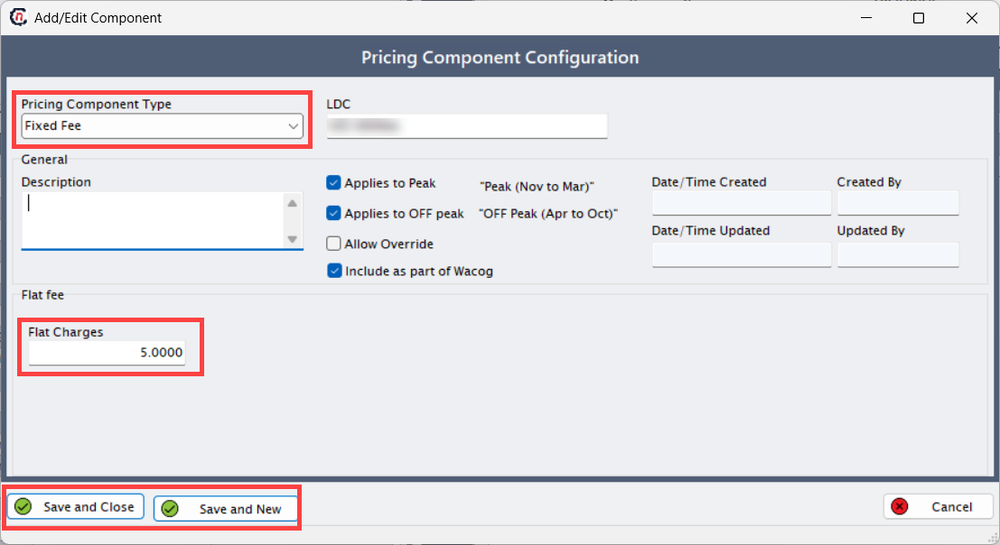

##### Defined tier adder

An additional charge applied to specific usage tiers in the pricing structure.  

**Steps to create defined tier adder**:

1. Select **Defined tier adder** from the dropdown list as a pricing component Type.  
2. Fill the following fields:  

    | Fields | Description |  
    |--------|--------------|  
    | LDC | Select the LDC from the dropdown. |  
    | Description | Description of the defined tier adder component. |  
    | Date/Time | The date and time when the pricing component is defined. |  
    | Created by | Name of the person who defined the pricing component. |  
    | Updated by | Initially matches created by. Updates automatically when changes are made. |  
    | Adder type | Select the adder type from the dropdown. |  
    | Adder value | Enter the price for the adder type. |  
    | Save and close | Saves the information and closes the add or edit Component screen. |  
    | Save and new | Saves the current component and opens a new one for configuration. |  

3. Click **Edit pricing adder type** to add or modify adder types and default charge values.  
4. Click **Add a adder types record** icon to create a new adder type (if required).  
5. If no changes are needed, click **Save and close**.  
    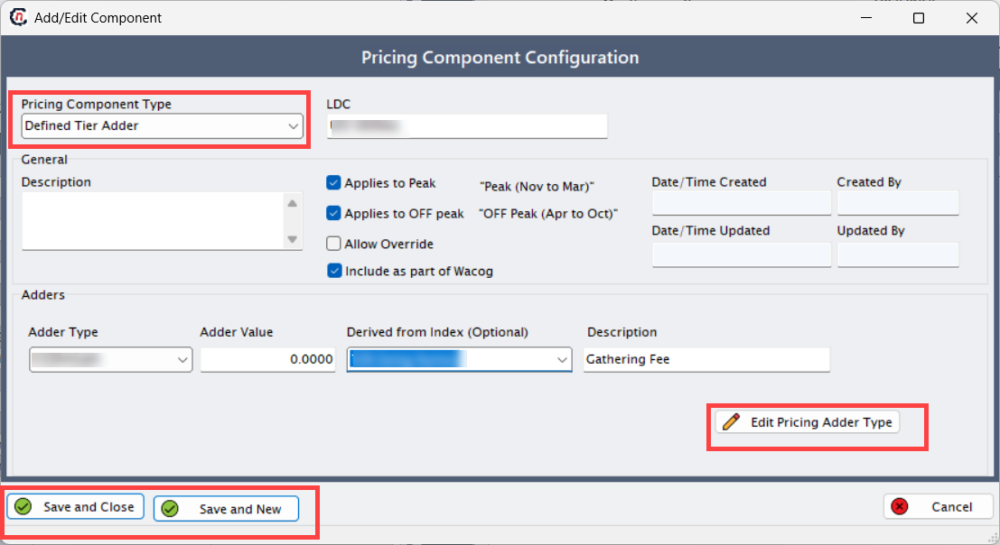

    !!! note "Note"

        If a default value is provided, it will be pre-filled in the **Adder value** field. The user can modify this value as required.  

##### LDC distribution charge

A fee charged by the LDC for delivering natural gas to the end-user. This covers the maintenance and operation of the distribution network.  

!!! note "Note"

    Before setting up the LDC distribution charge, ensure DQ values are added from the **LDC Charge Definition** screen.  

**Steps to create LDC distribution charge component**:

1. Select **LDC distribution charge** from the dropdown list as a pricing component type.  
2. Fill in the following fields:  

    | Fields | Description |  
    |--------|--------------|  
    | LDC | Select the LDC from the dropdown. |  
    | Description | Description of the LDC distribution charge component. |  
    | Date/Time | The date and time when the pricing component is defined. |  
    | Created by | Name of the person who defined the pricing component. |  
    | Updated by | Initially matches created by. Updates automatically when changes are made. |  
    | LDC charge | Defined in the **monthly LDC charge value** screen. |  
    | LDC charge as of today | The active LDC gas delivery rate as of today. |  
    | Save and close | Saves the information and closes the **Add or edit component** screen. |  
    | Save and new | Saves the current component and opens a new one for configuration. |  

3. Click **Edit LDC charge** to add or modify default charge values.  

    !!!note "Note"

        To ensure the LDC value displays correctly in the quote, verify:  
        a. DQ values are mandatory and must be provided.  
        b. In the **LDC rate class**, the specific daily value must match the corresponding value under the **DQ values** tab in the **Prospect information** screen.  

4. In **Tier 1 rate** field, define the LDC charges for each month.  
5. The **Filter by month** option allows users to search for charges applicable to a specific month.  
6. If no changes are needed, click **Save and close** to save the configuration.  
    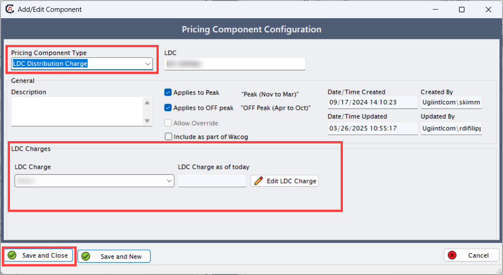

##### Margin

The difference between the cost of providing a service or product and the selling price, representing the profit.  

!!!example "Example"

    - If the cost to supply natural gas is $5/unit and the supplier charges $7/unit, the **margin** is $2 (profit per unit).  

**Steps to create margin component**:

1. Select **Margin** from the dropdown list as a pricing component type.  
2. Fill in the following fields:  

    | Fields | Description |  
    |--------|--------------|  
    | LDC | Select the LDC from the dropdown. |  
    | Description | Description of the margin component. |  
    | Date/Time | The date and time when the pricing component is defined. |  
    | Created by | Name of the person who defined the pricing component. |  
    | Updated by | Initially matches created by. Updates automatically when changes are made. |  
    | Margin | Enter the margin charge. |  
    | Save and close | Saves the information and closes the **Add or edit component** screen. |  
    | Save and new | Saves the current component and opens a new one for configuration. |  

3. Click **Save and close** to save the margin component configuration.
    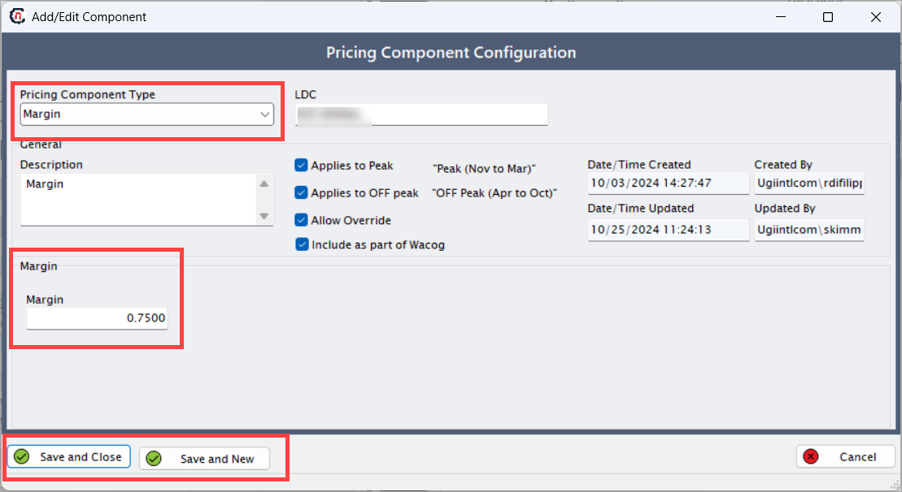

##### Pipeline transportation fee

A charge for moving natural gas through interstate or intrastate pipelines from the supply source to the LDC's distribution system.  

!!!note "Note"

    You must enter an **end date** in the **LDC charge configuration** for the system to display the pipeline values in the quote.  

**Steps to create pipeline transportation fee component**:

1. Select **Pipeline transportation fee** from the dropdown list as a pricing component type.  
2. Fill in the following fields:  

    | Fields | Description |  
    |--------|--------------|  
    | LDC | Select the LDC from the dropdown. |  
    | Description | Description of the pricing component. |  
    | Date/Time | The date and time when the pricing component is defined. |  
    | Created by | Name of the person who defined the pricing component. |  
    | Updated by | Initially matches created by. Updates automatically when changes are made. |  
    | Pipeline component type | Enter the pipeline component type. |  
    | Pipeline name | Select the pipeline name from the dropdown. |  
    | Pipeline charge | Select the charge from the dropdown. |  
    | Zone name | Enter the name of the applicable zone. |  
    | Rate as of today | Update with current rates to determine pipeline transport fees. |  
    | Save and close | Saves the information and closes the **Add or edit component** screen. |  
    | Save and new | Saves the current component and opens a new one for configuration. |  

3. Click **Edit pipeline charge** to manually adjust the rate. Modify pipeline details if required.  
4. Click **Save and close** to save the configuration.
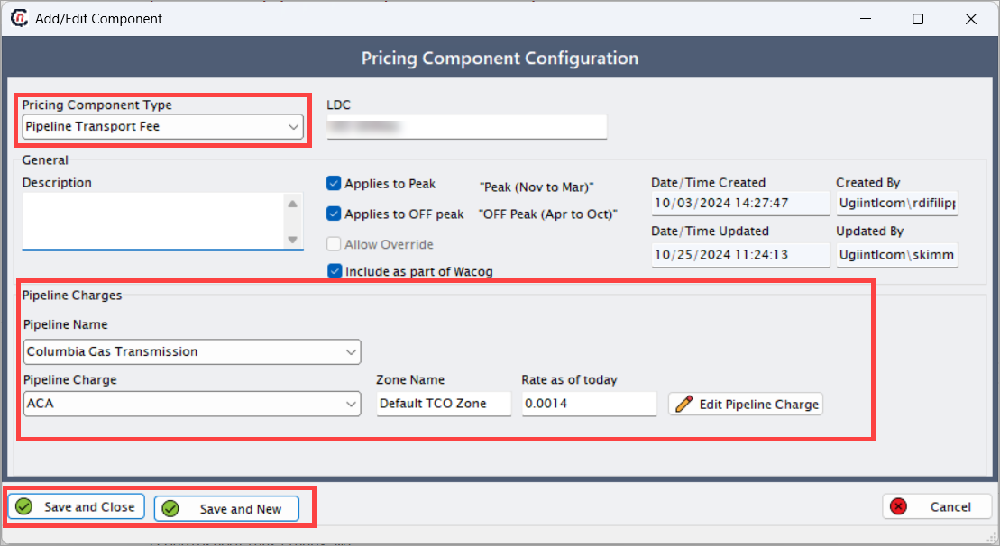 

##### Purchase of Receivables (POR) 

The utility pays the gas supplier for customer bills and then collects the money from the customers.  

!!!note "Note"

    Ensure POR is enabled in the **LDC rate class** screen. If not enabled, it will not appear in the component type.  

!!!example "Example"

    - Customer bill: $100  
    - Utility pays supplier $98 (keeps $2 as a fee).  
    - Utility bills customer $100 and collects payment.  

**Steps to create POR component**:

1. Select **POR** from the dropdown list as a pricing component type.  
2. Fill in the following fields:  

    | Fields | Description |  
    |--------|--------------|  
    | LDC | Select the LDC from the dropdown. |  
    | Description | Description of the POR component. |  
    | Date/Time | The date and time when the pricing component is defined. |  
    | Created by | Name of the person who defined the pricing component. |  
    | Updated by | Initially matches created by. Updates automatically when changes are made. |  
    | POR | Non-editable; values are derived from the LDC rate class. |  
    | Save and close | Saves the information and closes the **Add or edit component** screen. |  
    | Save and new | Saves the current component and opens a new one for configuration. |  

3. Click **Save and close** to save the POR component configuration.  
    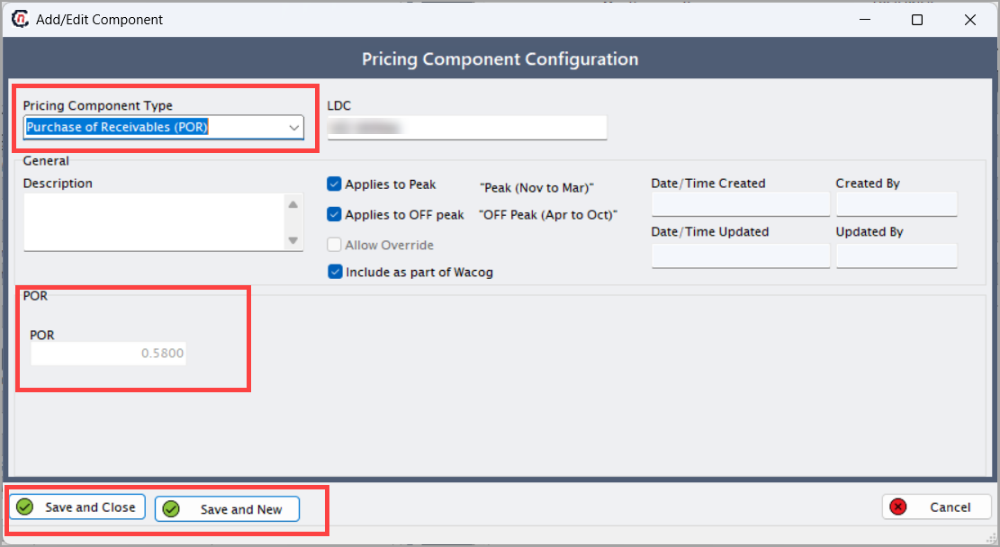

##### Storage charge

The cost for storing natural gas to ensure it’s available when demand is high.  

!!!note "Note"

    You must enter an **end date** in the **LDC charge configuration** for the system to display the storage charge values in the quote.  

**Steps to create storage charge component**:

1. Select **Storage charge** from the dropdown list as a pricing component type.  
2. Fill in the following fields:  

    | Fields | Description |  
    |--------|--------------|  
    | LDC | Select the LDC from the dropdown. |  
    | Description | Description of the storage charge component. |  
    | Date/Time | The date and time when the pricing component is defined. |  
    | Created by | Name of the person who defined the pricing component. |  
    | Updated by | Initially matches created by. Updates automatically when changes are made. |  
    | Pipeline component type | Enter the pipeline component type. |  
    | Pipeline name | Select the pipeline name from the dropdown. |  
    | Storage charge | Select the charge from the dropdown. |  
    | Zone name | Enter the name of the applicable zone. |  
    | Rate as of today | Update with current rates to determine storage fees. |  
    | Save and close | Saves the information and closes the **Add or edit component** screen. |  
    | Save and new | Saves the current component and opens a new one for configuration. |  

3. Click **Edit storage charge** to manually adjust the rate.  
4. Update storage fees if required.  
5. Click **Save and close** to save the configuration.
    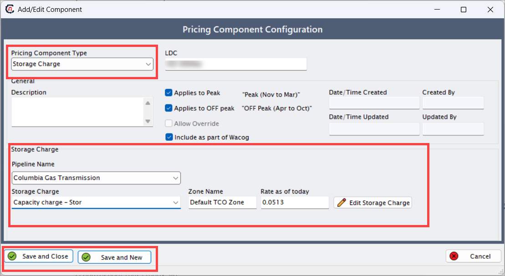

##### Tier-1/Contract volume basis

Fixed charges based on a pre-agreed volume, regardless of actual usage.  

**Steps to create Tier-1/contract volume basis component**:

1. Select **Tier-1/Contract volume basis** from the dropdown list as a pricing component type.  
2. Fill in the following fields:  

    | Fields | Description |  
    |--------|--------------|  
    | LDC | Select the LDC from the dropdown. |  
    | Description | Description of the component. |  
    | Date/Time | The date and time when the pricing component is defined. |  
    | Created by | Name of the person who defined the pricing component. |  
    | Updated by | Initially matches created by. Updates automatically when changes are made. |  
    | Type | Select from:   • **Fixed**: Constant price.   • **Floating**: Fluctuates based on market indices.   • **Fixed from today's index**: Fixed price based on the current index rate. |  
    | Basis | Specify the charge for the selected pricing basis. |  
    | Basis index | Select the **Basis index** from the dropdown. |  
    | Index point | Choose the appropriate index point. |  
    | Rate as of today | Update with current rates. |  
    | Save and close | Saves the information and closes the **Add or edit component** screen. |  
    | Save and new | Saves the current component and opens a new one for configuration. |  

3. Click **Edit index value** to manually adjust values.  
4. In the **Index curve definition** screen, input charges monthly or daily.  
5. Click **Save and close** to save the configuration.
    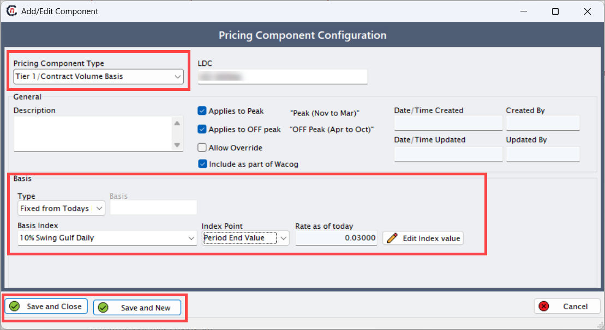

##### Tier-1/Contract volume commodity

Choose **Tier-1/Contract volume commodity** as the component type.  

**Steps to create Tier-1/contract volume commodity component**:

1. Select **Tier-1/Contract volume commodity** from the dropdown list as a pricing component type.  
2. Fill in the following fields:  

    | Fields | Description |  
    |--------|--------------|  
    | LDC | Select the LDC from the dropdown. |  
    | Description | Description of the component. |  
    | Date/Time | The date and time when the pricing component is defined. |  
    | Created by | Name of the person who defined the pricing component. |  
    | Updated by | Initially matches created by. Updates automatically when changes are made. |  
    | Type | Select from:   • **Fixed**: Constant price.   • **Floating**: Fluctuates based on market indices.   • **Fixed from today's index**: Fixed price based on the current index rate. |  
    | Fixed price | Specify the charge for the selected pricing basis. |  
    | Index definition | Select the index definition (created in **Index curve definition**). |  
    | Index point | Choose the appropriate index point. |  
    | Rate as of today | Update with current rates. |  
    | Save and close | Saves the information and closes the **Add or edit component** screen. |  
    | Save and new | Saves the current component and opens a new one for configuration. |  

3. Click **Edit index value** to manually adjust values.  
4. In the **Index/Curve values** screen, input charges monthly or daily.  
5. Click **Save and close** to save the configuration.  
    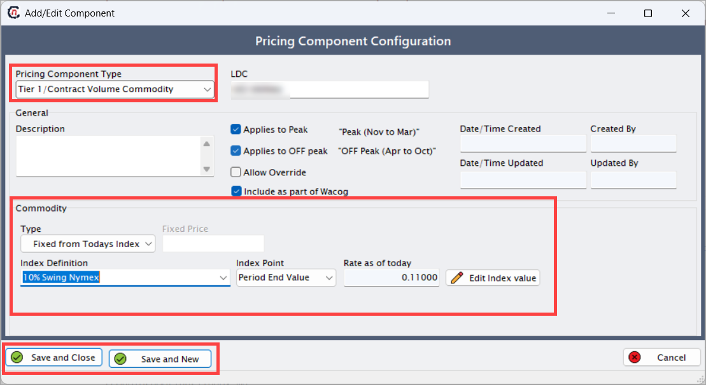

#### Retail cashouts tab

**Cashouts** are financial adjustments when actual usage differs from the contracted quantity. The system calculates the difference and applies predefined rates to settle the imbalance.  
!!!example "Example"

    - Contracted quantity: 28,569 units  
    - Actual usage: 29,089 units  
    - Difference: 520 units → Charged at $2.222/unit.  

**Swing**: Defines the allowable percentage deviation from the contracted quantity.  

- **Within swing**: Fixed rate applies.  
- **Exceeds swing**: Excess charged at a different rate (e.g., market price).  

    !!!example "Example"

        - **Contracted quantity**: 28,569 units  
        - **Swing threshold**: 10% (2,856.9 units)  
        - **Actual usage**: 29,089 units → 520 units within swing → Charged at $2.222/unit.  
        - **If usage exceeds swing (e.g., 32,000 units)**: Excess (3,431 units) charged at market rate.  

**Tolerance**: Operational allowances for variances (e.g., fuel loss). Adjustments occur automatically without penalties.  

!!!example "Example"
  
    - Total fuel: 38,000 units  
    - Fuel loss tolerance: 5% (1,900 units)  
    - System deducts 1,900 units before billing.  

**Steps to configure a retail cashout**:

1. Navigate to the **Retail cashouts** tab.  
2. Click **Add new cashout**.
    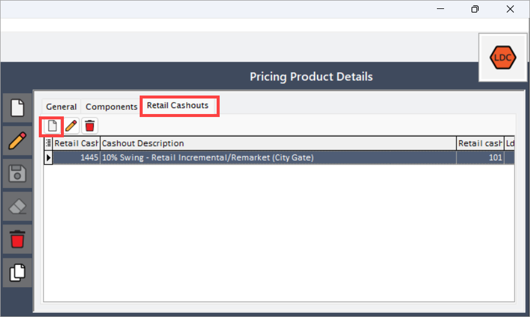
3. Select the **Cashout definition** from the drop-down.

    !!!note "Note"

        **Cashout definition** configured in the **Retail cashout definition** screen. Common scenarios:   • **0% swing**: No deviation allowed. Penalties apply immediately.   • **10% swing**: Permits up to 10% over-usage before penalties.

4. Set the **Tolerance** level.
5. Select the **Start date and end date**.
6. Enable **Daily calculation (checkbox)**.
7. Click on the **Tier 1 pricing** or **Tier 2 pricing** tabs, which is categorized into two scenarios:  
   a. **Excess**: Charges for usage above the contracted quantity.  
   b. **Short**: Charges for usage below the contracted quantity.  

    ##### Excess section

    | Fields | Description |  
    |--------|-------------| 
    | Price formula | Method to calculate cashout charges (e.g., fixed, index). |  
    | Index (if applicable) | Use a market-based rate. |  
    | Percent | Weight applied to the index (100% = full index value). |  
    | Fixed price | Flat rate per unit for excess usage. |  
    | Premium rate | Additional charge per unit for excess usage. |  
    | Margin/Broker fee | Extra costs added to the total cashout amount. |  

    ##### Short section

    | Fields | Description |  
    |--------|-------------|
    | Price formula | Method to calculate cashout charges. |  
    | Index (if applicable) | Use a market-based rate. |  
    | Percent | Weight applied to the index. |  
    | Fixed price | Flat rate per unit for under-usage. |  
    | Restocking rate | Fee per unit for under-usage. |  
    | Margin/Broker fee | Extra costs added to the total cashout amount. |  

8. Click **Accept** to save the configuration.
    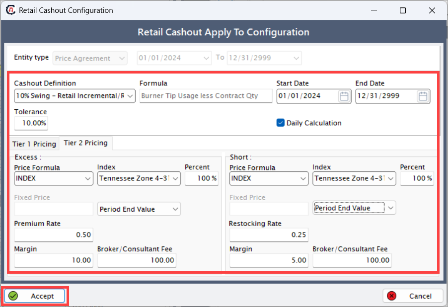

---