# Price lock and liquidation configuration

The **Price lock and liquidation configuration** feature allows users to manage price locks and liquidation for natural gas transactions. Users can lock in prices for specific periods, securing favorable rates and managing price risk effectively. Flexible configuration options support various liquidation methods, helping users adapt to market changes and optimize trading strategies. It also provides a clear and auditable record of all price lock and liquidation activities, supporting transparency and alignment with regulatory requirements.

## Procedure to configure price lock and liquidation

### Step 1: Navigate to the Price agreement screen
**Price agreement** specify the pricing structure and validity period for gas transactions with counterparties. This section allows users to access, create, or modify pricing details that are applied in contract management and billing processes.

Follow below steps to navigate to the **Price agreement** screen:

1. Go to the **End user** screen, then navigate to **Price agreement** screen to view all existing price agreement records.
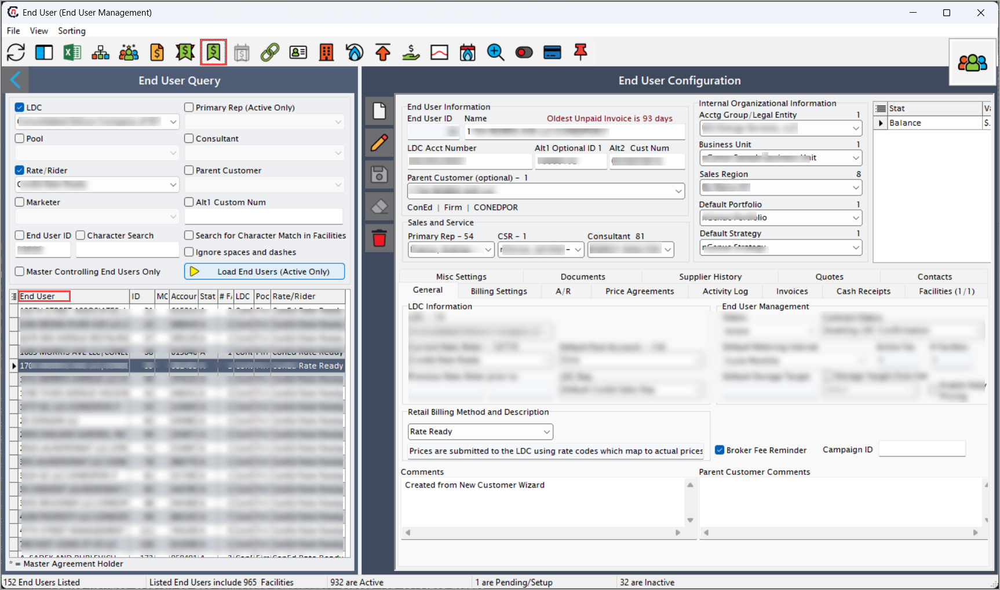
2. Select the price agreement record to open **End user price agreement** screen.
3. Click **Edit** to modify **Pricing tiers** details.
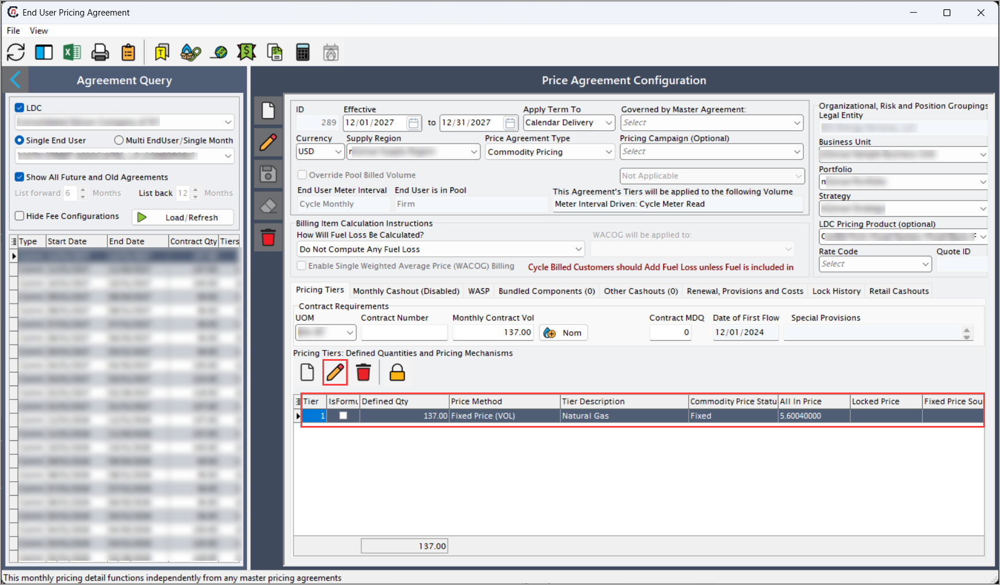
4. Define the fields available in the **Complex pricing**, **Components** and **Computed price** tab.
5. Click **Save** to apply changes. 
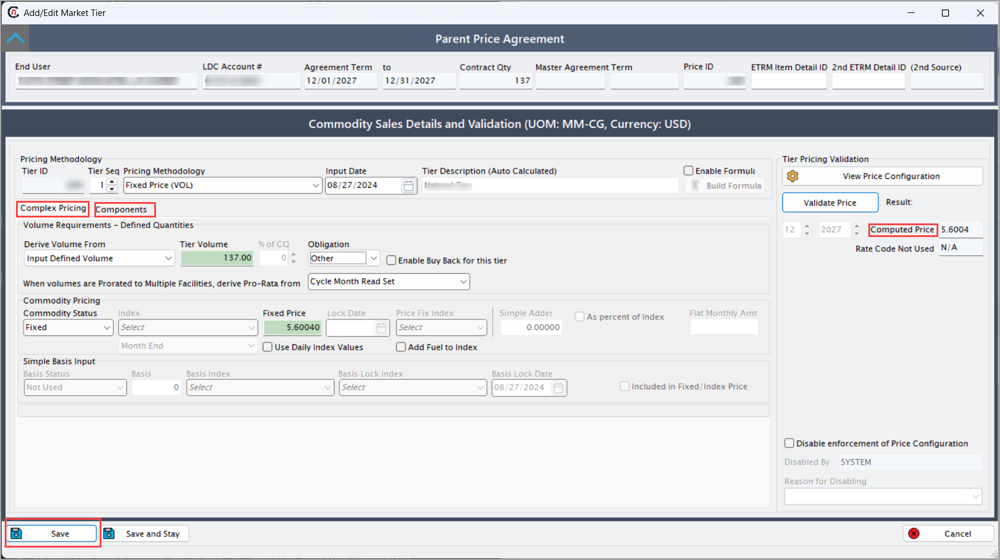

    !!!note "Note"
         **Price agreements** may differ significantly depending on the Pricing methodology applied.

### Step 2: Configure lock
**Lock configuration** is the process of fixing prices or volumes for a defined period to protect against market fluctuations. Locked volumes are calculated using a single Weighted Average Cost of Gas (WACOG) applied uniformly across all months.

1. Navigate to the **Price agreement** screen.  
2. Click on the **Lock** icon to open the **Price lock wizard**. 
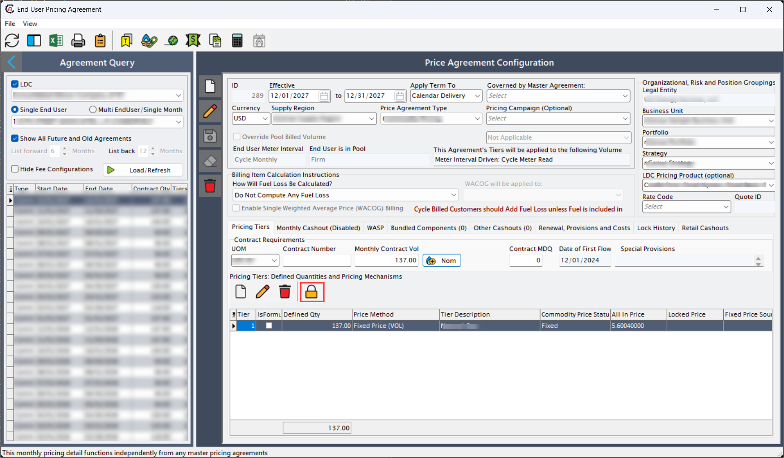 
3. In the **Price lock wizard** screen, fill in the below details:
    1. Specify the date range and enter the **Volume to lock/fix**. 
    1. Choose the **Execute price lock method** from the dropdown.
    1. Enable the **Use single WACOG for all months** checkbox (optional).
    1. Click **Next**.
       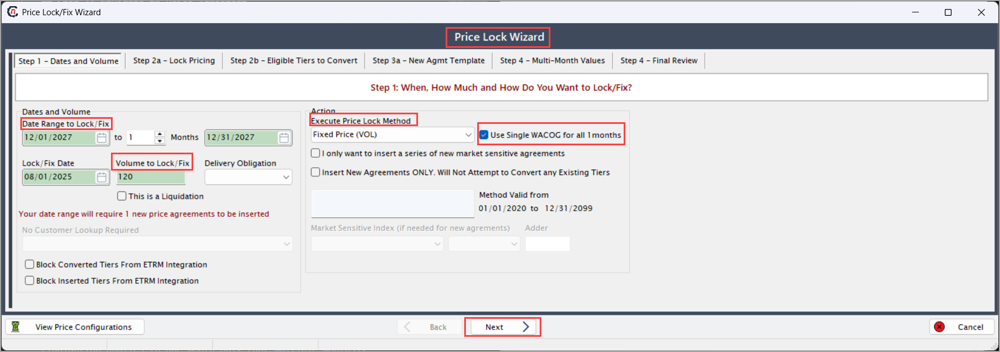

5. Verify whether the **Eligible** box is checked for each tier and click **Next**. 
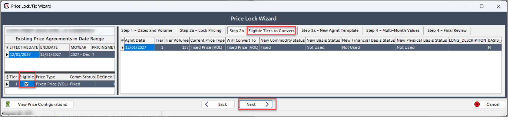

    !!!note "Note" 
        The display of the commodity and basis value will depend on the price method locking configuration. 

8. Review the **WACOG details (commodity-specific)** and click **Next**.
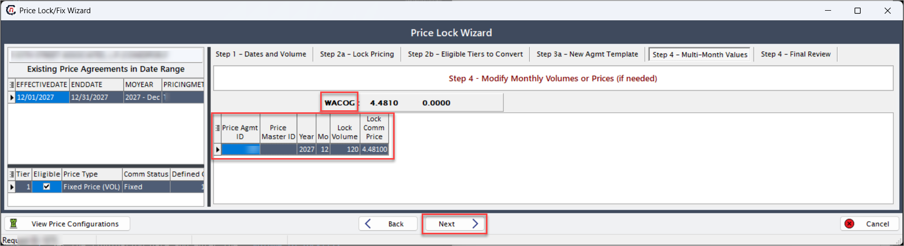
9. Validate the **new volume** and click **Execute lock**. The locked volumes displays in the **Pricing agreement** screen for selected months.
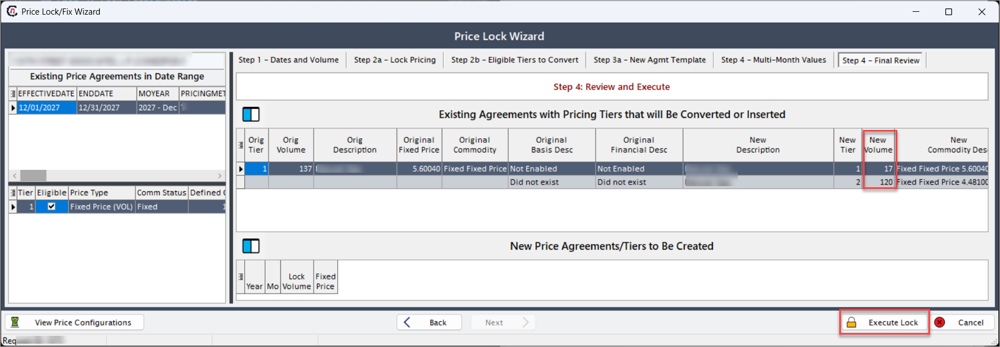

### Step 3: Configure liquidation
**Liquidation** is the process of closing or offsetting a position by creating opposing tiers—one positive and one negative. It is typically used for risk management or contract settlement. Liquidation applies to a single month only and cannot span multiple months.

Follow the below steps to configure the **liquidation** in nGenue. 

1. Click the **Lock** icon to reopen the **Price lock wizard** screen.
    
2. Set the liquidation date and enter the **Volume to lock/fix**. 
4. Select **Execute price lock method** from drop-down. 
   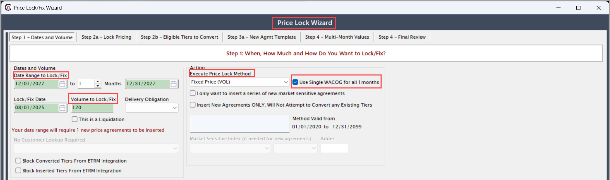 
5. Enable the checkbox: **This is a liquidation**. Click **Next**.
   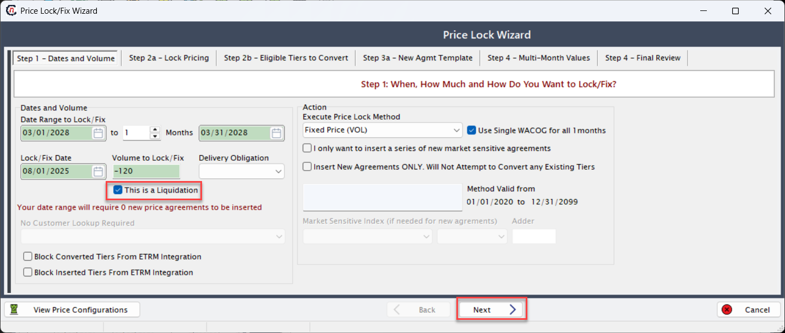 
7. Check the **Eligible** box of each tier and click **Next**.
   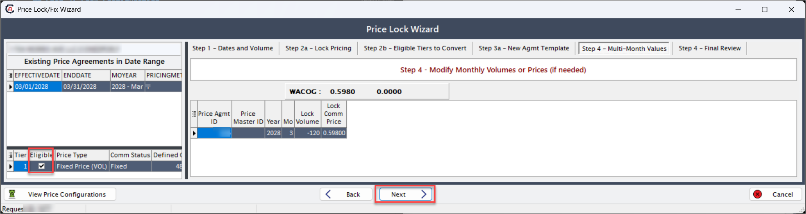 
8. Validate the liquidation volume and click **Execute lock**. This will create two tiers, one negative and one positive tier.
   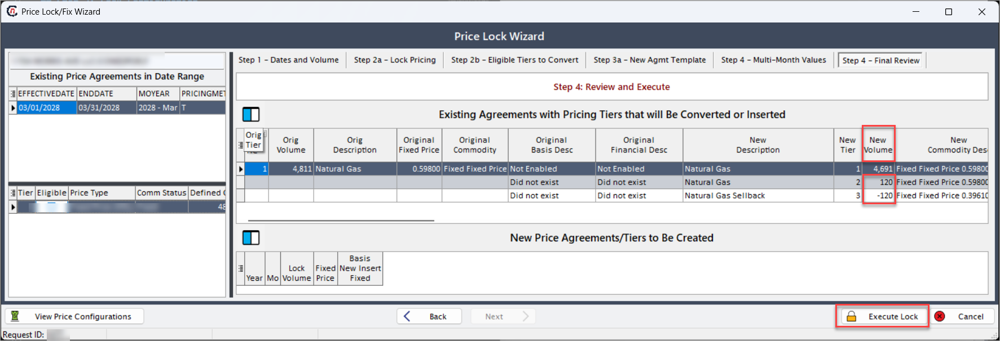

---   

