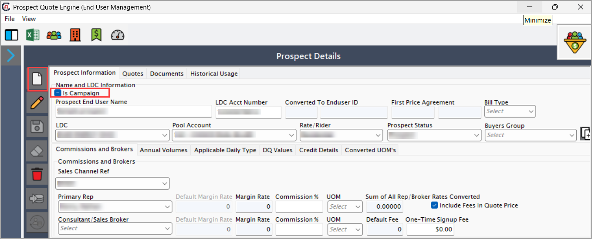
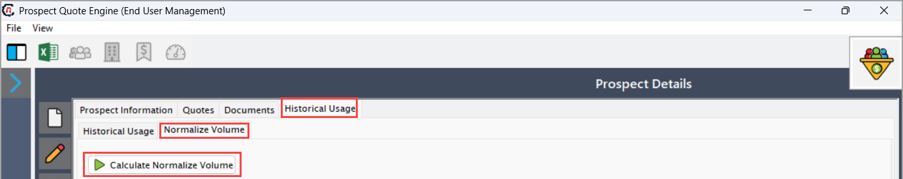
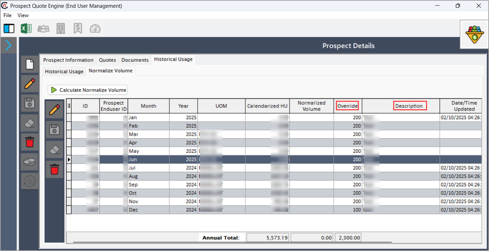
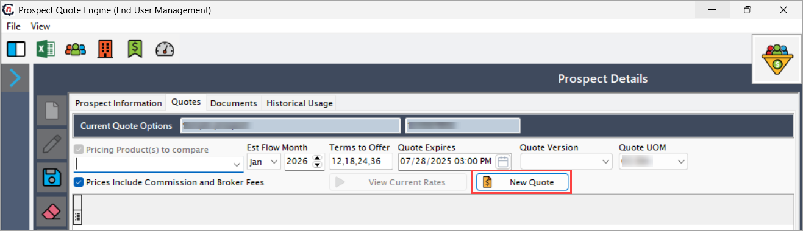
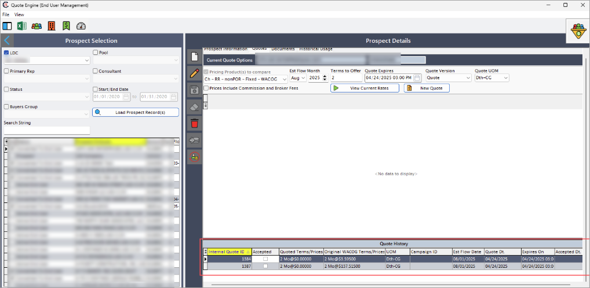
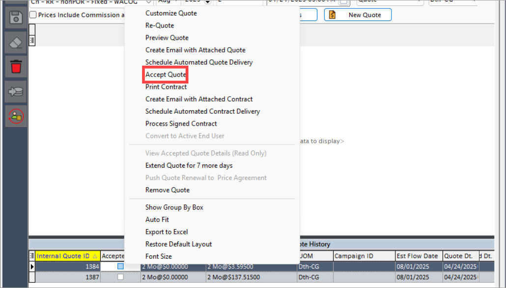

# Mass marketing
 
**Mass marketing** supports large-scale marketing strategies by enabling the enrollment of multiple prospects under a unified pricing product. This approach enhances efficiency and ensures consistency in pricing, quoting, and enrollment, making it ideal for managing group-focused marketing campaigns with ease.

## Procedure to create a mass marketing campaign
 
Follow the steps below to create and manage **Mass marketing campaign**:
 
### Step 1: Enable the "Is campaign" checkbox
 
1. Navigate to **Prospect quote engine** screen.
   
2. In the **Prospect Information** section, click **Add a prospect record**.
3. Select the **Is campaign** checkbox. 
4. Fill in the details as mentioned in the table below: 
   
    | Fields | Description |
    |--------| ------------ |
    | Prospect end username| Enter the unique identifier for the prospect.|
    | LDC |  Select the Local Distribution Company (LDC) associated with the prospect.|
    |Pool account | Choose the appropriate pool account that groups similar customers under a unified pricing structure.|
    | Rate rider |  Select the rate rider from the dropdown, which applies special charges, discounts, or adjustments to the base rate, depending on LDC-specific rules.|
    | Prospect status | Choose the current status of the prospect. The following status options are available:   1. **Prospect**: Initial status assigned to new leads who have not yet started the negotiation process.   2. **Negotiating**: The prospect is currently in discussions regarding pricing, terms, or contract finalization   3. **No longer viable**: The prospect is no longer a potential customer due to disinterest, or other business reasons.   4. **Converted to end user**: The prospect has completed the transition and is now an active customer in the system.|
    | Add primary rep | Enter the name of the primary representative responsible for this prospect. This helps in assigning ownership and follow-up actions.|
    | UOM | Define the unit (e.g., CCF, MCF, MMBtu) for rate calculations. |

5. After filling in all required fields, click **Save**.
 
### Step 2: Calculate normalize volume
 
1. Navigate to **Historical usage** > **Normalize volume** tab.
    
2. Click **Calculate normalize volume** button.
3. Enter  **Override value** and **Description**.
   
4. Click **Save** to update the details.
 
### Step 3: Configure the quote
 
1. Navigate to the **Quote** tab.
   
2. Configure the quote with the following fields:

    | Fields | Description |
    |--------| ------------ |
    | Pricing product | Select the appropriate product from the dropdown menu.|
    | Estimated flow month | Enter the starting month for gas delivery under the quote. |
    | Quote UOM (Unit of measure) | Define the unit (e.g., CCF, MCF, MMBtu) for rate calculations. |
    | Quote version | Select either Prospect quote or Prospect Nymex quote from the dropdown. |     
    
3. Click **New quote**. The system will generate a new quote associated with a unique Campaign ID, which will be visible in the **Quote history** section.  
 
### Step 4: Accept the quote
 
1. In the **Quote history** section, search for the quote you created recently.
    
2. Right-click on the quote and select **Accept quote**.
    
3. Click **Finish** to confirm the quote.
 
### Step 5: Prepare the EDI file for enrollment

1. Download the predefined **Campaign template** from the **Master data** screen, or use an existing version if available.

    Complete the following mandatory fields in the template:
       
    | Fields | Description |
    |--------| ------------ |
    | LDC name | Select the Local Distribution Company (LDC) associated with the prospect. |
    | LDC pool | Select the appropriate pooling that groups customers under the same pricing structure. |
    | End user state | Select the state from the dropdown where the end user operates. |
    | End user billing contact for invoice |Specify contact title, email, and city, ZIP. |
    | Price agreement configuration details | Define quote accepted date, quote start and end date, campaign ID, and rate code. |
    | LDC account number | Provide the utility account number assigned by the LDC. |
    | Bill cycle | Select the billing cycle group aligned with the utility’s schedule from the dropdown. |

2. **Sales representatives** must complete the template manually for each prospect, ensuring the following:
    - The correct **Campaign ID** is entered in the appropriate column for each relevant end user.
    - If multiple campaigns are active, create separate **Campaign codes** as needed. Assign the appropriate code to each prospect based on the campaign they belong to.

3. Save the completed template and upload it to the designated **EDI path**.
 
### Step 6: Enrollment initiation
 
1. The **EDI service** will automatically detect the uploaded file in the designated path and initiate the enrollment process.
2. All prospects listed in the template will be:

    * Converted into **Active end users.**
    * Enrolled based on the **Campaign ID.**
    * Automatically associated with the corresponding **Facility, Price agreement**, and other necessary configurations as defined in the template.

        !!!note "Note" 
            The entire downstream enrollment process is handled by the EDI service based on the structured data provided in the uploaded campaign template.