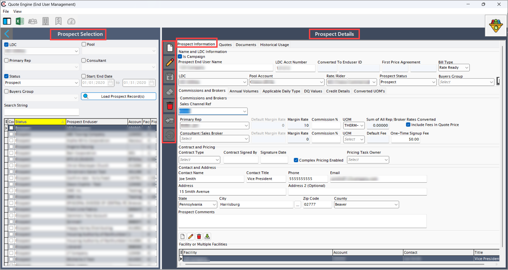
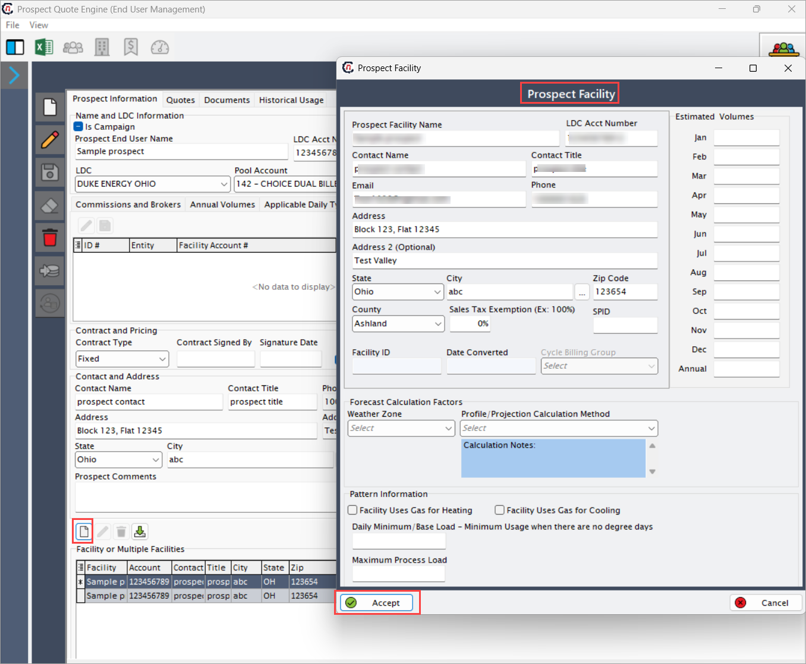
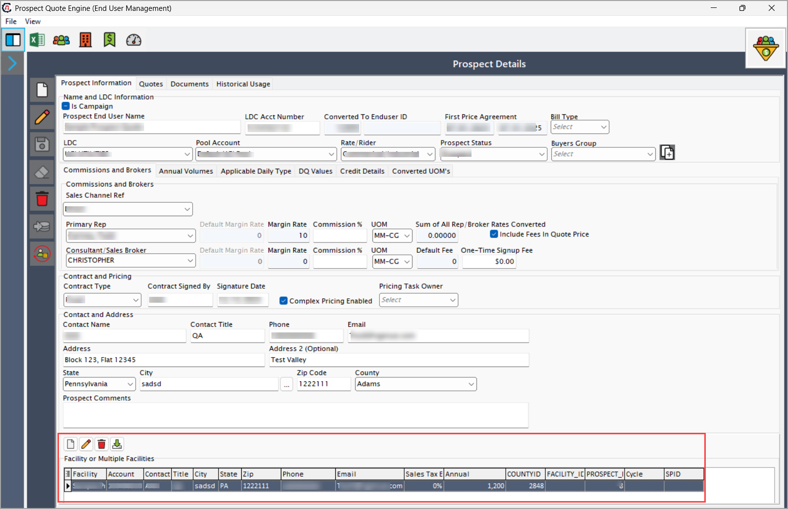
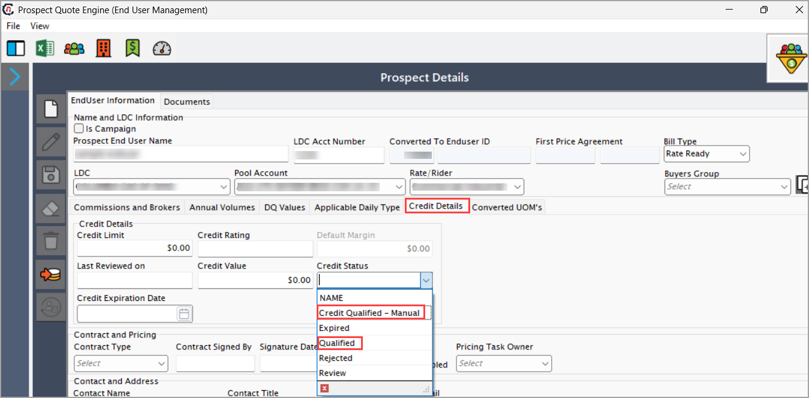
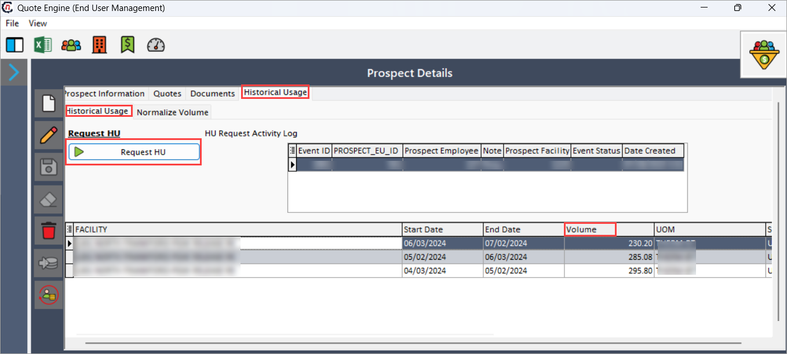
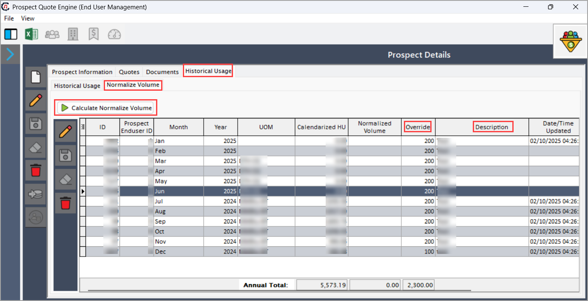
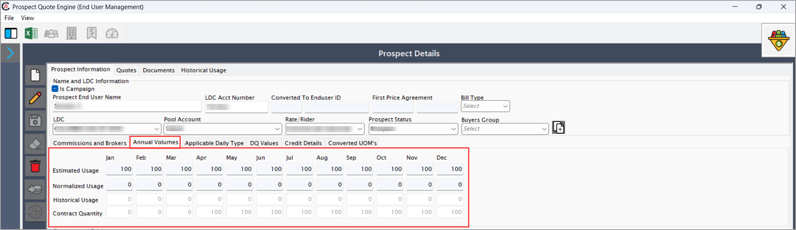

# Create a new prospect
 
Creating a prospect is the initial step in the quoting process. It involves capturing essential customer information to prepare a quote efficiently. By following the steps below, users can add new prospects in the system through the **Prospect quote engine** screen.
 
## Procedure to create a prospect

The procedure below highlights the steps to create a prospect in nGenue.
 
### Step 1: Add prospect details
 
1. Navigate to the **Prospect quote engine** screen in nGenue.
2. Click **Add a prospect record**. 
   

    !!!note "Note"
         Make sure the prospect has the same **LDC, LDC pool, rate rider,** and **UOM** configured on the **LDC pricing product** screen. These fields are required to enable and use the associated product fields.
 
3. Below are fields and description available in the **Quote engine** screen:
 
    | Fields | Descriptions |
    |--------| ------------ |
    |Is campaign (check box)| Identifies prospects generated through marketing campaigns. Checking this box hides prospect/facility details and restricts quote customization.|
    |Prospect end username | Enter the prospect’s name.|
    |LDC acct number | Provide the utility account number assigned by the LDC.|
    | Converted to end user ID | Automatically generates a unique customer ID upon prospect conversion.|
    | Bill type | Specify the billing structure:   1. Rate ready (fixed pricing) or   2. Dual ready (flexible pricing).|
    |LDC | Select the LDC associated with the prospect’s utility account from the pre-configured dropdown.|
    | Pool account | Choose a pool account (shared purchasing group) from the dropdown configured in the LDC Pool settings.|
    | Rate/rider | Choose the Rate/Rider (pricing structure) from the dropdown configured in the Rate/Rider settings.|
    | Prospect status | Track the current stage of the prospect in the sales pipeline (e.g., New, Negotiation, Accepted). |
    | Buyers group | Assign the prospect to a buyers group to enable bulk quoting for multiple accounts. |
    | Sales channel ref | Identify the sales channel (e.g., Direct, Broker, Online) that originated the prospect.|
    | Primary rep | Assign the primary sales representative responsible for managing the prospect. |
    | Consultant/sales broker | Designate any third-party brokers or consultants involved in the transaction. |
    | Margin rate | Display the profit margin percentage (auto-populated based on the selected sales representative or broker). |
    | Commission% | Show the commission percentage allocated to reps/brokers (auto-calculated from their profiles).|
    | UOM | Define the unit of measure (e.g., kWh, MWh) for rate calculations.|
    | Sum of all rep/broker rates | Validate that the total commission percentages for reps/brokers do not exceed 100%.|
    |Include fees in quote price | Enable to display the total quote price with all fees included.|
    | Contract type | Select the agreement type (e.g., Fixed-Term, Variable) from the dropdown.|
    | Contract signed by | Enter the full name of the authorized signatory for the contract.|
    | Signature date | Capture the date the contract was officially signed.|
    | Pricing task owner | Assign the team member responsible for validating quote pricing from the dropdown.|
    | Contact name | Enter the prospect’s primary contact name.|
    | Contact title | Provide the title of the prospect’s primary contact.|
    | Phone | Enter a valid phone number for the prospect.|
    | Email | Provide a valid email address for the prospect.|
    | Address | Enter the service address (must match LDC records for validation).|
    | State | Select the state from the dropdown where the prospect operates.|
    | City | Enter the city associated with the prospect’s service address.|
    | Zip code | Enter the 8-digit postal code for the prospect’s location. |
    | Country | Select the country from the dropdown where the prospect is located.|
 
4. Click **Save**.
 
### Step 2: Add or import facility

<!-- add brief description here -->
Adding or importing a facility is to monitor and measure gas delivery while being compliant with standards and regulations of gas industry. It also helps in commercial and contractual tracking, to perform operational controls. Facility data are used to generate reports for regulatory bodies and invoices in billing process.
 
Follow the steps below to add or import a facility:
 
#### Add a facility
 
1. Click on the **Add facilities** icon.
2. A new popup window appears where the fields are auto-filled based on the details provided in the **Prospect information** tab.
 
3. Below are the fields and description of the **Prospect facility** screen:
 
    | Fields | Description |
    |--------| ------------ |
    | Prospect facility name | Enter the official name of the facility.|
    | LDC acct number | Enter the utility account number issued by the LDC.|
    | Contact name | Enter the primary contact’s full name for the facility.|
    | Contact title | Specify the job title of the facility’s primary contact.|
    | Email | Enter a valid email address for the facility’s primary contact.|
    | Phone | Enter a valid phone number for the facility’s primary contact.|
    | Address | Enter the facility’s service address (must match LDC records).|
    | State | Select the state where the facility is located from the dropdown.|
    | City | Enter the city where the facility is located.|
    | Zip code | Enter the 8-digit postal code for the facility’s location.|
    | Country | Select the country where the facility operates from the dropdown.|
    | Sales tax exemption (EX: 100%) | Enter the sales tax exemption percentage (e.g., 100% for full exemption).|
    | SPID | Enter the **Service Point Identifier** (SPID) for the utility meter.
    | Cycle billing group | Select the billing cycle group aligned with the utility’s schedule from the dropdown.|
    | Weather zone | Select the weather zone used for consumption analysis from the dropdown.|
    | Profile/Projection calculation method | Select the calculation method for daily metered accounts (requires historical usage and weather data averages).|
    | Estimated volumes | Enter estimated monthly energy consumption.|

4. Click **Accept** to save the facility.
 
#### Import a facility
 
1. Click on the **Import facility** icon.
    <!--need to update the image-->

2. Upload the **Facility template** from the designated folder.
3. Once uploaded, the system will display a confirmation message: **"Import process completed."**
    <!-- need to add image here of above confirmation msg-->
4. Click **Yes** to proceed.

    !!!note "Note"
        The system displays an error message if *duplicate LDC* details are uploaded.
 
   <!--need to add screenshot of error msg-->
### Step 3: Enter Daily Quantity (DQ) values
 
**Daily Quantity (DQ) values** are automatically populated when a new facility or end user is created, or when an existing one is updated. While the system may be pre-configured to display DQ values, they appear under the **DQ** tab only if the associated rate rider includes DQ values at the time of facility creation or update.

Follow the below steps edit DQ values:
 
1. Go to the **DQ values** tab on the **Quote engine** screen.
2. Enter the required DQ values based on the prospect data.
    <!-- need to add dq image-->
3. Click **Save** to update the changes.
 
    !!!note "Note"
        Manually entering the **Daily quantity** is only necessary if the selected **LDC pricing product** includes **LDC distribution charge** as one of its components.

### Step 4: Update credit details
 
1. Go to the on the **Credit details** tab in the **Quote engine** screen.

2. Set the *Credit status* to either: **Qualified** or **Manually qualified**.
 
    !!!note "Note" 
        If the prospect's status is **Expired, Rejected,** or **Review**, the system prevents you from accepting the quote.

3. Click **Save** to update the credit information.
 
### Step 5: Request historical gas usage
 
The **Historical usage** feature allows you to request and review past gas usage data for a prospect or end user. This data helps in analyzing consumption patterns and generating more accurate quotes.
 
#### Request historical usage details
 
1. Navigate to the **Historical usage > Historical usage** tab.
   
2. Click on the **Request HU** button. The system creates a record in the **HU request activity log** and displays the volume usage history on the **Historical Usage** screen.
 
#### Normalize volume
 
1. Navigate to the  **Normalize volume** in the **Historical usage** tab.
   
3. Click **Calculate Normalize volume**.
4. Enter **Override values** and **Description**.
5. Click **Save**.
 
### Step 6: Annual volumes
Annual volumes ensures usage estimates stay accurate despite of any given circumstances by tracking normalized and historical usage and whether that is aligned with contract quantity and estimated volumes.

The following fields are available in the **Annual volumes** tab:

| Data type | Source/Input location | Display location |
|---|--- |--- |
| Historical usage | Derived from historical gas consumption data from **Monthly/cycle meter read history** screen.|     Monthly/cycle meter read history > Historical usage > Annual volumes |
| Normalized usage | The normalized usages are derived from the **Historical usage** screen and calculated using the formula: **Normalized usage = Historical usage − Base load × (Sum of average degree days/(HDD + CDD)) + Base load.** **Hdd: **Heating Degree Day | Historical usage > Annual volumes |
| Estimated volumes | Aligned with **Contract quantity** projections from **Historical usage** tab. | Price agreement |
| Contract quantity volumes | Automatically divided into monthly allocations. | Price agreement |

---
