# Process a quote

The **Quote process** is a systematic workflow designed to generate, customize, and manage pricing agreements for natural gas supply. This process ensures accuracy, compliance, and efficiency while enabling transparent rate offerings to prospects and existing customers. 

Follow the below steps to process a quote:

1. Navigate to the **Quote** tab in the **Quote engine** screen.
2. Provide the following details:
    - **Pricing product(s) to compare**: Select the appropriate product from the dropdown menu.
    - **Estimated flow month**: Enter the starting month from which the flow begins for the quote generation.
    - **Terms to offer**: Specify the number of months for which the quote should be generated.
    - **Quote version**: Select the required quote version from the dropdown list.
  
3. Click **View current rates** to preview estimated details.

    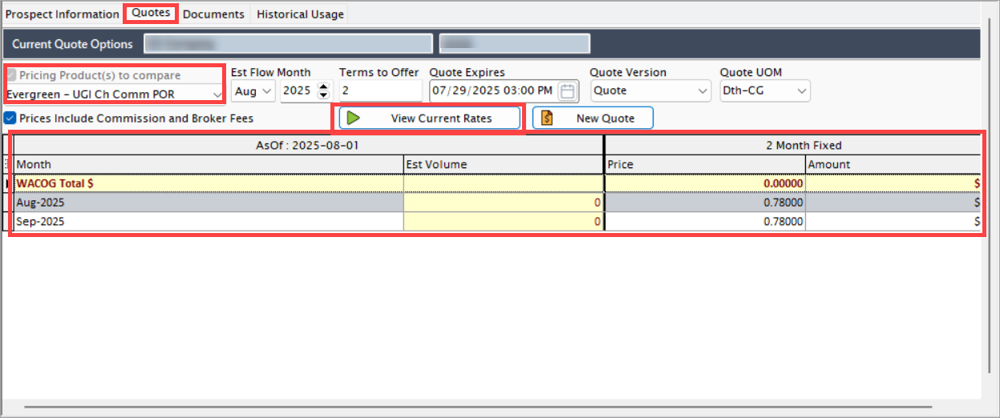

## Generate new quote

You can generate a new quote using either the quote start date or end date. However, once you accept a quote, any new quote must not overlap with the flow months of the accepted quote.

Follow the below steps to create a new quote:

1. Click on the **New quote** button on the **Quote engine** screen.
2. The system generates a new quote and lists it below the **Quote history** section.
    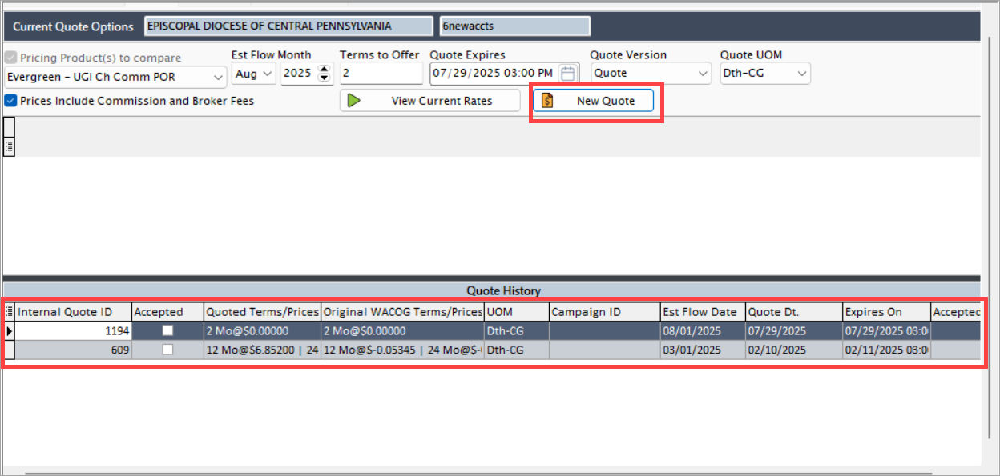
3. The **Customize quote** screen opens automatically.
    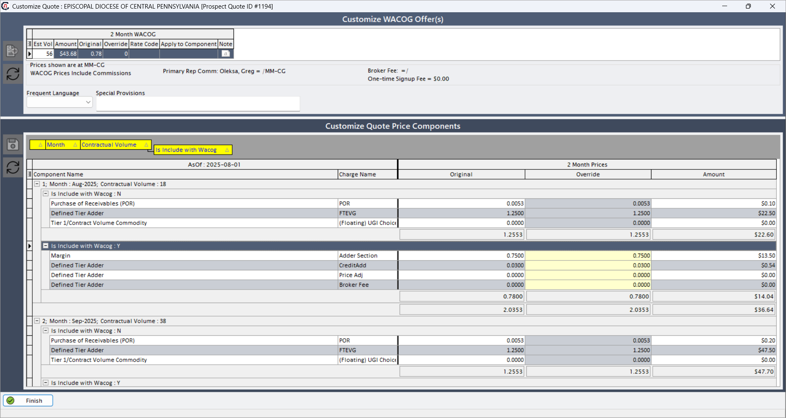

4. In this screen you can customize the values of each component.

**Various key component involved in price calculations**:

The below table outlines the pricing methodologies for various components in **Prospect Quote Engine (PQE)**. It defines how each cost element, such as fixed fees, margins, transportation charges, and POR is calculated and whether it influences the WACOG, flows into the final price agreement, or requires unitization (conversion to a per-unit rate).

The pricing structure includes:

- **Fixed and variable charges** (e.g., fixed fees, margins, tiered commodity pricing).
- **Transportation and distribution costs** (e.g., LDC charges, pipeline fees, storage).
- **Special adjustments** (e.g., Overrides, POR mechanisms).
- **WACOG calculations,** which determine the blended gas cost used in pricing.

| Component                              | Quote formula                                                                                                                                                                                                 | Flows to price agreement | WACOG impact           | Unitization required |
|----------------------------------------|--------------------------------------------------------------------------------------------------------------------------------------------------------------------------------------------------------------|--------------------------|------------------------|----------------------|
| Fixed fee                              | Fee/Contractual volume                                                                                                                                                                                       | Yes                      | Yes (if flagged)       | No                   |
| Margin                                 | Fee × Contractual volume                                                                                                                                                                                     | Yes                      | Yes (if flagged)       | Yes                  |
| Tier 1/Contract volume commodity       | Fee × Contractual volume                                                                                                                                                                                     | Yes                      | Yes (if flagged)       | Yes                  |
| Tier 1/Contract volume basis           | Fee × Contractual volume                                                                                                                                                                                     | Yes                      | Yes (if flagged)       | Yes                  |
| LDC distribution charge                | 1. DQ Value × WACOG (LDC Charge) = Total demand dollars 2. Grand total demand dollars/Grand total contract volume = Unit rate 3. Contract volume × Unit rate = Amount                                    | Yes                      | No                     | Yes                  |
| Pipeline transport fee                 | Fee × Contractual volume                                                                                                                                                                                     | Yes                      | Yes (if flagged)       | Yes                  |
| Storage charge                         | Fee × Contractual volume                                                                                                                                                                                     | Yes                      | Yes (if flagged)       | Yes                  |
| Purchase of Receivables (POR) - Floating (with fixed fee) | 1. Components override value (Monthly, WACOG=Y) × contractual volume = Amount (Monthly) 2. (Grand total amount - fixed fee)/Grand total contractual volume = Final WACOG 3. Final WACOG × POR% (LDC Rate Class) = POR Unitized Rate | Yes                      | Yes                    | Yes                  |
| Purchase of Receivables (POR) - Floating (no fixed fee) | 1. Components override value (Monthly, WACOG=Y) × Contractual volume = Amount (Monthly) 2. Grand total amount/grand total contractual volume = WACOG 3. WACOG × POR% (LDC rate class) = POR unitized rate | Yes                      | Yes                    | Yes                  |
| Purchase of Receivables (POR) - Fixed  | WACOG × POR% (LDC rate class) = POR unitized rate                                                                                                                                                            | Yes                      | Yes                    | Yes                  |
| Override                               | Override value - Original (WACOG) value = Difference value → Difference value + Original component value = Override value                                                                                 | N/A                      | Depends on Component   | N/A                  |
| WACOG (Standard)                       | 1. Components override value (Monthly, WACOG=Y) × Contractual volume = Amount (Monthly) 2. Grand total amount/Grand total contractual volume = WACOG                                                      | N/A                      | N/A                    | No                   |
| WACOG (with fixed fee)                 | 1. Components override value (Monthly, WACOG=Y) × Contractual volume = Amount (Monthly) 2. (Grand total amount - fixed fee)/Grand total contractual volume = Final WACOG                                  | N/A                      | N/A                    | No                   |

## Apply override to a quote

If any component requires adjustment, apply an **override** to a quote by following the below steps:

1. Right-click on the any selected quote in the **Quote history** section.
    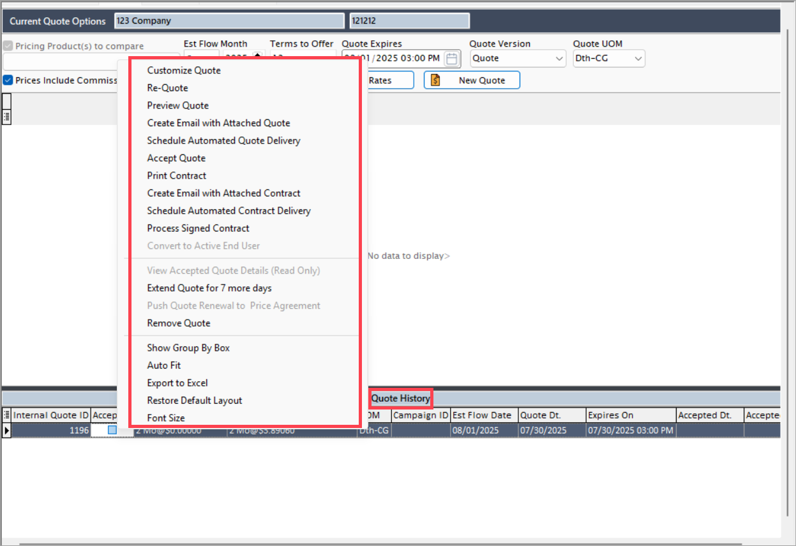
2. Select **Customize quote** from the context menu.
    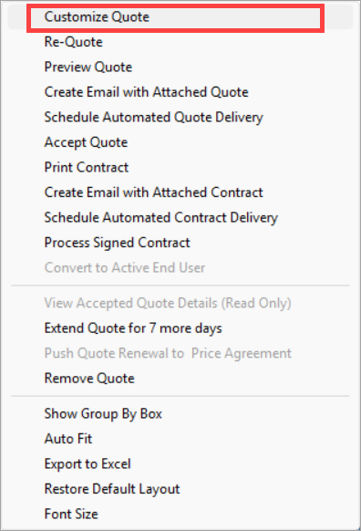
3. Provide the **Override values**.
4. Click on the **Distribute** button. The system recalculates and updates the values accordingly.
5. After validating all values, click **Finish**.
    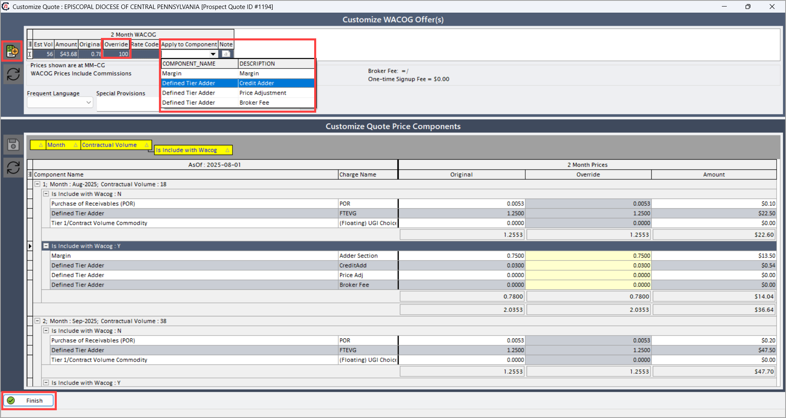

    !!!note "Note"

        Multiple overrides can be applied, each triggering a different calculation.

## Create email with quote attached

Generate an email with the quote document for immediate customer sharing. 

Follow the steps below to create an email with quote attached:

1. Right-click on the any selected quote in the **Quote history** section.
2. Select **Create email with attached quote** from the context menu.

    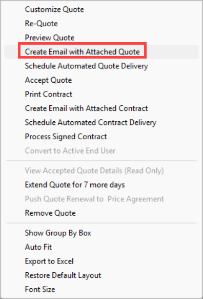

## Schedule automated quote delivery

Configure timed distribution of the quote to the customer. 

Follow the steps below to schedule automate quote delivery:

1. Right-click on the any selected quote in the **Quote history** section.
2. Select **Schedule automated quote delivery** from the context menu.
    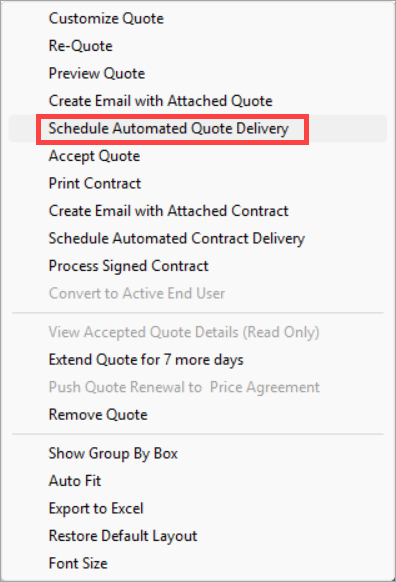
3. Requests are automatically set to go out **1 hour** after quote creation.
4. Click **OK** in the confirmation window to schedule the quote.
    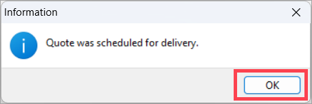

## Preview quote

Review quote terms and adjustments before submission or acceptance. 

Follow the steps below to preview a quote:

1. Right-click on the any selected quote in the **Quote history** section.
2. Select **Preview quote** from the context menu.
     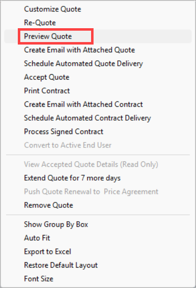

3. This will open a new window where you can preview the quote before actual submission.

## Remove quote

To permanently remove a quote, you can use the **Remove quote** option from the context menu. Upon confirmation, the quotes get permanently deleted.
    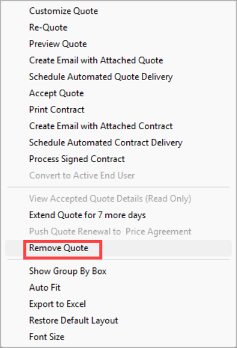

## Extend quote for 7 more days

Prolong the validity period of a pending quote to accommodate customer delays. 

Follow the steps below to extend a quote:

1. Right-click on the any selected quote in the **Quote history** section.
2. Select **Extent quote for 7 more days** from the context menu.
    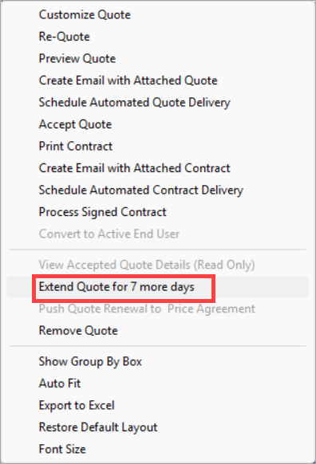
3. A confirmation window appears stating **"Are you sure you want to extend quote expiration date by 7 days?"**
4. Click **Yes** to confirm and proceed with the extension.
    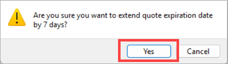

    !!!note "Note"

        You may extend the quote expiration date multiple times as needed to meet your requirements.

## Quote expiration and re-quote

If the quote is not accepted by 15:00 Indian Standard Time (IST) daily, it will expire. 

To regenerate the quote, follow these steps:

1. Right-click on the any selected quote in the **Quote history** section.
2. Select **Re-quote** from the context menu.  
    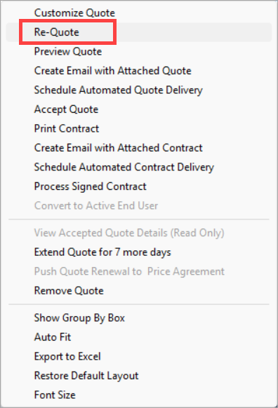
3. Choose the **Select flow month.**
4. Click **Accept** to finalize and save the new quote.
     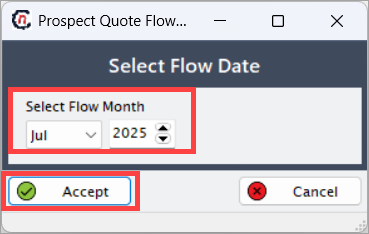

## Accept quote

Confirm and lock in the quoted terms to proceed with enrollment or renewal. 

Follow the steps below to accept a quote:

1. Right-click on any selected quote in the **Quote history** section.
2. Choose **Accept quote** from the available options.
    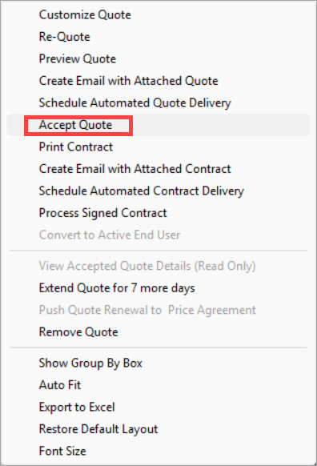
3. In the **Quote acceptance** screen, select the **Term/Price accepted** form the dropdown list.
4. Click **Accept**.

    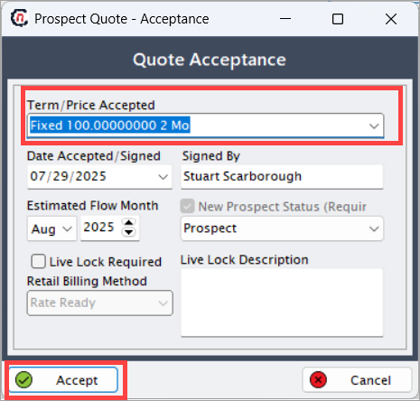

5. After you accept the quote, the system displays it and enables the **Accepted** box.
    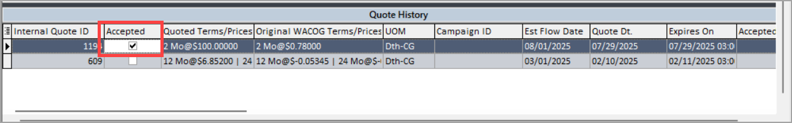

    !!!note "Note"

        Accepting the quote generates the enrollment request and makes it available in the **Facility** screen under the **Pending EDI** actions section.

## View accepted quote details

Review finalized quote terms in a read-only format post-acceptance. 

Follow the steps below to view the details of an accepted quote:

1. Right-click on the any selected quote in the **Quote history** section
2. Select **View accepted quote details** from the context menu.
    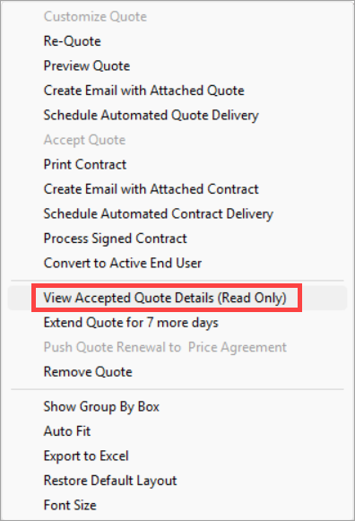
3. The system will redirect you to the **Customize quote** screen, where you can view the quote details.

    !!!note "Note"
        The fields are non-editable in the **Customize quote** screen.

## Process signed contract

Upload and validate the executed contract to finalize the agreement and enable enrollment. Follow the steps below:

1. Right-click on any selected quote in the **Quote history** section.
2. Choose **Process signed contract** from the available options.
    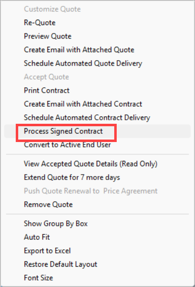
3. Add **Signature date** and **Signed by.**
4. Click on the **three dots(...)** and upload the document from the archive.
5. Click **Accept**.  
    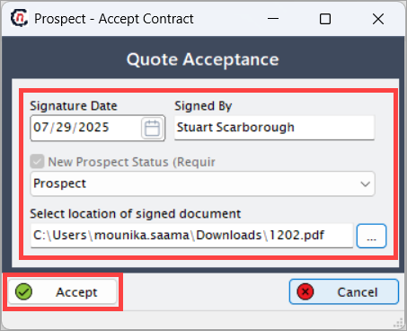

    !!!note "Note"
        The **Convert to end user** option will remain disabled until the signed contract document is uploaded.

## Create email with attached contract

You can draft and send the contract directly to the customer with a pre-formatted email by right-clicking any selected quote in the **Quote history** section and choosing **Create email with attached contract** from the context menu.

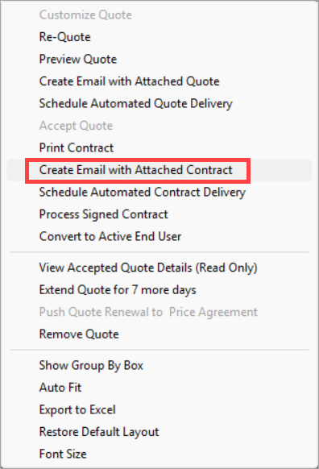

## Schedule automated contract delivery

To set up timed delivery of the contract via email or system notification, right-click any selected quote in the **Quote history** section and select **Schedule automated contract delivery**. By default, requests are scheduled to send 1 hour after quote creation. To deliver immediately, click **Yes** when prompted.

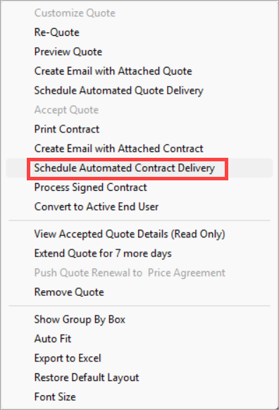

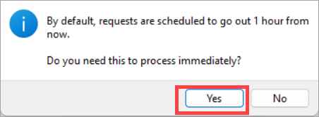

## Print contract

For a hard copy of the finalized contract, right-click any selected quote in the **Quote history** section and choose **Print contract** from the context menu.

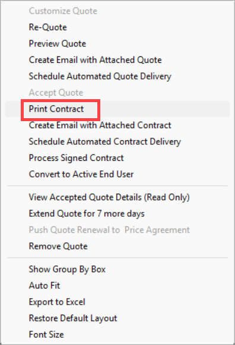
