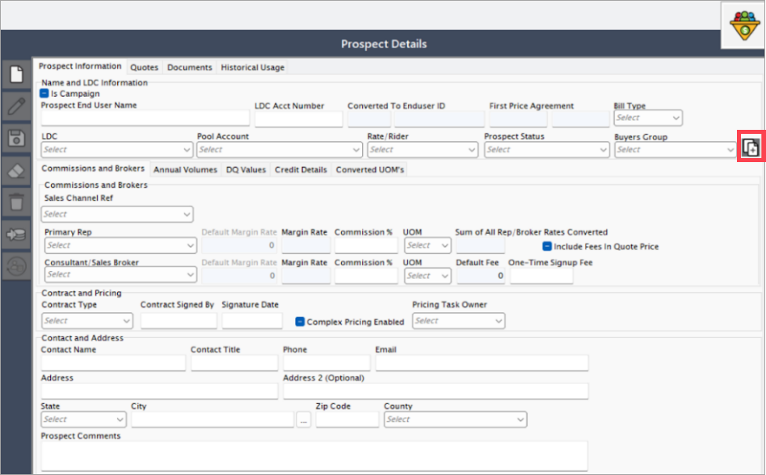
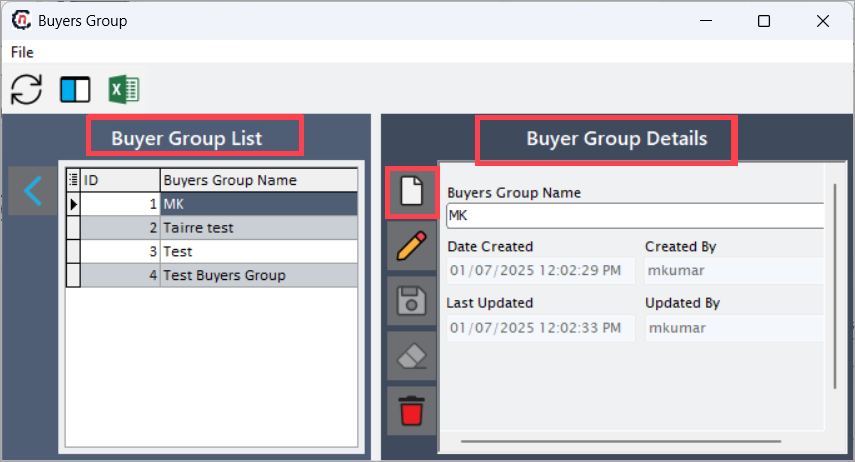
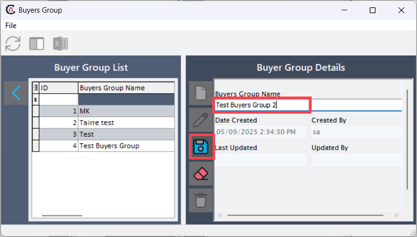
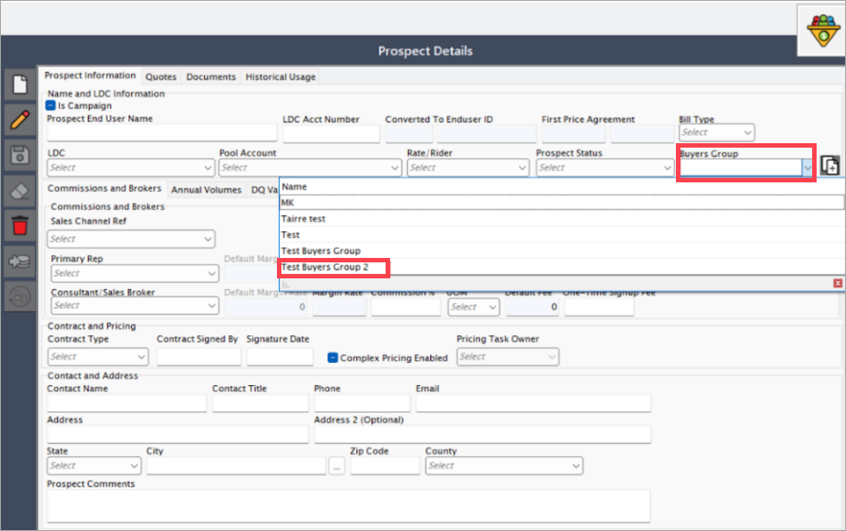
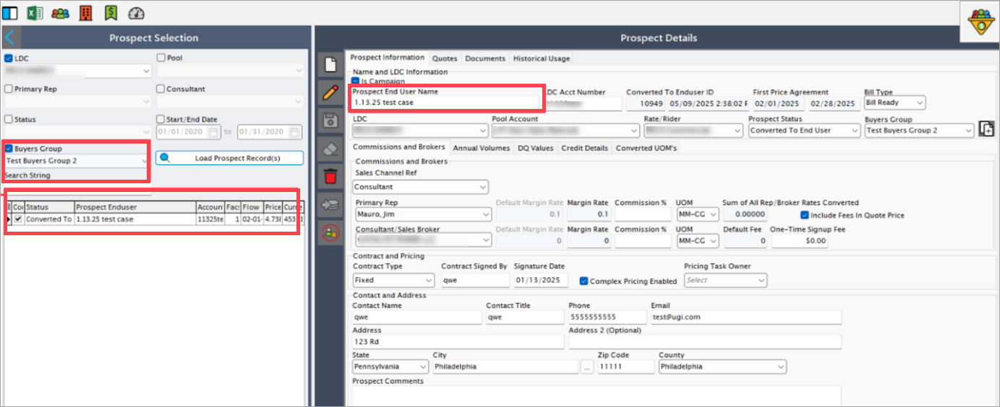

# Manage bulk quotes for prospects

The **Buyers group** feature in the **Prospect quote engine** screen enables users to efficiently manage and streamline quote creation for multiple prospects. This functionality allows grouping prospects together, associating them to a named buyers group, and filtering them during quote generation, ensuring consistency and operational efficiency.

## Procedure to manage bulk quotes for prospects

This section explains how to create, associate, and filter prospects using the buyers group feature for bulk quote processing.

### Create a buyers group

Creating a buyers group allows users to categorize and manage a set of prospects under one unified group, making it easier to generate and manage quotes in bulk.

1. Go to **Prospect quote engine > Buyers group** field.
2. Click the **"+"** icon (or designated button) next to the **Buyers group** field to open the **Buyers group** screen.
    
3. The system displays a split-screen view:
    4. **Left panel**: Lists existing buyers groups.
    5. **Right panel**: Shows details of the selected group.

4. Click **Add new** to initiate a new buyers group entry. 
    

5. Enter a **Buyers group name**. This field is mandatory and helps identify the group during prospect assignment.

6. The system automatically fills in metadata fields:
    1. **Date created** – Timestamp of when the group was created
    1. **Created by** – Username of the creator
    1. **Last updated** – Timestamp of the most recent update
    1. **Updated by** – Username of the person who last modified the group.

7. Click **Save** to finalize and store the buyers group.  
    

### Associate prospects with a buyers group

After creating a buyers group, you can link one or more prospects to it. This association is essential for performing bulk operations like quote generation or reporting.

1. Navigate to the **Prospect** tab within the **Quote engine** screen.
2. When adding or editing a prospect, locate the **Buyers group** field.
3. Select the appropriate group from the dropdown list to associate the prospect with that group.
    

4. Once saved, the prospect will be grouped and available for group-based filtering and quote operations.    

### Filter prospects by buyers group

This functionality enables users to quickly locate and load only those prospects that are associated with a particular buyers group. It is particularly useful during quote creation and review processes for bulk quotes.

1. In the **Quote engine**, enable the **Buyers filter** checkbox.
2. From the dropdown list, choose the **Buyers group** you wish to work with.
3. Click **Load**. The system will display only those prospects linked to the selected buyers group.  
    

    !!!note "Note"

        **Filtering by buyers group** helps streamline bulk quote creation for grouped prospects, ensuring consistent pricing and simplified processing.

---