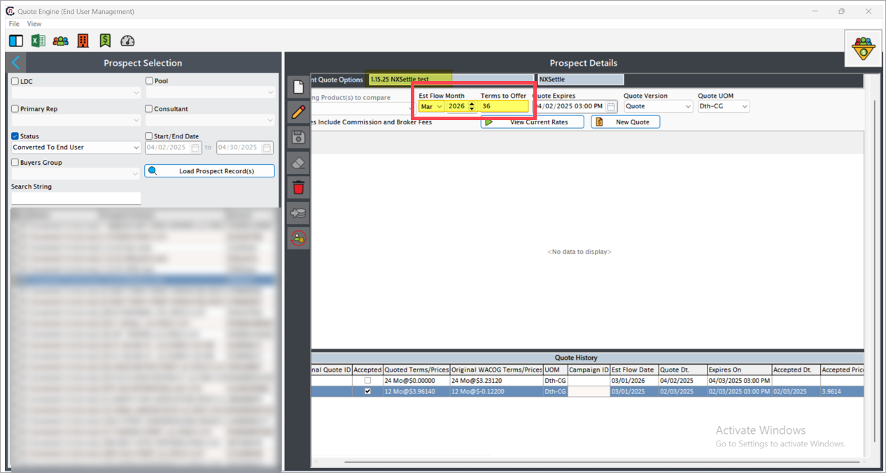
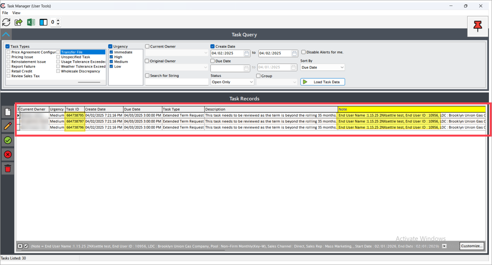
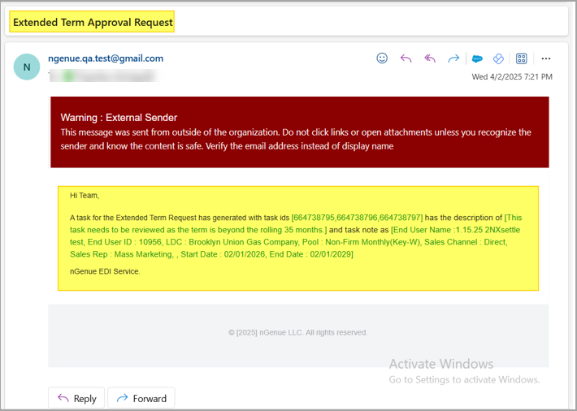

# Extend quote term request

When the quote term **exceeds 36 months**, the system treats it as an extended term request and triggers a review and approval workflow involving task creation and email notifications.

## Steps to trigger an extended term request

Follow these steps to initiate and handle an extended term request:

1. Navigate to the **Quote engine** screen.
2. Select **Prospect/Converted end user**.
3. If the user quotes for a term greater than **36 months**, it will be considered an extended term request. A task will then be generated via email and the task manager for the approval process.
    

## Generate a new extended term quote

1. Create a new quote for the selected end user with a term greater than **36 months**.
2. Once the quote is saved or submitted, the system generates a review task automatically in the **Task manager** screen.
    
3. In parallel, an email will be triggered to notify approvers, if the following condition is met to specific users:  
   **(Current month - Estimated flow month) + Contract terms > 35**.
   

    !!! note "Note"
         1. The task will remain open in the **Task manager** until it is reviewed and either approved or rejected.
         2. No further processing (e.g., pushing to price agreement) is allowed until the task is resolved.
         3. Emails are sent to users configured under the approval workflow settings for long-term quotes.

---