# Sync retail contact information to prospect quote engine

The sync functionality in the **Prospect quote engine** (PQE) allows users to pull existing data, such as LDC, end user contact information, sales representatives, sales tax details, daily quantity values, and credit statuses, from **Retail contract** screen. This eliminates redundant data entry and ensures consistency across the quoting process.

## Add retail contact details

This section explains how to add and save retail contact information that can later be synced into the **Quote engine** for prospect users.

1. Navigate to the **Retail contact** screen.
2. Select the appropriate **LDC** and **End user** from the dropdown fields.
3. Click on the **Add a retail contact** icon.
4. Enter the contact details as described in the table below:

    | Field         | Description |
    |---------------|-------------|
    | First name    | Enter the contact's first name. |
    | Middle name   | Provide the contact's middle name, if applicable. |
    | Last name     | Enter the contact's last name. |
    | Title         | Specify the contact’s professional title or designation. |
    | E-mail        | Enter a valid email address for communication. |
    | Phone voice   | Provide the primary voice contact number. |
    | Phone cell    | Enter the mobile phone number for the contact. |
    | Phone fax     | Provide the fax number, if available. |
    | Address       | Enter the full street address of the contact. |
    | City          | Specify the city where the contact is located. |
    | State         | Select the state from the dropdown menu. |
    | ZIP           | Enter the 8-digit postal code for the location. |

5. Click **Save** to store the contact information.
    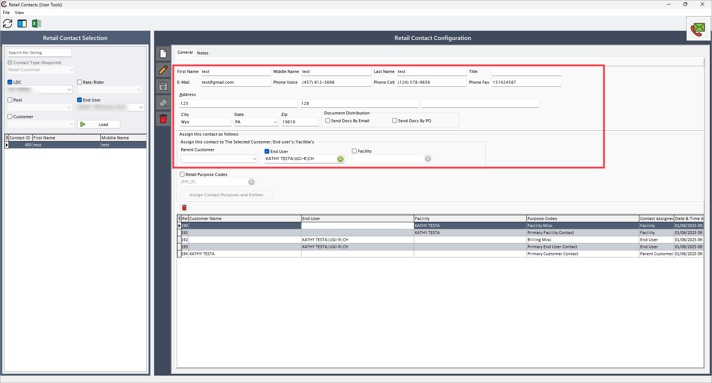

**To sync this data:**

1. Navigate to the **Quote engine** screen.
2. Select the same **LDC** and **End user** as selected in the **Retail contract** screen.
3. Click the **Sync** icon to refresh and update the details.
4. The contact information entered in the **Retail contact** screen will now appear in the **Quote engine**.
    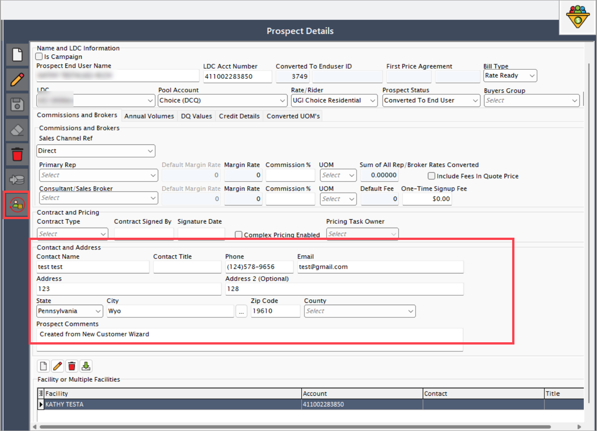

## Sync sales channel and consultant info

This section covers how the **Primary rep** or **Consultant** information maintained in the **End user** screen is synced to the Quote engine, impacting the **Sales channel ref** field.

### Scenario #1: End user with primary rep only

1. Navigate to the **End user** screen.
2. Select the relevant **LDC** and **End user**.
3. Edit the **Primary rep** information.
4. Click **Save** to apply changes.
    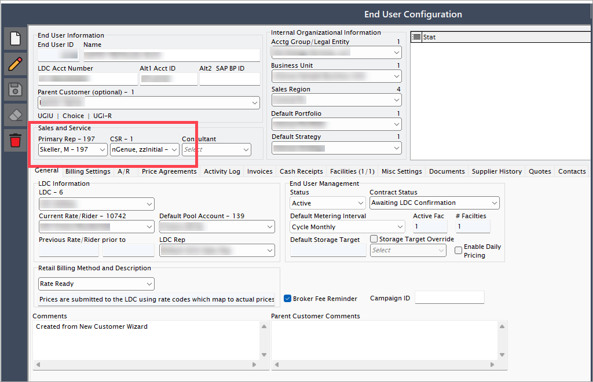

**To sync this data:**    

1. Navigate to the **Quote engine** screen.
2. Choose the same **LDC** and **End user** as selected in the **End user** screen.
3. Click the **Sync** icon to refresh and update the details.
4. The **Quote engine** now shows the updated **Primary rep**, and the **Sales channel ref** is set to **Direct**.  
    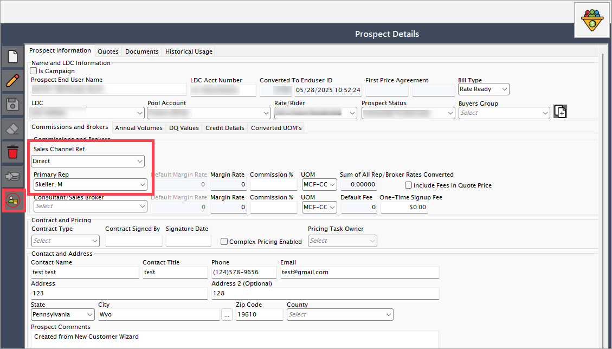

### Scenario #2: End user with consultant only

1. Navigate to the **End user** screen.
2. Select the relevant **LDC** and **End user**.
3. Edit the **Consultant** information.
4. Click **Save** to apply changes.
    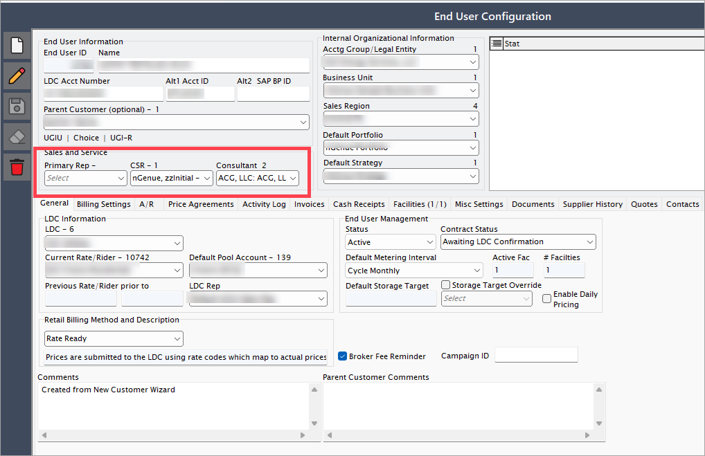

**To sync this data:**  

1. Navigate to the **Quote engine** screen.
2. Choose the same **LDC** and **End user** as selected in the **End user** screen.
3. Click the **Sync** icon to refresh and update the details.
4. The **Quote engine** now shows the updated **Primary rep**, and the **Sales channel ref** is set to **Consultant**.
    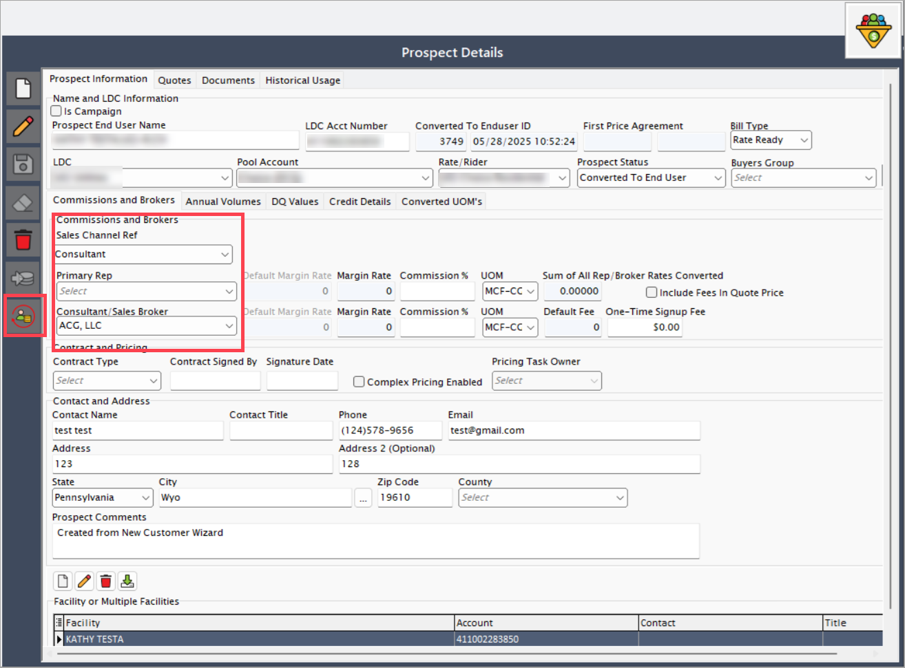

## Sync sales tax exemptions

This feature ensures that any sales tax exemptions added at the facility level are automatically reflected in the quote engine.

1. Navigate to the **Facility** screen.
2. Click on the **Physical address and sales tax** tab.
3. If the **Sales tax exemptions** section is empty, right-click the **Applicable sales taxes** section and select **Add exemption for selected tax**.
    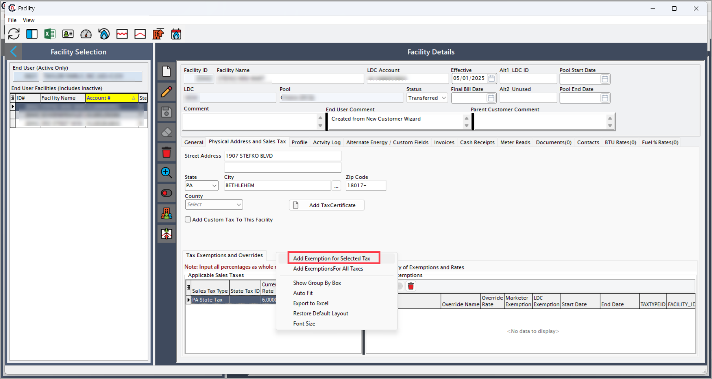
4. Modify the existing value in the **LDC exemption** field.
5. Click the **Save** button to proceed.
    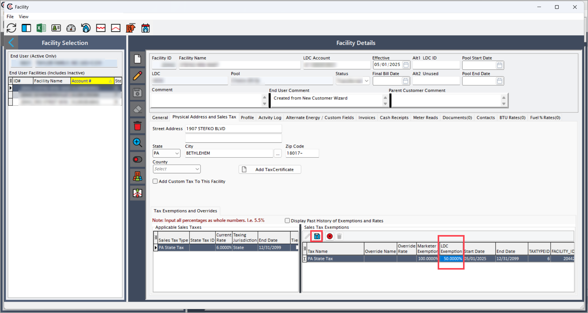

**To sync this data:**  

1. Navigate to the **Quote engine** screen.
2. Choose the same **LDC** and **End user** as selected in the **End user** screen.
3. Select the same facility you modified in the **End User** screen.
4. Click the **Sync** icon to refresh and update the details.
5. The sales tax exemption values you updated in the **End user** screen will now appear in the **Prospect facility** screen.
    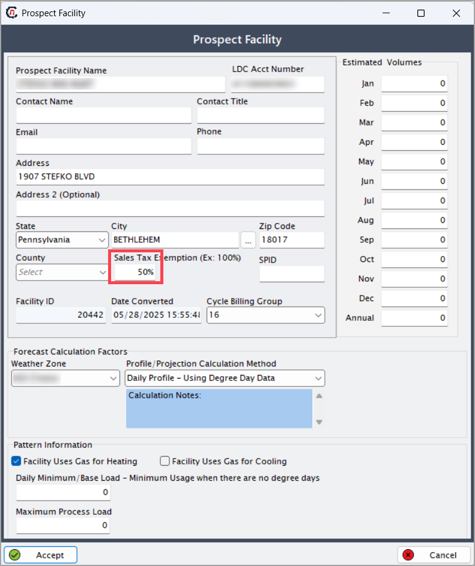

## Sync daily quantity (DQ) values
This option allows syncing of historical or forecasted daily quantity (DQ) values from the **Facility DQ values** screen into the quote engine.

1. Navigate to the **Facility DQ values** screen.
2. Select the **LDC** and **End user** for which you need to add DQ values.
3. Choose the month and year, enter the value, and click the **Create** icon.
4. The system will add the values.
    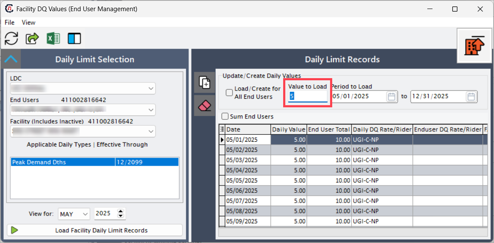

**To sync this data:**

1. Navigate to the **Quote engine** screen.
2. Select the same **LDC** and **End user**, then go to the **DQ values** tab.
3. Click **Sync**. The DQ values will appear.
    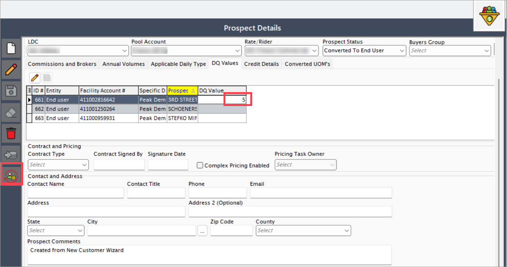

## Sync credit status
This process ensures that credit ratings or statuses assigned to an end user are accurately reflected in the quote engine.

1. Navigate to the **End user** screen.
2. Select the **LDC** and **End user** for which you need to add credit status.
3. Click on the **Billing settings** tab, then click the **Edit** button.
4. Change the credit status to **Credit qualified – manual**.
5. Click on the **Save** button.
    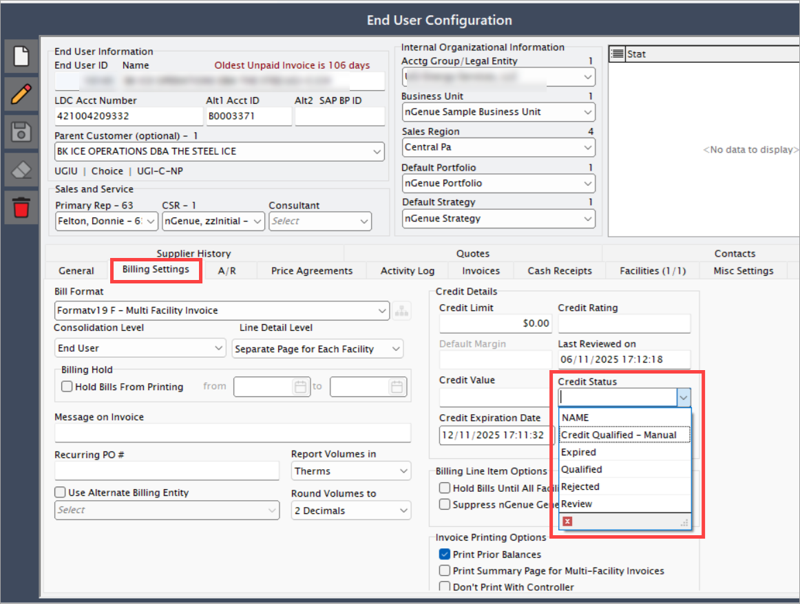

**To sync this data:**

1. Navigate to the **Quote engine** screen.
2. Select the same **LDC** and **End user**, then go to the **Credit details** tab.
3. Click **Sync**. The Credit status will appear.
    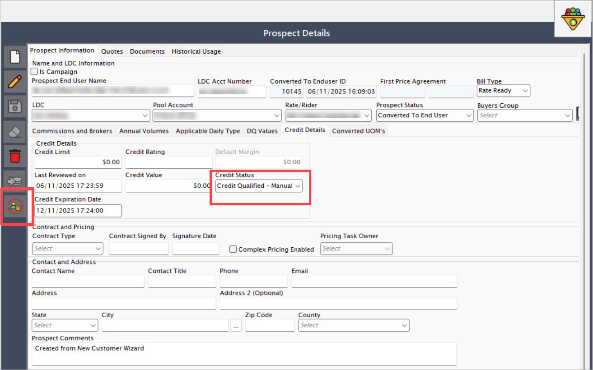

---