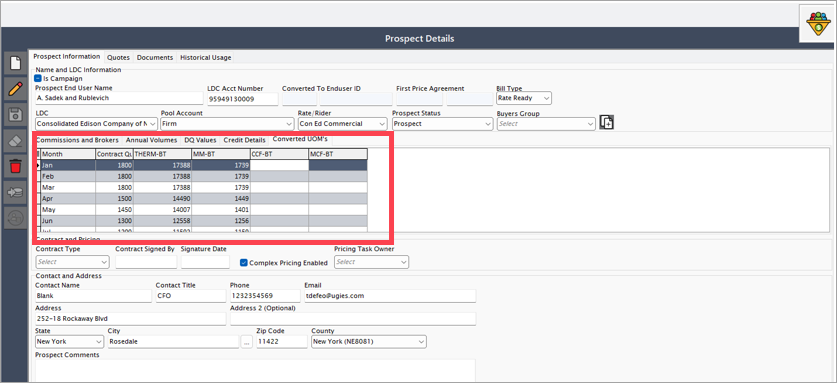
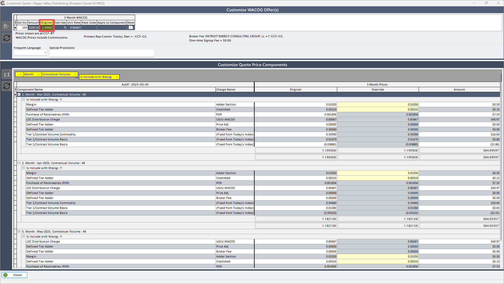
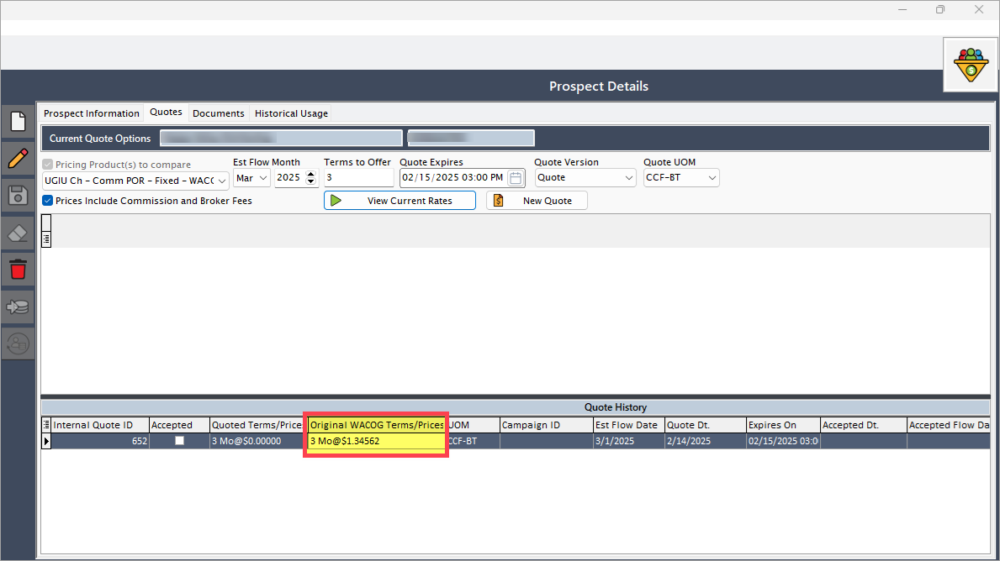

# Unit of measurement (UOM) conversion

The **Unit of measurement (UOM)** conversion functionality enables quoting in a unit of measurement different from the product’s default, with accurate recalculations.

If the user wants to quote in a different **Unit of Measurements (UOM)** than the pricing product's UOM, they can select the desired UOM from the dropdown in the **'Quote'** tab and proceed with quote generation. After the quote is generated, the user will be able to view the prices and volumes converted to the selected UOM at the time of quote creation. Before generating the quote, the user can check the volume conversions according to the selected UOM in the **'Converted UOM'** tab within the **'Prospect information'** screen. 

Follow the below process to convert UOM:

1. Go to the **Quote engine** screen.
2. Select a **prospect** and create a quote using a UOM other than **DTH-CG**.
    
3. Contractual quantities now display as whole numbers in the **Quote engine** screen.
4. Original WACOG values remain consistent between initial quote creation and subsequent views.
    
5. LDC charge unit rate calculates correctly based on price and volume conversion.
    

    !!! example "Example"
        **Initial Values:**
        - **DQ_VALUE = 5**
        - **LDC charges:**
        - March: 5.5
        - April: 8.5
        - May: 10.5  
        (CCF-BT conversion as per quote UOM)

        **Converted Values:**
        - **DQ_VALUE = 47.8261**
        - **LDC charges:**
        - March: 0.575
        - April: 0.8886
        - May: 1.0977

        **Calculations:**
        - March: 47.8261 × 0.575 = 27.500
        - April: 47.8261 × 0.8886 = 42.4983
        - May: 47.8261 × 1.0977 = 52.4987
        - Total Demand Dollars: 27.500 + 42.4983 + 52.4987 = 122.497
        - Unit rate: 122.497 / 143 = 0.85667

---