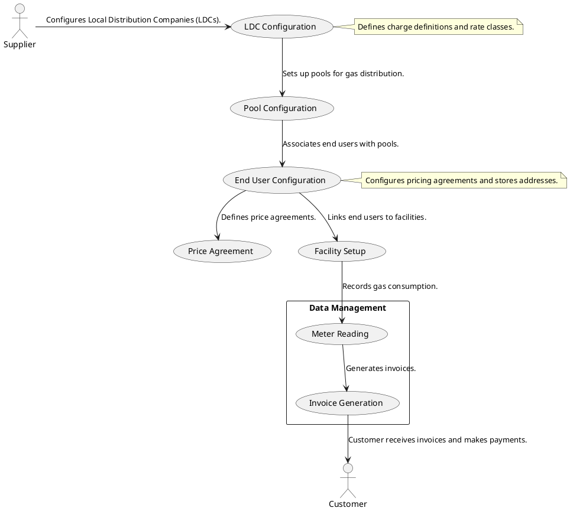

---
hide:
 - toc
---

# Retail workflow

Let's explore the retail workflow in nGenue with the following diagram:

## Workflow explanation

The **nGenue retail gas workflow** outlines the step-by-step process involved in configuring gas distribution, managing customers, and handling billing. The workflow follows a structured approach, starting from **supplier-side configurations** to **customer invoicing and payments**.

1. **LDC configuration**
    1. The **supplier** configures **Local Distribution Company (LDC)** to define charge definitions and rate classes.
    1. This step ensures that gas distribution is categorized appropriately based on pricing structures and market regulations.

2. **Pool configuration**
    1. Pools are set up to manage **gas distribution** efficiently.
    1. A pool groups multiple end users, allowing streamlined gas allocation and usage tracking.

3. **End user configuration**
    1. End users (customers receiving gas supply) are assigned to respective pools.
    1. This step involves configuring **pricing agreements** and **storing end-user addresses**.

4. **Price agreement**
    1. These agreements ensure transparency in billing and compliance with regulatory standards.
    1. Price agreements are defined based on **contractual terms, market rates, and business policies**.

5. **Facility setup**
    1. Facilities (customer locations) are linked to respective **end users**.
    1. This setup is necessary to track gas consumption at a granular level for accurate billing.

6. **Data management**
This section handles the operational aspects of **meter readings, invoicing, and customer billing**.

    1. ***Meter reading***
        - Gas consumption is recorded based on periodic **meter reads**.
        - These readings form the foundation for **accurate billing and usage tracking**.

    2. ***Invoice generation***
        - Based on the recorded meter readings, invoices are generated.
        - The system applies the appropriate charges, taxes, and rate calculations as per the **LDC configurations and price agreements**.

    3. ***Customer interaction***
        - The **customer receives invoices** for the gas consumed.
        - They **make payments** based on the generated invoices, completing the billing cycle.

## Conclusion

This workflow ensures an **organized, efficient, and transparent** approach to retail gas distribution. By systematically configuring LDCs, pools, end users, and facilities, the system streamlines the entire process from **gas distribution to invoicing and payment collection**.
