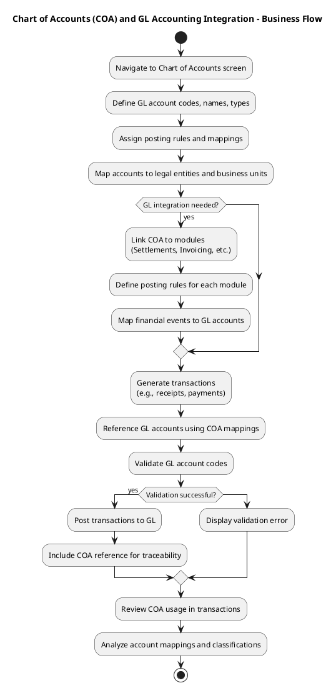
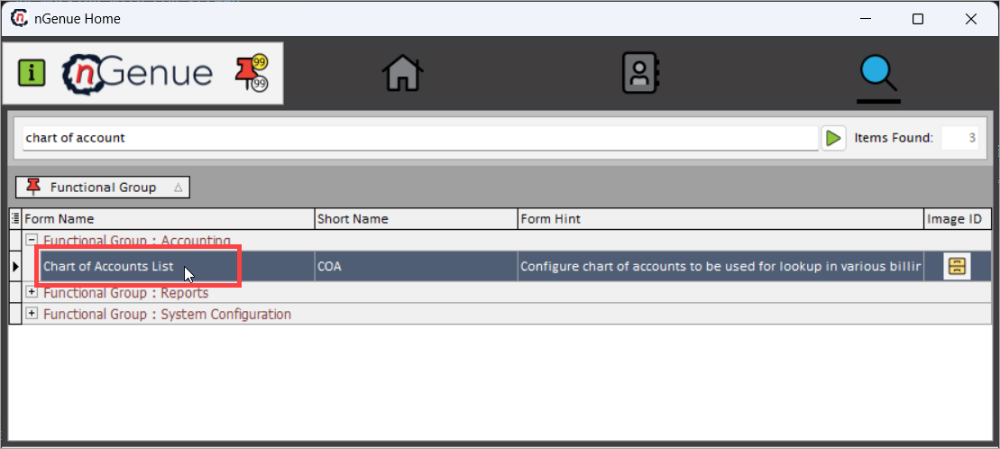
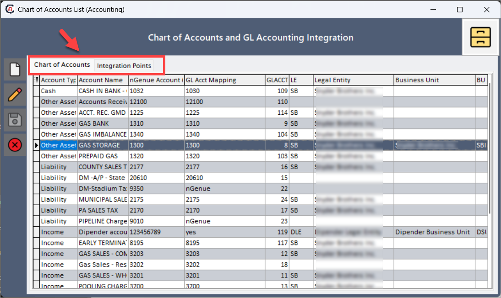
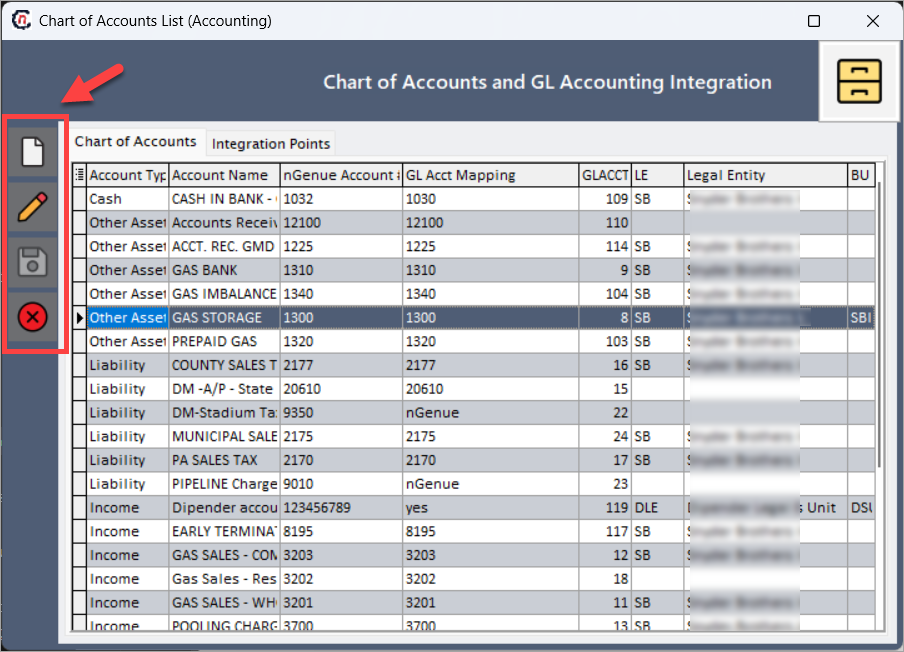
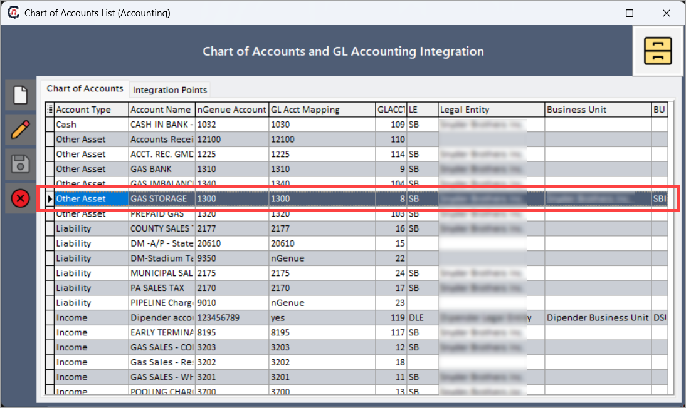
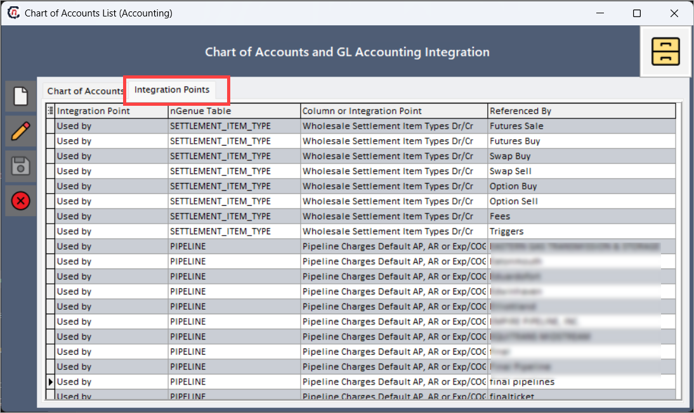

# Understanding chart of accounts list

The **Chart of accounts (COA)** list screen serves as a centralized reporting tool that provides detailed visibility into all general ledger (GL) accounts used in the system. It supports accurate financial processing, enables efficient integration across business modules, and ensures compliance with accounting rules and reporting requirements.

This screen is especially useful for financial users who need to configure, monitor, and audit the general ledger activity across modules such as settlements, invoicing, and deal management.

<!-- ## Business flow: Chart of accounts (COA) and GL accounting integration

The end-to-end process of chart of accounts setup and its integration with the GL transactions includes the following steps:

1. **Chart of accounts setup**

    * Navigate to the chart of accounts screen from the search bar.
    * Define and configure general ledger account codes, names, descriptions, and account types (e.g., income, expense, asset, liability).
    * Assign posting rules, define GL account mappings, and categorize accounts based on their financial and operational use.
    * Map each account to appropriate internal book structure elements such as legal entities and business units.

2. **GL integration configuration**

    * Link chart of accounts entries to relevant business modules like settlements, deal management, and invoicing.
    * Define integration rules for how transactions originating from these modules are posted to the general ledger.
    * Ensure all financial events are properly mapped to their corresponding GL accounts based on transaction type and business rules.

3. **Transaction entry and processing**

    * Transactions (e.g., receipts, payments, settlement postings) are generated in business modules.
    * These transactions automatically reference GL accounts based on predefined COA mappings.
    * The system validates the assigned GL account codes for accuracy and compliance before allowing the transactions to proceed.

4. **GL transaction posting**

    * Once validated, transactions are posted to the GL transactions screen.
    * Each posted transaction includes the associated COA account, ensuring that financial entries follow proper accounting structure and traceability.

5. **Review and reporting**

    * Use the chart of accounts screen to review and analyze all defined accounts.
    * Track usage across transactions, identify mapping inconsistencies, and ensure account classification is aligned with business unit and legal entity configurations. -->

## Accessing and configuring COA in nGenue

This section outlines the process to access and configure COA within nGenue.

### Prerequisites

* You have the necessary administrative permissions to access and update the COA screen.
* The [internal book structure](../getting_started/configure_book_structure.md) must be pre-configured with valid [legal entities](../getting_started/configure_book_structure.md#step-2-create-a-new-legal-entity) and [business units](../getting_started/configure_book_structure.md#step-3-add-a-business-unit-to-the-legal-entity).

### Steps to manage chart of accounts

#### Step 1: Navigate to the COA screen

1. Log in to the nGenue application with your credentials.
2. Click the **Search** icon and enter *chart of accounts list* in the search bar.
3. Double-click **Chart of accounts list** to open the respective screen.
  

4. The **Chart of Accounts list** screen includes two tabs:
    1. **Chart of accounts:** Displays details of accounts that are utilized in the **GL Transactions** screen. This tab ensures structured classification and mapping of all accounts for seamless financial management.
    2. **Integration points:** Provides an overview of how COA integrates with various system tables for financial processing.
   

5. Options available on this screen include *creating new GL accounts, editing existing accounts, saving updates, and discarding changes*.

 

#### Step 2: Create a new GL account

1. Click the  icon to create a new GL account.
2. In the **GL account** popup window, provide the below details:
  
    | Field | Description |
    |---|---|
    | **Account name** | Enter a descriptive name for the GL account. This label should clearly define the purpose or use of the account (e.g., "Natural Gas sales revenue" or "Customer receivables"). |
    | **Account number** | Enter a unique numeric or alphanumeric identifier for the account. This account number must follow your organization's internal chart of accounts numbering scheme. |
    | **Account type** | Select the appropriate type from the dropdown. Each type defines how the account is treated in financial reports. Available options:   - **Cash** – used for accounts that hold liquid funds.   - **Other asset** – non-cash assets such as inventory, receivables.   - **Liability** – obligations such as payables, accrued expenses.   - **Income** – revenue-generating accounts.   - **Expense** – cost-related accounts such as salaries, utilities.   - **Cost of goods** – direct costs related to production or services sold. |
    | **Mapping to GL system** | Provide the external or mapped GL account number that integrates with your enterprise GL or ERP system. This ensures consistency between nGenue and downstream financial systems. |
    | **Accounting group** | Select the relevant legal entity (accounting group) that this GL account belongs to. This field is populated from the internal book structure and ensures legal and operational segregation. |
    | [**Business unit**](../getting_started/inbook_structure.md) | Choose the business unit responsible for managing transactions under this account. The dropdown displays available business units configured under the selected legal entity. |

3. Click **Accept** to save the record. Once saved, the records are saved under the **Chart of accounts** tab.
4. The table below describes the columns shown in the **Chart of accounts** tab:

    

    | Column name | Description |
    |-------------|-------------|
    | **Account type** | Displays the financial classification of the account. Examples: income, liability, expense. This is selected from the dropdown during creation. |
    | **Account name** | The descriptive label assigned to the account for easy identification. |
    | **nGenue account#** | The unique identifier defined by the user and stored in the system. This acts as a primary key for transaction references. |
    | **GL acct mapping** | External GL account number used in integration with accounting systems. |
    | **GL account ID** | A system-generated internal identifier used for back-end referencing. Not editable. |
    | **LE (legal entity code)** | Code representing the legal entity. This code is pulled from the internal book structure. |
    | [**Legal entity**](../getting_started/configure_book_structure.md#step-2-create-a-new-legal-entity) | The full name of the legal entity associated with the account. Helps with legal and audit-level traceability. |
    | [**Business unit**](../getting_started/configure_book_structure.md#step-3-add-a-business-unit-to-the-legal-entity) | Organizational unit responsible for managing this account. Helps classify transactions by operational area. |
    | **Business unit code** | Code assigned to the business unit within the system. Used for backend mapping and reporting. |

#### Step 3: Review COA integration points

1. Navigate to the **Integration points** tab to review how accounts are mapped to other system tables.
2. The following table outlines the available columns and their purpose:
   

    | Column name | Description |
    |-------------|-------------|
    | **Integration point** | Identifies the type of linkage – whether the GL account is mapped to a specific table or is referenced dynamically by another module. |
    | **nGenue table** | Specifies the name of the internal nGenue table where the GL account is used (e.g., `settlement_summary`, `invoice_detail`). |
    | **Column or integration point** | Highlights the exact column or field where the GL account is referenced. Useful for developers or auditors. |
    | **Referenced by** | Lists the modules (e.g., Settlements, Deal Management) or specific process flows that use this GL account. Helps identify downstream dependencies. |

This view helps financial teams understand how GL accounts are leveraged in different modules and ensures data traceability throughout the system.

## Summary

The **Chart of accounts** list screen offers a centralized, user-friendly interface to define, manage, and audit financial account structures within the nGenue system. By mapping these accounts accurately to legal entities, business units, and system transactions, organizations can maintain consistent financial records and support downstream processes such as billing, reconciliation, and compliance reporting.

---
