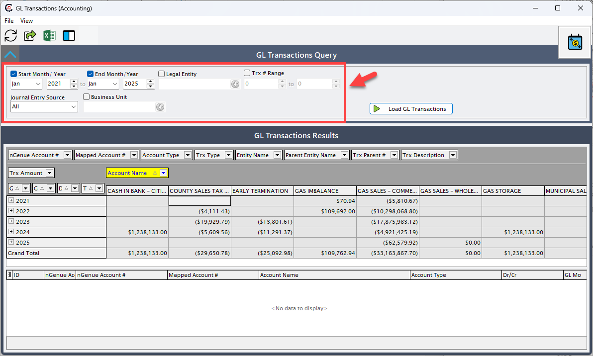

# Understanding General Ledger (GL) transactions

The **GL transactions** screen is a pivot grid report designed for businesses that closely monitor credits, debits, accounts payable, and accounts receivable transactions. It presents financial data in a structured and organized manner, enabling users to efficiently analyze debit and credit activity. Additionally, the grid contents can be exported to Excel for further analysis as needed.

## Accessing and configuring GL transactions in nGenue

This section outlines the process to access and configure GL transactions within nGenue.

<!-- ## Business flow: transaction capture and posting

### Transaction capture and posting

- **Trigger:** Deals and associated settlements are processed within the system (e.g., trades, invoices, payments).
- **Action:** Each transaction—whether a credit (accounts receivable) or debit (accounts payable)—is recorded and posted to the general ledger (GL).

### Data aggregation in GL transactions screen

- **Trigger:** Users access the GL transactions screen to review financial activities.
- **Action:**
  - The system retrieves GL data from the underlying financial modules (e.g., settlements, invoices, payments).
  - The pivot grid organizes the data into categories such as:
    - Credits/debits
    - Accounts payable (AP)
    - Accounts receivable (AR)
    - Transaction dates
    - Business units, etc.
- **Outcome:** A comprehensive report showing all transactions affecting the GL.

### User interaction and analysis

- **Trigger:** User interaction with the screen for monitoring or auditing purposes.
- **Action:**
  - Users can filter the data (by date, account, transaction type, etc.).
  - Users can drill down into specific transactions for detailed information.
  - Users can reconcile credits and debits to ensure accuracy in financial statements.

### Export for further analysis

- **Trigger:** Users need detailed analysis outside the system.
- **Action:**
  - The system provides an Excel export feature for users to:
    - Perform advanced financial analysis.
    - Share reports with other stakeholders (e.g., accounting, audit, or finance teams).

--- -->

### Prerequisites

The following prerequisites must be in place for the user to access and utilize the GL transactions screen:

* The user must have the necessary permissions to access the GL transactions screen.
* The [chart of accounts](./chart_of_accounts.md) must be established.
* The [internal book structure](../getting_started/configure_book_structure.md) must be pre-configured with valid [legal entities](../getting_started/configure_book_structure.md#step-2-create-a-new-legal-entity) and [business units](../getting_started/configure_book_structure.md#step-3-add-a-business-unit-to-the-legal-entity).
* For wholesale operations, [deals](../deal_management/overview.md) and [counterparty](../getting_started/counterparty/counterparty.md) configurations must be in place, including valuation setups.
* For physical and financial deals, both internal and external counterparties must be defined.
* For retail operations, [end user](../getting_started/end_users/create_end_user.md), [facility](../facility_management/overview.md), invoice, and cash receipts configurations must be completed.

### Steps to manage GL transactions

1. Log in to the nGenue application.
2. Click the **Search** icon and enter **GL transactions** in the search bar.
3. Double-click **GL transactions** to open the respective screen.
    

4. The next screen is divided into two sections: **GL transactions query** and **GL transactions results.**

#### GL transactions query

This section acts as the starting point for refining the dataset. The users can apply various filters based on criteria such as legal entity, business unit, transaction start and end dates. 

Available fields in the **GL transactions query** section:

| Field               | Description |
|--------------------|-------------|
| Start month/year | Specifies the start month and year of the transaction. |
| End month/year   | Specifies the end month and year of the transaction. |
| Legal entity     | Represents the legal entity associated with deals, price agreements, counterparties, or end users. |
| Business unit    | The operational unit responsible for managing the deal or transaction. |
| Transaction# range | Filters transactions within a specific range of invoice or settlement numbers. |
| Journal entry source | Dropdown to filter by source. Options include:  - Retail sales (accounts payable)  - Retail cash receipts (accounts receivable)  - Settlements (wholesale) |

#### GL transactions results

Once all filters are selected, click **Load GL transactions** to generate the data. The report is populated from the **Chart of accounts list** and the following sources:

  * **Settlements review** (for wholesale settlements)
  * **Review invoice item batch details** (for retail invoices).

Available fields in the **GL transactions results** section:

| Field                  | Description |
|------------------------|-------------|
| nGenue account#     | Pulled from the *nGenue account #* column in the chart of accounts list screen. |
| Mapped account#     | Sourced from the *GL acct mapping* column. |
| Account type         | Fetched from the *account type* column. |
| Account name         | Derived from the *account name* column. |
| Trx type             | Identifies whether the transaction type is from settlements (wholesale) or retail invoices. |
| Entity type          | Represents the end user name linked to the invoice. |
| Parent entity name   | Refers to the parent customer grouping multiple end users. |
| Trx parent #         | Corresponds to the invoice ID from the *invoice #* field. |
| Trx description      | Sourced from the *item description* field. |
| Trx amount           | Taken from the *$amount* field. |
| GL year              | Reflects the general ledger transaction year. |
| GL month             | Reflects the general ledger transaction month. |
| Dr/Cr                | Displays debit (payable) and credit amounts. |
| Trx source           | Indicates billing items and commission details. |
| Grand total          | Summarizes the total amount across all account names. |

### Drill-down insights in the GL transactions results section

An additional section is available at the bottom of the **GL transactions results** panel, offering detailed insights and drill-down capabilities of specific entries or records. It enables granular analysis to ensure all relevant data points are visible for in-depth review.

