# Global settings overview

The **Global settings** serves as a centralized hub for managing default configurations across various screens and tabs within the application. These settings allow administrators to define system-wide preferences, ensuring consistency and streamlining the user experience. By configuring options such as default values, display preferences, and behavior settings, organizations can establish values that will automatically apply across relevant fields— reducing the need for repetitive data entry and promoting standardized configuration.

!!!note "Note"

    Changes made in the **Global settings** screen are applied system-wide and affect all users unless overridden by specific user or role-based configurations. When a value is configured as a default, it is automatically populated on any screen containing that field

## Key default configurations 

## Procedure to configure

This section outlines the steps to configure the **Global settings** in nGenue.

### Prerequisites

* You have the necessary administrative permissions to access and modify the **Global settings** screen.
* A thorough understanding of the organization's requirements for screen and tab configurations is essential.
* Any dependent configurations, such as roles or permissions, are already set up.

### Procedure

#### Step 1: Access the Global settings screen

1. Log in to the **nGenue** application with your credentials.  
2. Click the **Search** icon and enter *global settings* in the search bar.  
3.	Double-click **Global settings** to open the respective screen.
    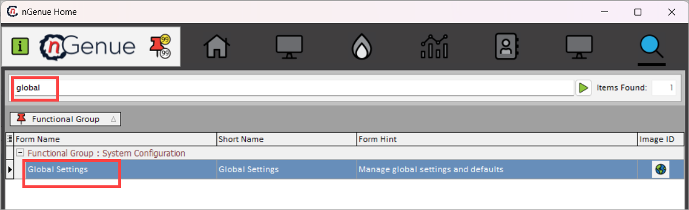

#### Step 2: Modify or configure settings

1. On the **Global settings** screen, locate the specific category or section you want to configure (e.g., default values, display preferences, color schemes, deal settings, or behavior settings).
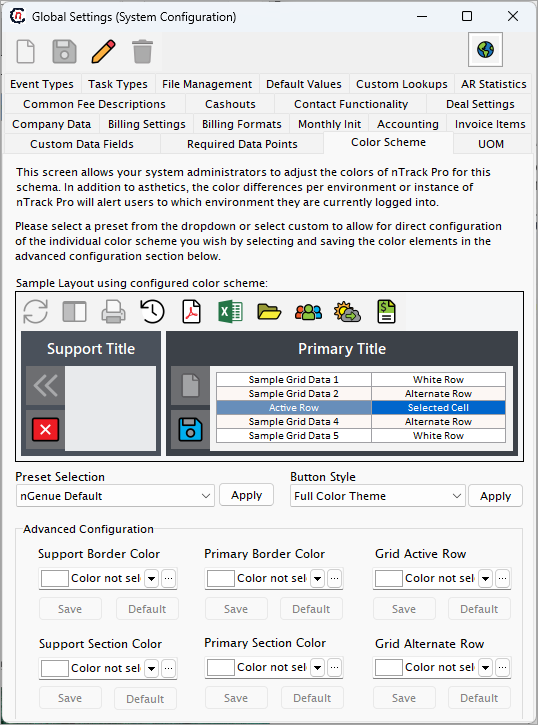

2. Click on the appropriate tab to access its settings. The tabs are as follows:

    * **Event types** 
    This tab allows you to define and manage the various event types used across the application. Event types help categorize and track system activities for better monitoring and reporting.
    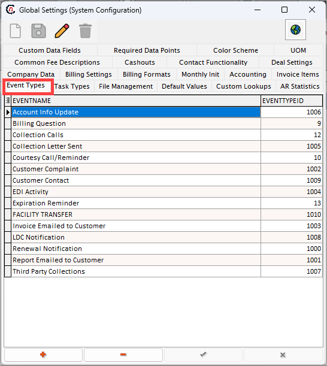

    * **Task types** 
    Use this tab to configure task categories, ensuring that all tasks are properly classified and aligned with your operational workflows.
    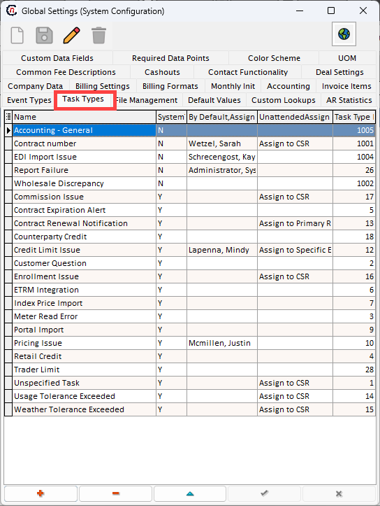

    * **File management**  
    This tab lets you select default paths for storing logs, reports, or documents. Proper configuration ensures efficient organization and easy access to essential files.
    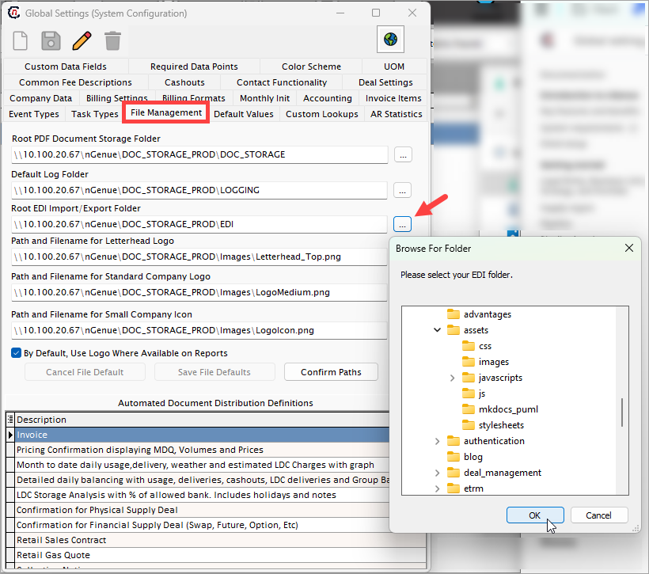

    * **Default values** 
    Configure default values that populate throughout the nGenue application. For example, if the default volume unit is set to **MMBTU**, this unit will auto-populate in relevant fields, such as when creating a new deal.
    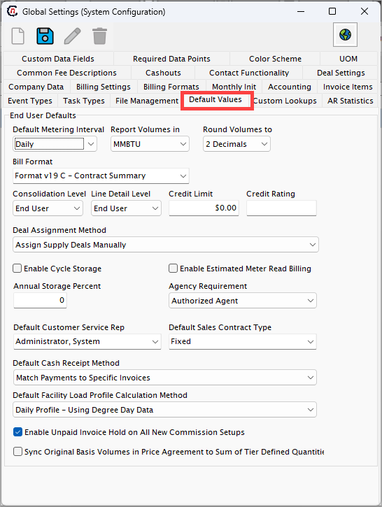

    * **Custom lookups** 
    This tab allows you to set up custom lookup fields for dropdowns or selection lists, enabling the application to cater to specific organizational needs.

    * **AR statistics** 
    Manage and view accounts receivable statistics. This tab helps track and report key metrics for financial operations.
    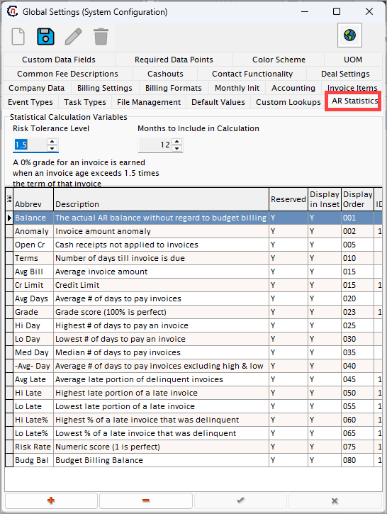

    * **Custom data fields** 
    Use this tab to create and manage custom data fields that extend the application’s functionality, ensuring that unique data requirements are met.

    * **Required data points** 
    This tab defines mandatory fields across the application. Enforcing required data points ensures data completeness and compliance.
    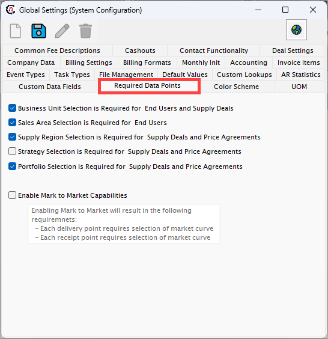

    * **Color scheme** 
    Manage nGenue’s interface color theme or grid settings. For example, selecting a **Green** theme updates the user interface with a consistent green color scheme.
    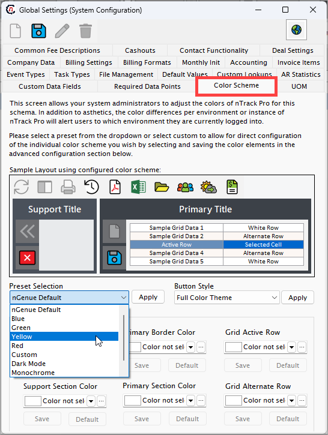

    * **UOM (Unit of measurement)** 
    Configure default units of measurement for quantities, such as **MMBTU**, **THERM**, or **MCF**. These units will be applied across the application for consistency.
    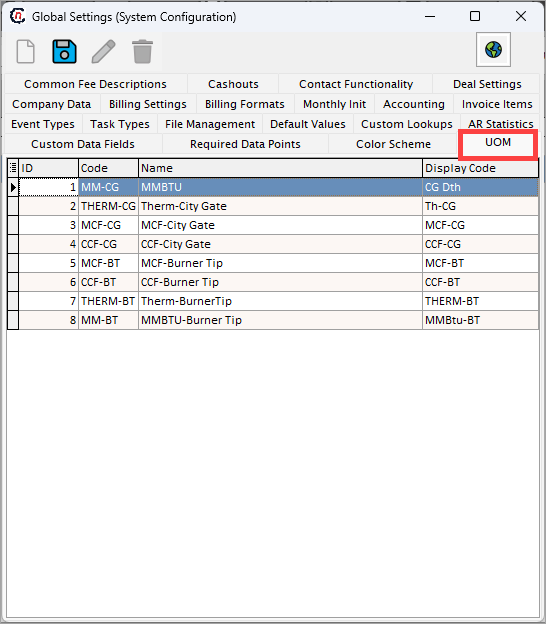

    * **Common fees descriptions** 
    Define standard fee descriptions for consistent terminology when adding or applying fees in various processes.
    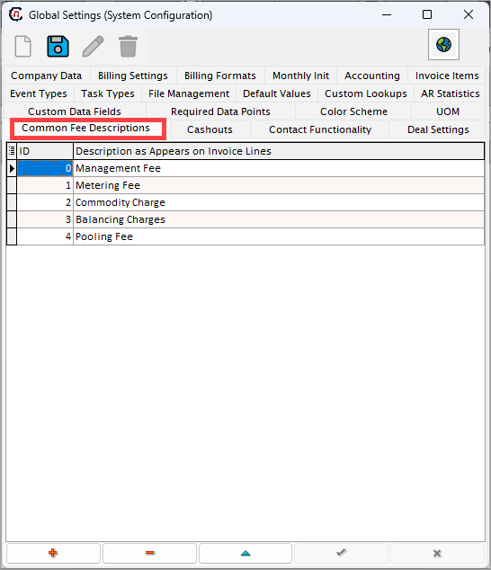

    * **Cashouts** 
    This tab helps configure cashout rules and parameters, ensuring proper handling and reporting of cashouts.
    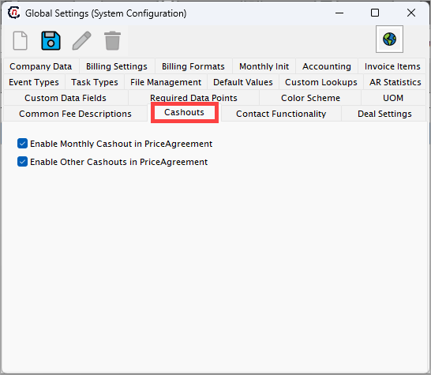

    * **Contact functionality** 
    Manage the contact settings for the application, such as default contact templates or rules for contact association.
    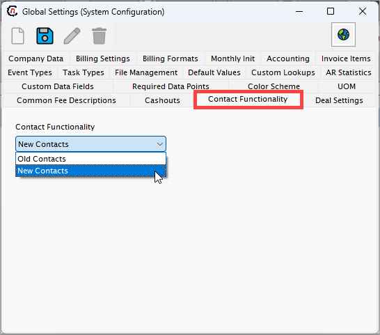

    * **Deal settings** 
    Configure deal-specific settings. For example, if **Default child deals allocation for buys or sells** is enabled, this option will be preselected when creating a new deal.
    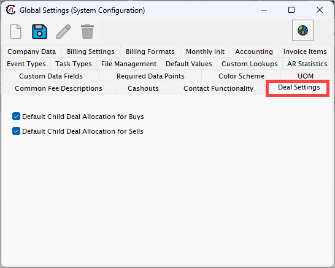

    * **Company data** 
    Provide and manage company information, including company name, address, main phone number, billing inquiries contact details, website URL, and other related data.
    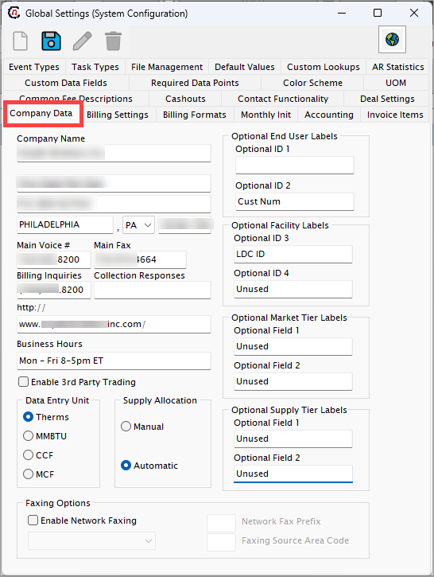

    * **Billing settings** 
    This tab is used to manage default billing configurations, such as billing cycles, payment terms, or billing options.
    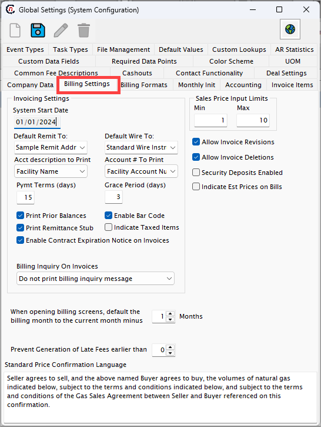

    * **Billing formats** 
    Set the default invoice format for end users. All generated invoices will follow the format specified in this tab unless overridden.
    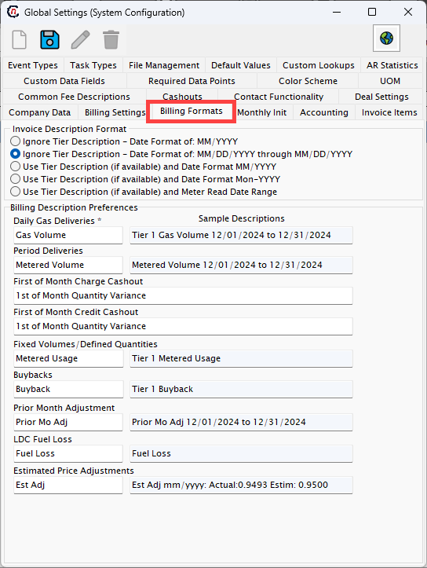

    * **Monthly Init** 
    Configure settings related to monthly initialization processes, ensuring the system is prepared for new operational cycles.
    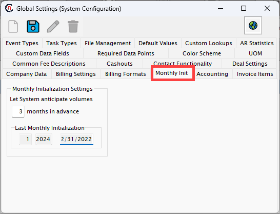

    * **Accounting** 
    Manage accounting-related settings such as account codes, financial periods, or other key parameters critical for financial management.

    * **Invoice items** 
    Define and manage items or services that appear on invoices. This includes descriptions, default prices, and categorization.
    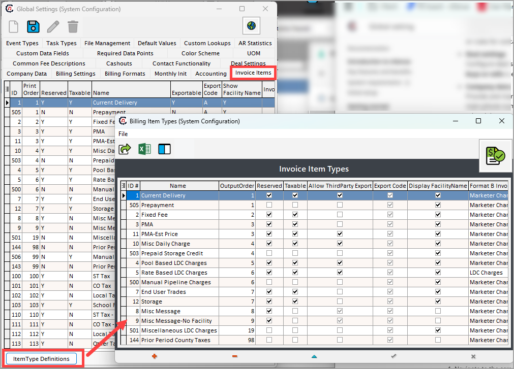

#### Step 3: Save and apply changes

1. After updating the required settings, click the **Save** button to apply the changes.  
2. A confirmation message will appear to indicate that the settings were successfully updated.  

#### Step 4: Validate the configuration

1. Navigate to the screens or tabs impacted by the updated global settings to confirm that the changes are reflected as expected.  
2. If adjustments are needed, return to the **Global settings** screen and modify the configuration accordingly.