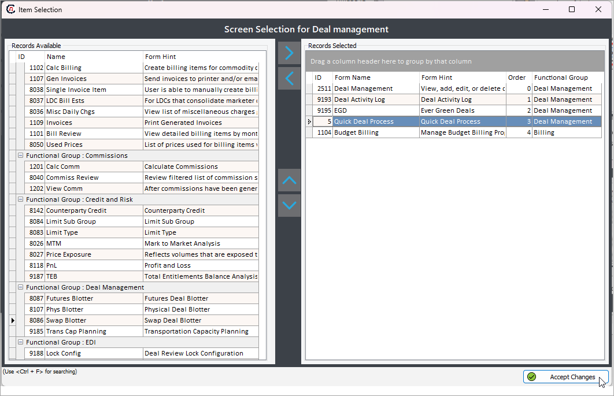
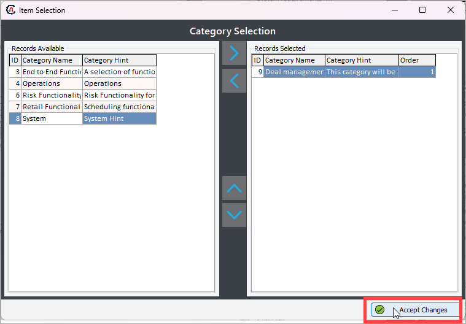

# Configure menu category and layouts

Configuring a menu category involves grouping related screens under a single category to streamline navigation. Users can assign screens to a category, define their order. This setup helps organize the interface efficiently, ensuring that related functionalities are easily accessible under a well-defined menu structure.

## Prerequisites
1.	The database and application executable (.exe) file installed in your system.
2.	You have valid credentials to log in to the application.
3.	You have the necessary permission to *add* or *modify* the Menu Configuration screen.

## Configure menu category

Follow the below steps to configure a new menu category:

1. In the **Menu configuration** screen, click on **---> Category** button.
    

2. The below table list down the different fields available on this page along with its features:

    | Icons      | Description                          |
    | ----------- | ------------------------------------ |
    |        | Displays a list of configured menu categories in the application.  |
    |         | Add a new category record |
    |     | Edit the category record detail. |
    |         |  Save the category record. |
    |   | Cancel the updates being made to the category record. |
    |   | Delete a category record. |
 	
3. You'll be able to configure a category while creating a new category record. To do so, click on the **Add a category record** button.
4. Fill in the below details:

    * **Category name**: Give a name to the menu category. For example: *Deal Management.*
    * **Category ID**: This field is auto generated when you save the category.
    * **Image selection**: Choose an image to display for your category.
    * **Category hint**: Enter a detailed description for the menu category.
    

5. **Save** the changes.
6. To assign screens to your menu category, click on the **Adjust category screen assignment** button. This will open a new popup screen where you will need to assign screens (using *left/right/top/bottom arrow* keys) to the newly created category. Click **Accept changes** to save the configuration.

    The assigned screens will reflect in the **Category details** section.
    
 
## Configure menu layout

Follow the below steps to configure a new menu layout:

1. In the **Menu configuration** screen, click on **---> Layout** button. 
2. By default, the system default data will be auto filled. To edit the details, you will need to click on the **Edit** icon.

3. Here are the list of fields along with each field description in the below table:

    | Icons      | Description                          |
    | ----------- | ------------------------------------ |
    |        | Displays a list of configured menu layouts in the application.  |
    |         | Add a new layout record. |
    |     | Edit the layout record detail. |
    |         |  Save the layout record. |
    |   | Cancel the updates being made to the layout record. |
    |   | Delete a layout record. |
 	
3. You'll be able to configure a layout while setting up a new category layout. To do so, click on the **Add a layout record** button.
4. In the **General** tab, fill in the below details:

    * **Layout name**: Give a name to the menu layout. For example: *Deal Management layout.*
    * **Layout ID**: This field is auto generated.
    * **Icon Properties**: 
        * **Size**: Enter the screen size to display proper screen images in menu category.
        * **Icon Font Size**: Enter the screen name font size to display in the menu category.
        

5. **Save** the changes.

6. To assign category to your menu layout, click on the **Assign category to Home page Layout** button. This will open a new popup screen where you will need to assign categories (using *left/right/top/bottom arrow* keys) to your layout. Click **Accept changes** to save the configuration.

    The assigned screens will reflect in the **Layout details** section.
    
	
	

 

