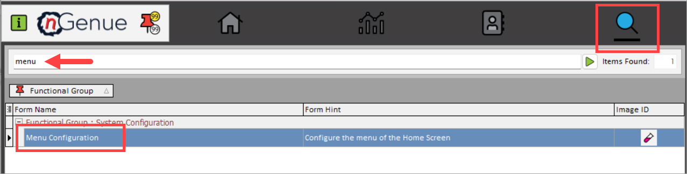

---
hide:
  - toc
---
# Menu configuration overview

The Menu configuration system in your application is designed to streamline the organization of screens by assigning them to specific menu categories, which can then be mapped to a particular menu layout. This allows for a flexible and dynamic structure where multiple screens can be grouped under relevant categories, and these categories are arranged in a defined layout for easy navigation. Users can add screens to a category, adjust their order, and ensure that each category fits into the overall menu design, making it easier to manage and customize the user interface based on Configuration.

## Navigate to Menu configuration page

You will be able to access Menu configuration page by typing **"menu"** in the quick search available in the nGenue application homepage. Select **Menu configuration** and this will redirect you to the **Menu configuration** page.

## Related topics
* [Configure menu category](configure.md#configure-menu-category)
* [Configure menu layout](configure.md#configure-menu-layout)
