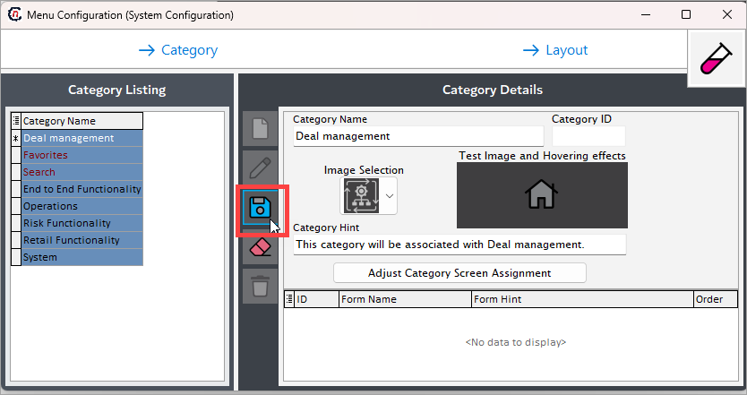
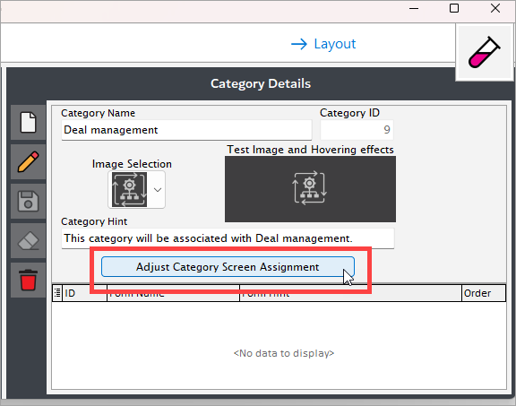
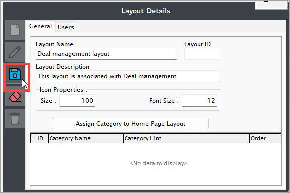

# Understanding menu configuration

The **menu configuration** feauture in nGenue is designed to streamline the organizing of screens by assigning them to specific menu [categories,](menu_configurations.md#configure-menu-category) which can then be mapped to a particular [menu layout.](menu_configurations.md#configure-menu-layout) This allows for a flexible and dynamic structure where multiple screens can be grouped under relevant categories, and these categories are arranged in a defined layout for easy navigation. You can add screens to a category, adjust their order, and ensure that each category fits into the overall menu design, making it easier to manage and customize the user interface based on configuration.

## Procedure to configure menu category and layouts

Configuring a menu category involves grouping related screens under a single category to streamline navigation. Users can assign screens to a category, define their order. This setup helps organize the interface efficiently, ensuring that related functionalities are easily accessible under a well-defined menu structure.

### Prerequisites

* You have the necessary permission to *add* or *modify* the **Menu configuration** screen.

### Configure menu category

#### Step 1: Navigate to the Menu configuration screen

1. Log in to the **nGenue** application.

2. Click the **Search** icon and enter *menu* in the search bar.  
    

3. Double-click **Menu configuration** to open the respective screen.
4. In the **Menu configuration** screen, click on **--> Category** button.
5. The next screen is divided into two sections: **Category listing** and **Category details.**
    
    1. The **Category listing** section lists existing menu categories configured within nGenue.
    2. The **Category details** section allows you to create, edit, or delete menu categories. The table below describes the available icons and their functions:
    
        | Icons      | Description                          |
        | ----------- | ------------------------------------ |
        |         | Add a new menu category record |
        |     | Edit the menu category record detail. |
        |         |  Save the menu category record. |
        |   | Cancel the updates being made to the menu category record. |
        |   | Delete a menu category record. |

#### Step 2: Create a new category record

1. Click on the **Add a category record** icon.
2. On the next screen, fill in the below details:

    * **Category name**: Give a name to the menu category. For example: *Deal management.*
    * **Category ID**: This field is auto generated when you save the category.
    * **Image selection**: Choose an image to display for your category.
    * **Category hint**: Enter a detailed description for the menu category.

5. **Save** the changes.
  

#### Step 3: Assign screens to category

1. Click the **Adjust category screen assignment** button to assign screens to your menu category. 
    
2. This will open a new popup screen where you will need to assign screens (using *left/right/top/bottom arrow* keys) to the newly created category. 
3. Click **Accept changes** to save the configuration.
    

3. The assigned screens will reflect in the **Category details** section.
 
### Configure menu layout

#### Step 1: Navigate to the Menu configuration screen

1. Log in to the **nGenue** application.

2. Click the **Search** icon and enter *menu* in the search bar.  

3. Double-click **Menu configuration** to open the respective screen.
4. In the **Menu configuration** screen, click on **--> Layout** button.
5. The next screen is divided into two sections: **Layout listing** and **Layout details.**
    
    1. The **Layout listing** section lists existing menu layouts configured within nGenue.
    2. The **Layout details** section allows you to create, edit, or delete menu layouts. The table below describes the available icons and their functions:
    
        | Icons      | Description                          |
        | ----------- | ------------------------------------ |
        |         | Add a new menu layout record |
        |     | Edit the menu category layout detail. |
        |         |  Save the menu layout record. |
        |   | Cancel the updates being made to the menu layout record. |
        |   | Delete a menu layout record. |

#### Step 2: Create a new category layout

1. Click on the **Add a new layout record** icon.
2. In the **General** tab, fill in the below details:
    1.  **Layout name**: Give a name to the menu layout. For example: *Deal management layout.*
    2.  **Layout ID**: This field is auto generated.
    3.  **Icon properties**: 
        1. **Size**: Enter the screen size to display proper screen images in menu category.
        2. **Font size**: Enter the screen name font size to display in the menu category.

5. **Save** the changes.
  

#### Step 3: Assign category to layout

1. Click the **Assign category to home page Layout** button to assign a category or categories to the layout. 
    
2. This will open a new popup screen where you will need to assign categories (using *left/right/top/bottom arrow* keys) to your layout.
3. Click **Accept changes** to save the configuration.
    

4. The assigned categories will reflect in the **Layout details** section.
    

    !!!tip "Note"
        * **Favorites** and **Search** categories are automatically added to any layout by default.
        * Restart the **nGenue** application to view the layout changes.

---