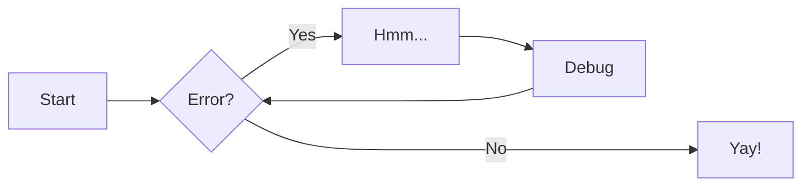
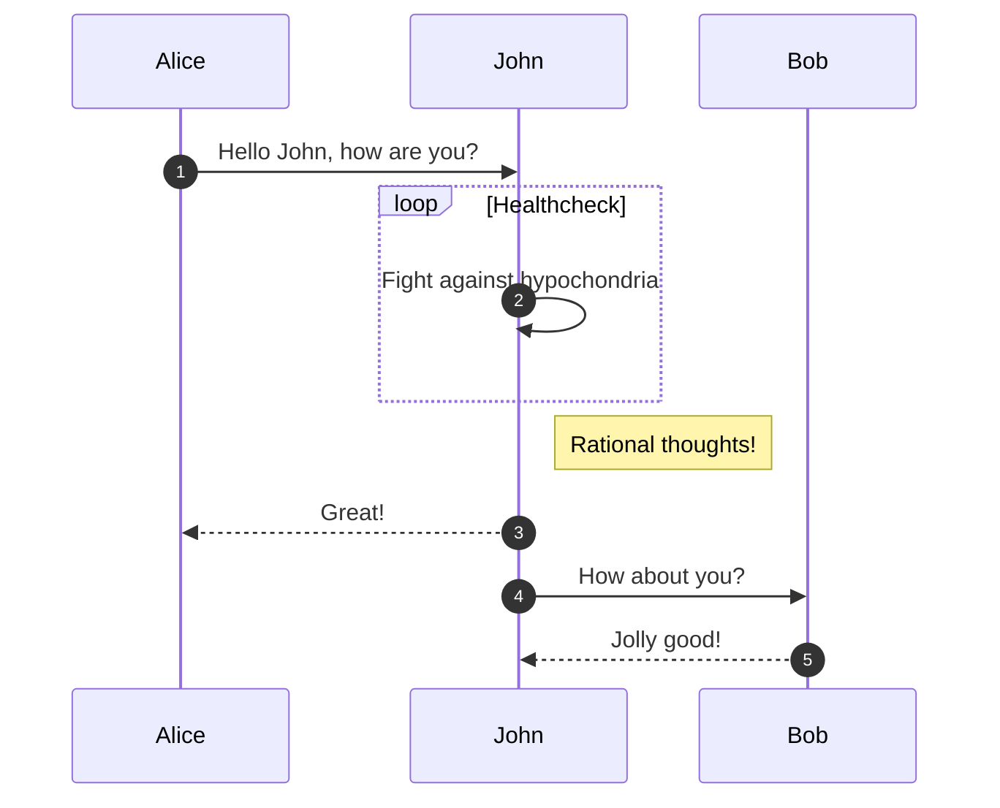
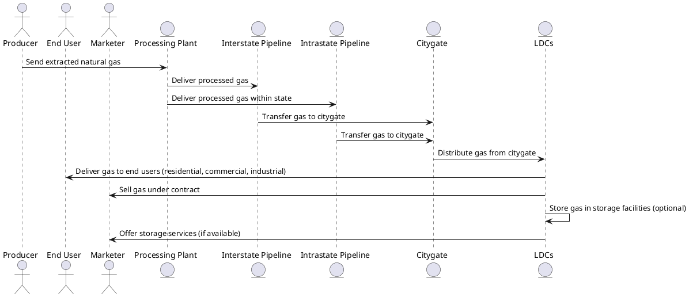

---
hide:
 - toc
---

# Few sample code to use

## Table

| Syntax | Description |
| ----------- | ----------- |
| Header | Title |
| Paragraph | Text |

### Example 1

| Method      | Description                          |
| ----------- | ------------------------------------ |
| `GET`       | :material-check:     Fetch resource  |
| `PUT`       | :material-check-all: Update resource |
| `DELETE`    | :material-close:     Delete resource |

### Example 2

| Browser                              | Version | Release date |         |        |      Usage |
| ------------------------------------ | ------: | -----------: | ------: | -----: | ---------: |
|                                      |         |              | desktop | mobile |    overall |
| :fontawesome-brands-chrome: Chrome   |     49+ |      03/2016 | 25.65%  | 38.33% |     63.98% |
| :fontawesome-brands-safari: Safari   |     10+ |      09/2016 |  4.63%  | 14.96% |     19.59% |
| :fontawesome-brands-edge: Edge       |     79+ |      01/2020 |  3.95%  |    n/a |      3.95% |
| :fontawesome-brands-firefox: Firefox |     53+ |      04/2017 |  3.40%  |   .30% |      3.70% |
| :fontawesome-brands-opera: Opera     |     36+ |      03/2016 |  1.44%  |   .01% |      1.45% |
|                                      |         |              |         |        | __92.67%__ |


## Warnings, Cautions, and Notes

!!! note "Note"

    The **Select Contact** step appears only for entities, such as an Employer, who have more than one contact available. Select the check boxes for the contacts attending the meeting, then click Next. The Adhoc Meeting Wizard moves to step 2 - Type.

[Twemoji]: https://twemoji.twitter.com/
[emoji search]: ../reference/icons-emojis.md#search

!!! warning "Warning"

    The **Select Contact** step appears only for entities, such as an Employer, who have more than one contact available. Select the check boxes for the contacts attending the meeting, then click Next. The Adhoc Meeting Wizard moves to step 2 - Type.

[Twemoji]: https://twemoji.twitter.com/
[emoji search]: ../reference/icons-emojis.md#search

!!! tip "Caution"

    The **Select Contact** step appears only for entities, such as an Employer, who have more than one contact available. Select the check boxes for the contacts attending the meeting, then click Next. The Adhoc Meeting Wizard moves to step 2 - Type.

[Twemoji]: https://twemoji.twitter.com/
[emoji search]: ../reference/icons-emojis.md#search

## Questions, Recommended and Tips

!!! question "How can I help you?"

    The **Select Contact** step appears only for entities, such as an Employer, who have more than one contact available. Select the check boxes for the contacts attending the meeting, then click Next. The Adhoc Meeting Wizard moves to step 2 - Type.

[Twemoji]: https://twemoji.twitter.com/
[emoji search]: ../reference/icons-emojis.md#search

!!! tip "Recommended"

    The **Select Contact** step appears only for entities, such as an Employer, who have more than one contact available. Select the check boxes for the contacts attending the meeting, then click Next. The Adhoc Meeting Wizard moves to step 2 - Type.

[Twemoji]: https://twemoji.twitter.com/
[emoji search]: ../reference/icons-emojis.md#search

## Adding two different codes for different regions (US and Canada)

??? question "How to add features for two different region?"

    Workflows only bundles selected plugins in order to keep the size
    of the official image small. If the plugin you want to use is not included,
    you can add them easily:

    === "US region"

        Hello World 1:

        ``` Dockerfile title="Dockerfile"
        FROM squidfunk/mkdocs-material
        RUN pip install mkdocs-macros-plugin
        RUN pip install mkdocs-glightbox
        ```

    === "Canada"

        Hello World 2:

        ``` txt title="user-requirements.txt"
        vitech-macros-plugin
        vitech-glightbox
        ```

    Next, build the image with the following command:

    ```
    docker build vitech .
    ```

    The new image will have additional packages installed and can be used
    exactly like the official image.

## Code block

``` javascript
    document$.subscribe(function() {
      console.log("Initialize third-party libraries here")
    })
```
## Keyboard shortcuts

++ctrl+alt+del++

## Flowcharts



## Sequence diagrams



## PlantUML diagrams



``` yaml
theme:
  features:
    - content.code.annotate # (1)
```

1.  :man_raising_hand: I'm a code annotation! I can contain `code`, __formatted
    text__, images, ... basically anything that can be written in Markdown.


