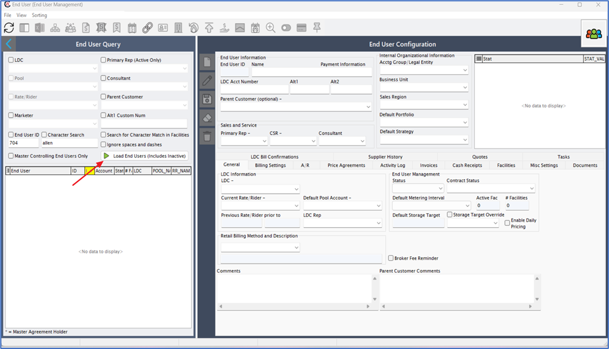
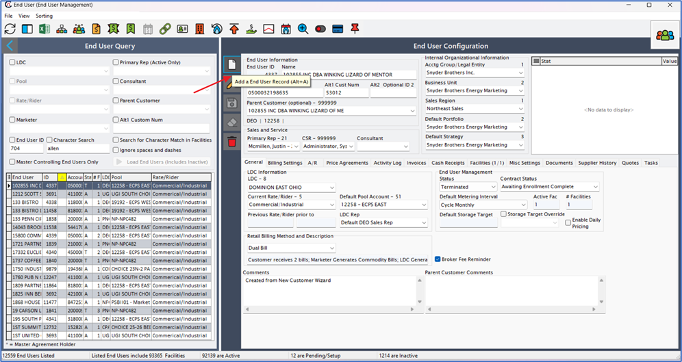
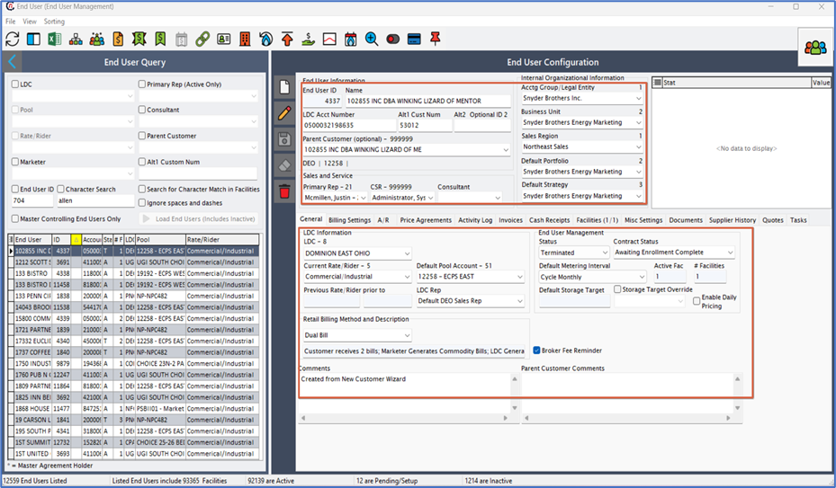
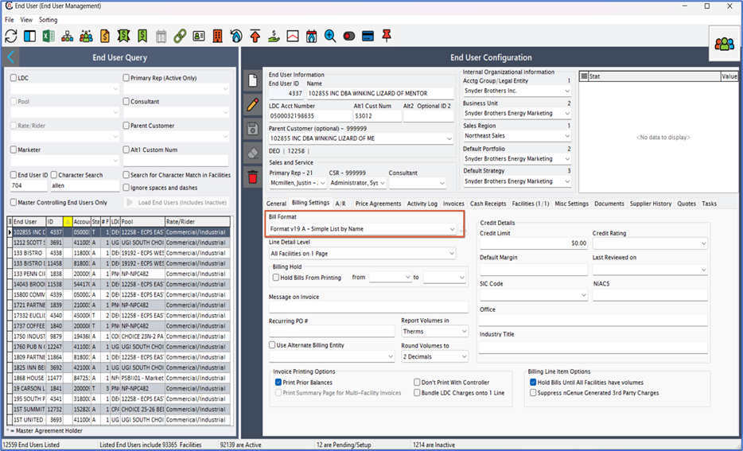

---
hide:
 - toc
---

# Create an end user

In this section, we will walk through the step-by-step process of creating an end user within the nGenue application. After you are done creating an end user, you will need to add their [address](create_end_user.md#creating-an-end-user-address), set up a [sales contract](create_end_user.md#creating-a-sales-contract) and [price agreement](create_end_user.md#adding-price-agreement), and add facilities to activate the account. Each of these steps is detailed in separate topics on this page.

1.	Login to the **nGenue** application.
2.	Click on the **Search** icon and enter *End user* into the search bar. 

3.	Double click on **End user**. 

4.	The **End user (End user management)** screen appears. Click on the **Load end users** button.   

5.	Click on the **Add an end user record** button. 
 

6.	Fill in the below details:

    - **End user information**: Enter the details such as end user name, LDC account number, primary rep and consultant.

    - **Default value**: Enter the details such as end user name, LDC account number, primary rep and consultant.

    - **General**: Fill in the details such as LDC name, current rate rider, default pool account, and LDC rep.
    

    - **Billing settings**: Select the required **Billing format** from the dropdown. 
    

7. Click **Save** to save the record. You have successfully created an end user in the nGenue application.

## Create an end user address

This section provides the steps to create an address for an end user within the application.

1.	Click on the **End user level address** icon from the **End user** screen. 

2.	Click on the **Add an end user address record** button.  

3.	Enter the required details in the **Address configuration** screen, including *contact*, *title*, *address*, and other relevant information.

4. Click **Save.**
 
## Create a sales contract 

This section explains the process for creating a Sales Contract within the application.

1.	From the **End user** screen, click on the **Sales** contracts menu. 
2.	Click on the **Add a Sales Contract Record** button.  
3.	Enter the required details in the **Contract Details** screen, including *contact type*, *effective date*, *contract*, and other relevant information.  

## Add price agreement

This section explains the process for adding a Price Agreement within the application.

1.	From the **End user** screen, click on the **Price agreements** menu.  
2.	Click on the **Add a price agreement record** button.  
3.	Enter the required details in the **Price agreement configuration** screen, including *effective date, currency, supply region*, and other relevant information.   

 
## New pricing tier configuration

This section explains the process for adding a new pricing tier configuration within the application.

1.	Click on the **Add new tier** button under the **Pricing tiers** tab.  

2.	Fill in or select the options as per your need. 
3.	Enable *buyback* if required.
4.	Additionally, fill in the details in the **Commodity sales and validation screen**, including *pricing methodology, date, derive volume from, commodity status* and its related fields.  
 

## Create a facility

This section provides a step-by-step guide for creating a Facility within the application.

1.	Click on the **Facility** icon in the End User screen.  
2.	Click on the **Add a facility record** button.  
3.	Enter the required details in the **Facility details** screen, including *facility name, effective date, currency, and supply region.*
4.	In the **Physical address and sales tax** section, enter the details such as *street address, state, city, and country.*  
5.	In the **Profile** tab, fill in the details as *weather zone, and estimated volumes.*  

## Create a facility address

This section provides a step-by-step guide for creating a facility within the application.

1.	From the **Facility** screen, click on the **Open facility addresses** menu.  
2.	Click on the **Add a facility address record** button.  
3.	Enter the required details in the **Address details** screen, including *contact, title, address,* and other relevant information.  

 
## Create a meter 

This section provides a step-by-step guide for creating a Facility within the application.
1.	Click on the **Open meter data** menu from the **Facility** screen. 
2.	Click on the **Add a facility meter record** button.  
3.	Enter the required details in the **Meter details*** screen, including name, meter number, status,* and other relevant information.  

## Activate a facility

Activate a facility by clicking on the **Change facility status** button.  

## Activate an end user
To activate an end user, click on the **Activate end user** button in the **End user** screen.

---

 

